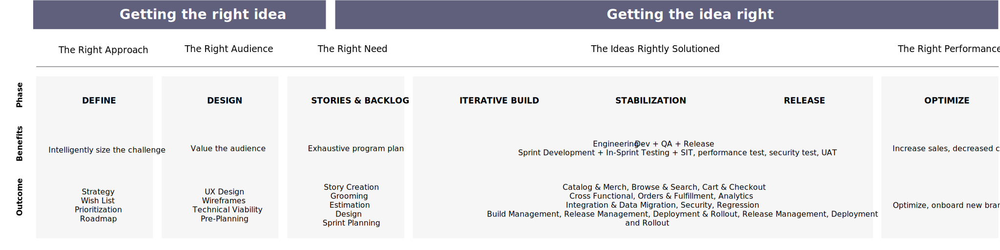
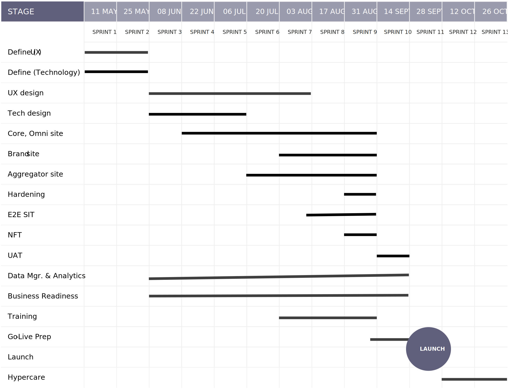
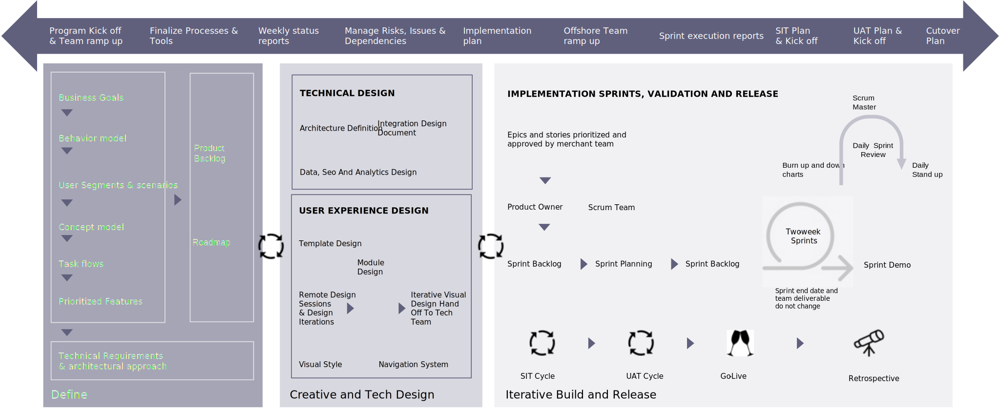

# Delivery and planning approach

Understanding the full scope of a project before beginning implementation is just as critical as having a plan for delivering a solution on time, on budget, and that meets your needs. This requires both identifying a foolproof blueprint for the design and implementation of the solution and executing that blueprint while measuring success.

It is a commitment from the entire team that begins at the initial ideation and doesn’t end until after launch. And while this is a detail-oriented and sometimes tedious aspect of the process, the work that you put into the plan and governance makes obstacles much easier to navigate around and overcome.

Strategic commerce projects can be delivered with several approaches and different project management methodologies. However, we recommend a hybrid Agile approach for successful delivery and optimal execution.

This approach consists of the following steps:

- Define phases to plan, architect, and strategize

- Agile sprints to build and design the solution

- Integration, performance, and user-acceptance testing for pilot

- Scrum team rollouts for brand and commerce sites

The hybrid model allows you to leverage the power of Agile methodology, keeping on target for the timeline, cost, and quality. The entire plan is divided into two distinct phases, followed by launch, optimization, and maintenance activities.

- **Getting the right idea**—This is a pre-implementation phase to ensure that the requirements, design, and technology solution are strategized, documented, and collaborated across stakeholders. The backlog for implementation is groomed and built, development sprints are planned, and a sequential strategy for building the product is finalized.

- **Getting the idea right**—This is the implementation phase to build the product iteratively, test thoroughly, and release appropriately. The first step is to develop the code through multiple sprints; each sprint contains in-sprint development and testing, followed by system-integration testing, performance and security testing, user-acceptance testing, and release activities.

Project planning is a critical activity. It guides the stakeholders, teams, sponsors, and project managers on how to monitor, manage, and control project phases. It also helps identify goals, avoid missing deadlines, prioritize essential tasks, reduce risks, and deliver desired results.

The project plan usually consists of four phases:

- Initiation and planning
- Execution
- Launch
- Post-launch

Each phase can be delivered through multiple smaller sprints, thereby managing progress and outcomes through smaller increments and with a higher degree of agility. Planning is unique, however, in that it is usually a part of the other three phases. We have provided a detailed breakdown of each phase and an example of a project plan for a successful Adobe Commerce implementation:

The approach we have defined shows different project phases coming together to enable successful project execution. The Project Management Office (PMO) provides close oversight at various levels and ensures success at each phase (and sprint) building up to successful, timely execution with optimal quality and cost.

