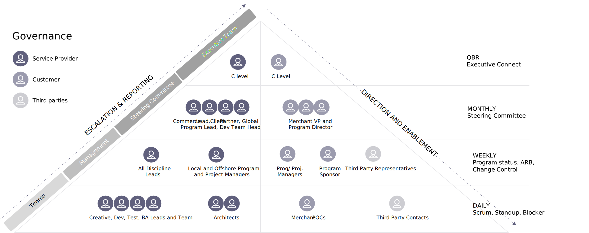
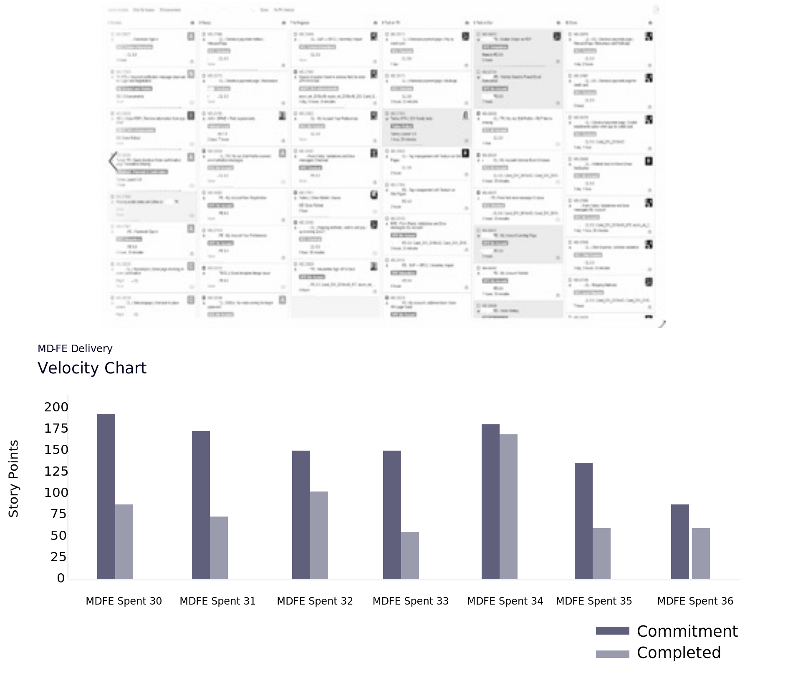
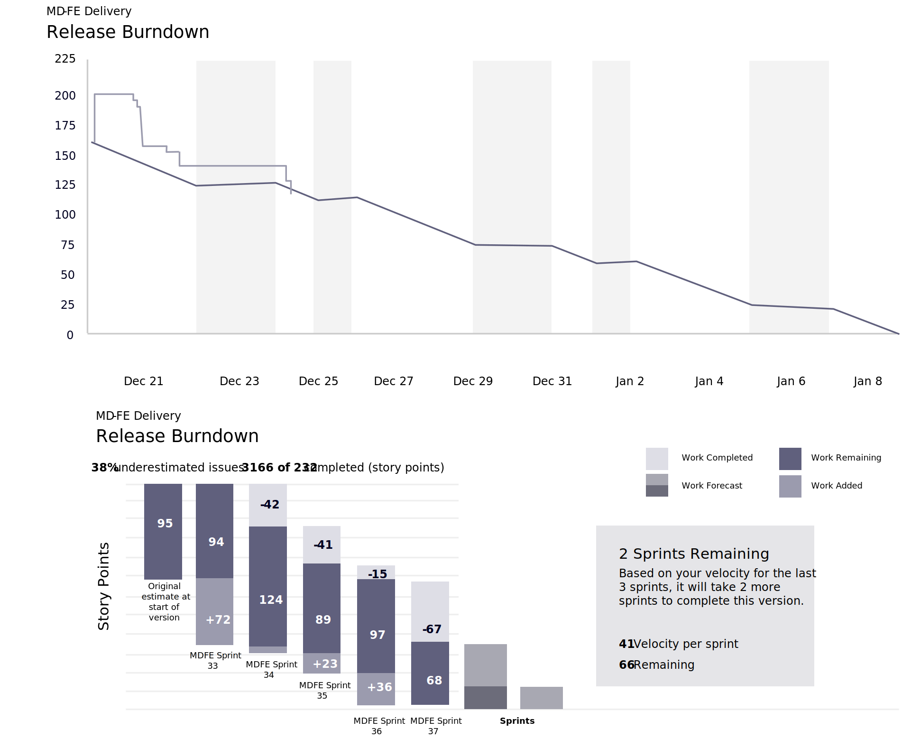

# Project governance

Project governance is an oversight function aligned with the organization’s governance structure and encompasses the project life cycle. It provides the project manager and team with structure, processes, decision-making models, and tools for managing and controlling the project, while also ensuring the successful delivery of the project. Project governance is a crucial element, especially for complex and strategic projects.

The governance model defines, documents, and communicates custom and effective practices to provide a comprehensive method of controlling the project and providing periodic visibility at every level to ensure success. It contains a framework for making decisions; defines roles, responsibilities, and liabilities for the accomplishment of the project; and governs the effectiveness. The governance structure rolls up from the execution team all the way to executive management, defining the activities, reporting, escalation, and information flow.

At various levels, the teams look into specific sprint and project metrics to understand the progress and take corrective actions as necessary. These sprint-level metrics can include the velocity and burndown of each sprint.

## Regular meeting details

- Quarterly business review

  - Discuss growth escalation strategies

  - Highlight current success & goals

  - Align on desired outcomes for the coming quarters

- Monthly steering committee

  - Coordinate and review project progress

  - Decision making on major impact items (if any)

  - Dentsuen sures customer satisfaction and concerns are recorded and addressed

- Weekly project committee

  - Decide on objectives, plan, organization for the week

  - Make architecture decisions as needed

  - Review & act on project status reports

  - Demos the platform and features

  - Escalate requests/issues/suggestions

- Daily meeting

  - Discuss and follow up on action items, including current sprint/boards/outstanding tickets

  - Monitor project progress

## Performance KPIs

Apart from the sprint metrics, it is also essential to measure project and quality performance KPIs. Not only does this help to ensure the level of quality throughout the plan, but it keeps the team on track and prevents the project from going off the rails.

## Storyboard and velocity

## Sprint and release burndown

Challenges or changes occur throughout the duration of any project. Empowering the right people within your organization with the ability to track, measure, and pivot when a challenge is met is going to increase the likelihood that you come out of the project having met your goals and are satisfied with the result.

<table>
<thead>
  <tr>
    <th>Key Performance Measurement</th>
    <th>Unit of Measure</th>
    <th>Reported Metrics</th>
  </tr>
</thead>
<tbody>
  <tr>
    <td>Test Coverage</td>
    <td>%</td>
    <td># of testable requirements covered by test cases VS Total of baselined testable requirements</td>
  </tr>
  <tr>
    <td>Defect Density</td>
    <td>%</td>
    <td># of valid Defects found VS Total of Test cases executed</td>
  </tr>
  <tr>
    <td>Defect Leakage to SIT/ UAT / Production</td>
    <td>%</td>
    <td>Defects reported in Production VS Defects reported in Production + Defects reported by QA+UAT</td>
  </tr>
  <tr>
    <td>Test Effectiveness</td>
    <td>%</td>
    <td>Valid Defects raised/Valid Defects raised Rejected defects</td>
  </tr>
  <tr>
    <td>Code Quality</td>
    <td># + %</td>
    <td>Complexity, LoC, Violations, Code coverage for the sprint</td>
  </tr>
</tbody>
</table>
