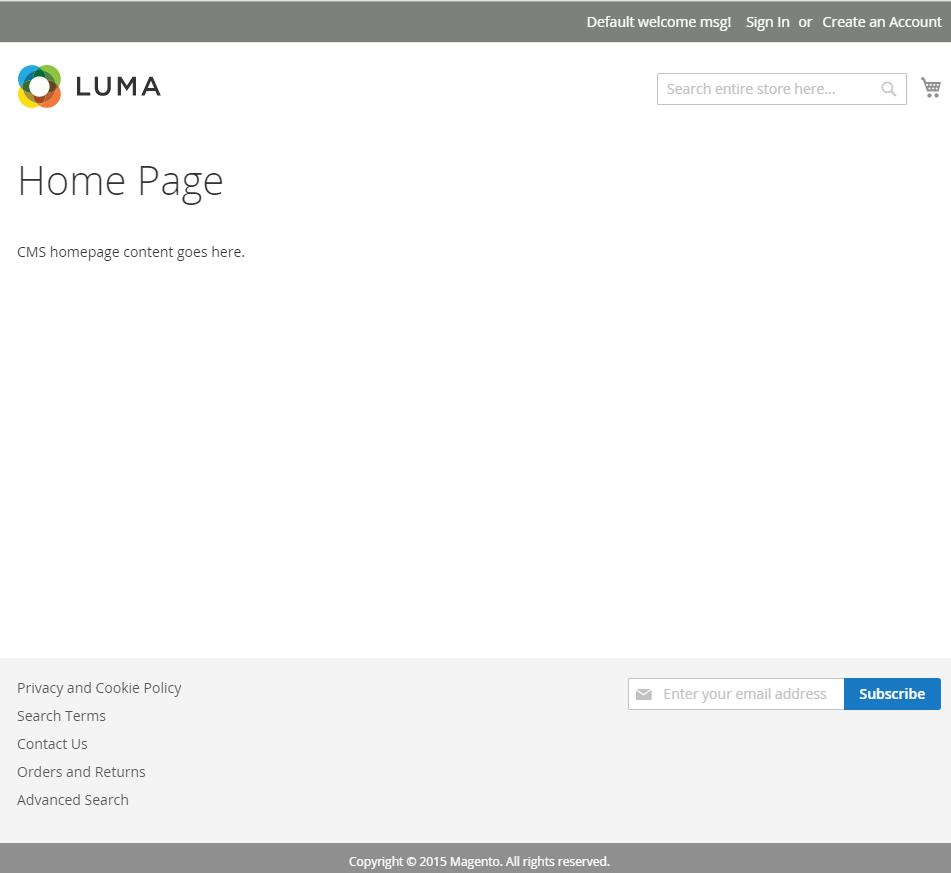
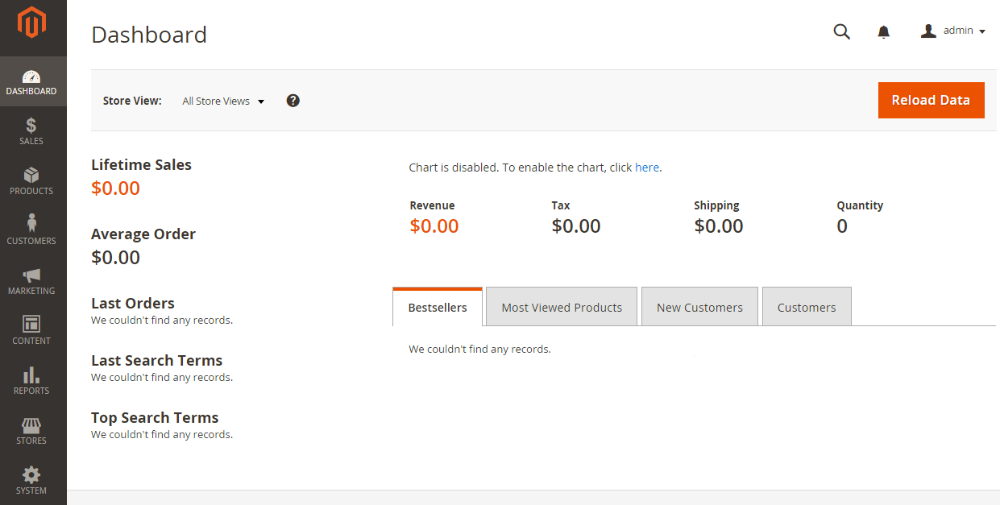

# Verify the installation

## Verify the storefront (with optional sample data)

Go to the [storefront](https://glossary.magento.com/storefront) in a web browser. For example, if your installation base [URL](https://glossary.magento.com/url) is `http://www.example.com`, enter it in your browser's address or location bar.

The following figure shows a sample storefront page. If it displays as follows, your installation was a success!

## Verify the storefront (no sample data)

Go to the storefront in a web browser. For example, if your installation base URL is `http://www.example.com`, enter it in your browser's address or location bar.

The following figure shows a sample storefront page. If it displays as follows, your installation was a success!

If the page displays a 404 (Not Found) or unconfigured (no styles, only text), see [After installing, images and stylesheets do not load; only text displays, no graphics](https://support.magento.com/hc/en-us/articles/360032994352).

## Verify the Admin

Go to the [Admin](https://glossary.magento.com/magento-admin) in a web browser. For example, if your installation base URL is `http://www.example.com`, and the Admin URI is `admin_au1nT`, enter `http://www.example.com/admin_au1nT` in your browser's address or location bar.

(The [Admin](https://glossary.magento.com/admin) URI is specified by the value of the `backend-frontname` installation parameter.)

When prompted, log in as a Administrator.

The following figure shows a sample Admin page. If it displays as follows, your installation was a success!

If the page displays unconfigured (no styles, only text), see [After installing, images and stylesheets do not load; only text displays, no graphics](https://support.magento.com/hc/en-us/articles/360032994352).

If you get a 404 (Not Found) error similar to the following, see [PHP version error or 404 when accessing Adobe Commerce in browser](https://support.magento.com/hc/en-us/articles/360033117152).

`The requested URL /magento2index.php/admin/admin/dashboard/index/key/0c81957145a968b697c32a846598dc2e/ was not found on this server.`
