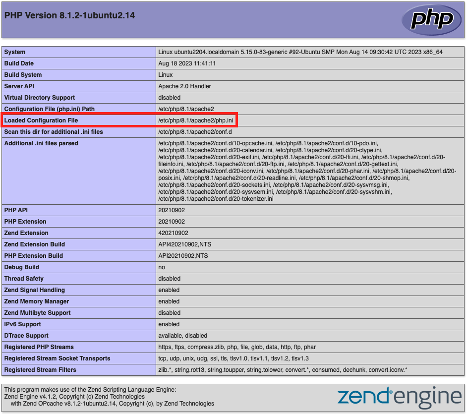

# PHP settings

This topic discusses how to set required PHP options.

>[!NOTE]
>
>The latest version of Adobe Commerce requires a minimum of PHP 8.1. See [system requirements](../system-requirements.md) for all supported versions of PHP.

For Cloud configuration guidance, see [PHP settings](https://experienceleague.adobe.com/docs/commerce-cloud-service/user-guide/configure/app/php-settings.html) in the _Commerce on Cloud Infrastructure_ guide.

## PHP Process Control

{{php-process-control}}

## Verify PHP is installed

PHP is installed by default on most Linux distributions. This topic assumes that you have already installed PHP. To verify if PHP is installed, enter the following on the command line:

```bash
php -v
```

If PHP is installed, a message similar to the following displays:

```
PHP 8.1.2-1ubuntu2.14 (cli) (built: Aug 18 2023 11:41:11) (NTS)
Copyright (c) The PHP Group
Zend Engine v4.1.2, Copyright (c) Zend Technologies
    with Zend OPcache v8.1.2-1ubuntu2.14, Copyright (c), by Zend Technologies
```

If PHP is not installed (or requires an upgrade), install it by following the instructions for your Linux distribution.

## Verify installed extensions

Adobe Commerce requires certain PHP extensions. The following lists specify required extensions for each edition of Commerce. The lists are autogenerated from a deployment running the latest version of each edition.

{{$include /help/_includes/templated/php-extensions.md}}

To verify installed extensions:

1. List installed modules.

   ```bash
   php -m
   ```

1. Verify that all required extensions are installed.
1. Add any missing modules using the same workflow used for installing PHP.

## Check PHP settings

>[!WARNING]
>
>If you are using PHP 7.4.20, set `pcre.jit=0` in your `php.ini` file. This gets around a PHP [bug](https://bugs.php.net/bug.php?id=81101) that prevents CSS from loading.

-  Set the system time zone for PHP; otherwise, errors like the following display during the installation and time-related operations like cron might not work:

```
PHP Warning:  date(): It is not safe to rely on the system's timezone settings. [more messages follow]
```

-  Set the PHP memory limit.

   Adobe recommends the following:

    -  Compiling code or deploying static assets, `1G`
    -  Debugging, `2G`
    -  Testing, `~3-4G`

-  Increase the values for the PHP `realpath_cache_size` and `realpath_cache_ttl` to recommended settings:

   ```conf
   realpath_cache_size=10M
   realpath_cache_ttl=7200
   ```

   These settings allow PHP processes to cache paths to files instead of looking them up on page load. See [Performance Tuning](https://www.php.net/manual/en/ini.core.php) in the PHP documentation.

-  Enable [`opcache.save_comments`](https://www.php.net/manual/en/opcache.configuration.php#ini.opcache.save-comments), which is required for Adobe Commerce 2.1 and later.

   Adobe recommends enabling the [PHP OPcache](https://www.php.net/manual/en/book.opcache.php) for performance reasons. The OPcache is enabled in many PHP distributions.

   Adobe Commerce 2.1 and later use PHP code comments for code generation.

>[!NOTE]
>
>To avoid issues during installation and upgrade, Adobe strongly recommends that you apply the same PHP settings to both the PHP command-line configuration and the PHP web server plug-in configuration. For more information, see the next section.

## Find PHP configuration files

This section discusses how you find the configuration files necessary to update required settings.

### Find `php.ini` configuration file

To find the web server configuration, run a [`phpinfo.php` file](optional-software.md#create-phpinfophp) in your web browser and look for the `Loaded Configuration File` as follows:



To locate the PHP command-line configuration, enter

```bash
php --ini | grep "Loaded Configuration File"
```

>[!NOTE]
>
>If you have only one `php.ini` file, change that file. If you have two `php.ini` files, change *both* files. Failure to do so might cause unpredictable performance.

### Find OPcache configuration settings

PHP OPcache settings are typically located either in `php.ini` or `opcache.ini`. The location might depend on your operating system and PHP version. The OPcache configuration file might have an `opcache` section or settings like `opcache.enable`.

Use the following guidelines to find it:

-  Apache web server:

   For Ubuntu with Apache, OPcache settings are typically located in the `php.ini` file.

   For CentOS with Apache or nginx, OPcache settings are typically located in `/etc/php.d/opcache.ini`

   If not, use the following command to locate it:

   ```bash
   sudo find / -name 'opcache.ini'
   ```

-  nginx web server with PHP-FPM: `/etc/php/8.1/fpm/php.ini`

If you have more than one `opcache.ini`, modify all of them.

## How to set PHP options

To set PHP options:

1. Open a `php.ini` in a text editor.
1. Locate your server's time zone in the available [time zone settings](https://www.php.net/manual/en/timezones.php)
1. Locate the following setting and uncomment it if necessary:

   ```conf
   date.timezone =
   ```

1. Add the time zone setting that you found in step 2.

1. Change the value of `memory_limit` to one of the values recommended at the beginning of this section.

   For example,

   ```conf
   memory_limit=2G
   ```

1. Add or update the `realpath_cache` configuration to match the following values:

   ```conf
   ;
   ; Increase realpath cache size
   ;
   realpath_cache_size = 10M

   ;
   ; Increase realpath cache ttl
   ;
   realpath_cache_ttl = 7200
   ```

1. Save your changes and exit the text editor.

1. Open the other `php.ini` (if they are different) and make the same changes in it.

## Set OPcache options

To set `opcache.ini` options:

1. Open your OPcache configuration file in a text editor:

   -  `opcache.ini` (CentOS)
   -  `php.ini` (Ubuntu)
   -  `/etc/php/8.1/fpm/php.ini` (nginx web server (CentOS or Ubuntu))

1. Locate `opcache.save_comments` and uncomment it if necessary.
1. Make sure that its value is set to `1`.
1. Save your changes and exit the text editor.
1. Restart your web server:

   -  Apache, Ubuntu: `service apache2 restart`
   -  Apache, CentOS: `service httpd restart`
   -  nginx, Ubuntu and CentOS: `service nginx restart`

## Troubleshooting

See the following Adobe Commerce Support articles for help with troubleshooting PHP problems:

-  [PHP version error or 404 error when accessing Adobe Commerce in a browser](https://support.magento.com/hc/en-us/articles/360033117152-PHP-version-error-or-404-error-when-accessing-Magento-in-browser)
-  [PHP settings errors](https://support.magento.com/hc/en-us/articles/360034599631-PHP-settings-errors)
-  [PHP mcrypt extension not installed properly](https://support.magento.com/hc/en-us/articles/360034280132-PHP-mcrypt-extension-not-installed-properly-)
-  [PHP version readiness check issues](https://support.magento.com/hc/en-us/articles/360033546411)
-  [Common PHP Fatal Errors and solutions](https://support.magento.com/hc/en-us/articles/360030568432)
