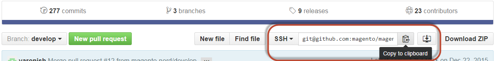
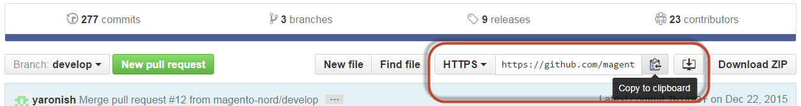

# Clone sample data Git repositories

This topic discusses how to clone and add sample data if you cloned the Magento Open Source GitHub repository. This method is intended only for contributing developers (that is, developers who plan to contribute to the Magento Open Source codebase).

If you're not a contributing developer, choose one of the other options displayed in the table of contents on the left side of the page.

Contributing developers can use this method of installing sample data *only* if the following is true:

*  You use Magento Open Source
*  You [cloned the GitHub repository](https://developer.adobe.com/commerce/contributor/guides/install/clone-repository/)

>[!WARNING]
>
>You can use sample data with either the `develop` branch (more current) or a released branch (such as `2.4` (more stable)). We recommend you use a released branch because it's more stable. If you're contributing code to the repository and you need the most recent code, use the `develop` branch. Regardless of the branch you choose, you must [clone](https://developer.adobe.com/commerce/contributor/guides/install/clone-repository/) the corresponding branch of the Magento Open Source GitHub repository. For example, sample data for the `develop` branch can be used *only* with the Magento Open Source `develop` branch.

## Clone the sample data repository

This section discusses how to install sample data by cloning the sample data repository. You can clone the sample data repository in any of the following ways:

*  Clone with the [SSH protocol](#clone-with-ssh)
*  Clone with the [HTTPS protocol](#clone-with-https)

### Clone with SSH

To clone the sample data GitHub repository using the SSH protocol:

1. In a web browser, go to the [sample data repository](https://github.com/magento/magento2-sample-data).
1. Next to the name of the branch, click **SSH** from the list.
1. Click **Copy to clipboard**

   The following figure shows an example.

   

1. Change to your web server's docroot directory.

   Typically, for Ubuntu, it's `/var/www` and for CentOS it's `/var/www/html`.

1. Enter `git clone` and paste the value you obtained previously.

   An example follows:

   ```bash
   git clone git@github.com:magento/magento2-sample-data.git
   ```

1. Wait for the repository to clone on your server.

   >[!NOTE]
   >
   >If the following error displays, make sure you [shared your SSH key](https://docs.github.com/articles/generating-ssh-keys/) with GitHub:<br>

   ```
   Cloning into 'magento2'...
   Permission denied (publickey).
   fatal: The remote end hung up unexpectedly
   ```

1. Ensure you check out the branch of the sample data repository that corresponds with the branch you used from the main `magento2` repository.

   For example:

   If you used the `2.4-develop` branch of the Magento Open Source GitHub repository, the Sample Data branch should be `2.4-develop`.

   To checkout the correct branch, run the following command from the sample data repository's root directory (assuming you need the `2.4-develop` branch):

   ```bash
   git checkout 2.4-develop
   ```

1. Change to `<app_root>`.
1. Enter the following command to create symbolic links between the files that you cloned so sample data works properly:

   ```bash
   php -f <sample-data_clone_dir>/dev/tools/build-sample-data.php -- --ce-source="<path_to_your_magento_instance>"
   ```

1. Wait for the command to complete.

1. See [Set file system permissions and ownership](#set-file-system-ownership-and-permissions).

1. Run the following command:

   ```bash
   bin/magento setup:upgrade
   ```

### Clone with HTTPS

To clone the sample data GitHub repository using the HTTPS protocol:

1. In a web browser, go to the [sample data repository](https://github.com/magento/magento2-sample-data).
1. On the right side of the page, under the **clone URL** field, click **HTTPS**.
1. Click **Copy to clipboard**.

   The following figure shows an example.

   

1. Change to your web server's docroot directory.

   Typically, for Ubuntu, it's `/var/www` and for CentOS it's `/var/www/html`.

1. Enter `git clone` and paste the value you obtained previously.

   An example follows:

   ```bash
   git clone https://github.com/magento/magento2-sample-data.git
   ```

1. Wait for the repository to clone on your server.
1. Ensure you check out the branch of the sample data repository that corresponds with the branch you used from the main `magento2` repository.

   For example:

   If you used the `2.4-develop` branch of the Magento Open Source GitHub repository, the Sample Data branch should be `2.4-develop`.

   To checkout the correct branch, run the following command from the sample data repository's root directory (assuming you need the `2.4-develop` branch):

   ```bash
   git checkout 2.4-develop
   ```

1. Change to `<magento_root>`.
1. Enter the following command to create symbolic links between the files that you cloned so sample data works properly:

   ```bash
   php -f <sample-data_clone_dir>/dev/tools/build-sample-data.php -- --ce-source="<path_to_your_magento_instance>"
   ```

   For example,

   ```bash
   php -f <sample-data_clone_dir>/dev/tools/build-sample-data.php -- --ce-source="/var/www/magento2"
   ```

1. Wait for the command to complete.
1. See the next section.

>[!WARNING]
>
>If you're installing sample data *after* installing Adobe Commerce, you must also run the following command to update the database and schema:
>
>```bash
><magento_root>/bin/magento setup:upgrade
>```

## Set file system ownership and permissions

Because the `php build-sample-data.php` script creates symlinks between the sample data repository and your Magento Open Source repository, you must set file system permissions and ownership in the sample data repository. Failure to do so results in errors accessing the storefront.

To set file system permissions and ownership on the sample data repository:

1. Change to your sample data clone directory.
1. Set ownership:

   ```bash
   chown -R :<your web server group name> .
   ```

   Typical examples:

   *  CentOS: `chown -R :apache .`

   *  Ubuntu: `chown -R :www-data .`

1. Set permissions:

   ```bash
   find . -type d -exec chmod g+ws {} +
   ```

1. Clear static files:

   ```bash
   cd <your Magento Open Source install dir>
   ```

   ```bash
   rm -rf var/cache/* var/page_cache/* generated/*
   ```

## Complete the sample data installation

{{$include /help/_includes/sample-data-complete.md}}
