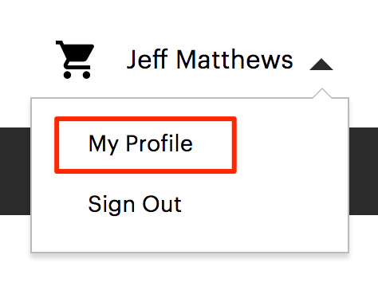
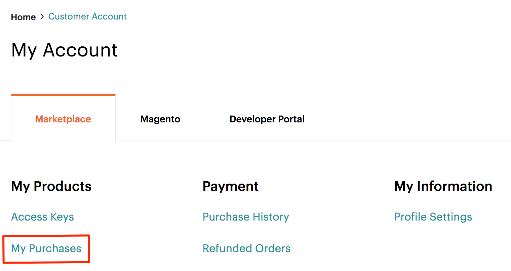

# Manage third-party extensions

Code that extends or customizes Adobe Commerce behavior is called an extension. You can optionally package and distribute extensions on the [Commerce Marketplace](https://commercemarketplace.adobe.com/) or another extension distribution system.

Extensions include:

-  Modules (extend Adobe Commerce capabilities)
-  Themes (change the look and feel of your storefront and Admin)
-  Language packages (localize the storefront and Admin)

This topic explains how to use the command-line interface to manage third-party extensions that you purchase from the Commerce Marketplace for _on-premises_ projects. For cloud infrastructure projects, see [Manage extensions](https://experienceleague.adobe.com/en/docs/commerce-cloud-service/user-guide/configure-store/extensions).

You can use the same procedure to install _any_ extension; all you need is the extension's Composer name and version. To find it, open the extension's `composer.json` file and note the values for `"name"` and `"version"`.

## Install

Before installation, you may want to:

1. Back up your database.
1. Enable maintenance mode:

   ```bash
   bin/magento maintenance:enable
   ```

To install an extension, you must:

1. Get an extension from the Commerce Marketplace or another extension developer.
1. If you install an extension from the Commerce Marketplace, make sure that the `repo.magento.com` repository exists in your `composer.json` file:

   ```bash
   "repositories": [
       {
           "type": "composer",
           "url": "https://repo.magento.com/"
       }
   ]
   ```

1. Get the extension's Composer name and version.
1. Update the `composer.json` file in your project with the name and version of the extension.
1. Verify that the extension installed properly.
1. Enable and configure the extension.

### Get extension information

If you already know the extension's Composer name and version, skip this step and continue with [Update your `composer.json` file](#update-composer-dependencies).

To get the extension's Composer name and version from the Commerce Marketplace:

1. Log in to [Commerce Marketplace](https://commercemarketplace.adobe.com/) with the username and password you used to purchase the extension.

1. In the upper-right corner, click **Your name** > **My Profile**.

   

1. Click **My Purchases**.

   

1. Find the extension that you want to install and make a note of the component name and version.

   

>[!TIP]
>
>Alternatively, you can find the Composer name and version of _any_ extension (whether you purchased it on Commerce Marketplace or somewhere else) in the extension's `composer.json` file.

### Update Composer dependencies

Add the extension's name and version to your `composer.json` file:

1. Navigate to your project directory and update your `composer.json` file.

   ```bash
   composer require <component-name>:<version>
   ```

   For example,

   ```bash
   composer require j2t/module-payplug:2.0.2
   ```

1. Enter your [authentication keys](../prerequisites/authentication-keys.md). Your public key is your username; your private key is your password.

1. Wait for Composer to finish updating your project dependencies and make sure that there aren't any errors:

   ```
   Updating dependencies (including require-dev)
   Package operations: 1 install, 0 updates, 0 removals
     - Installing j2t/module-payplug (2.0.2): Downloading (100%)
   Writing lock file
   Generating autoload files
   ```

### Verify installation

To verify that the extension installed properly, run the following command:

```bash
bin/magento module:status J2t_Payplug
```

By default, the extension is probably disabled:

```
Module is disabled
```

The extension name is in the format `<VendorName>_<ComponentName>`; this is a different format from the Composer name. Use this format to enable the extension. If you are unsure of the extension name, run:

```bash
bin/magento module:status
```

And look for the extension under "List of disabled modules".

### Enable

Some extensions don't work properly unless you clear generated static view files first. Use the `--clear-static-content` option to clear static view files when you're enabling an extension.

1. Enable the extension and clear static view files:

   ```bash
   bin/magento module:enable J2t_Payplug --clear-static-content
   ```

   You should see the following output:

   ```
   The following modules have been enabled:
   - J2t_Payplug

   To make sure that the enabled modules are properly registered, run 'setup:upgrade'.
   Cache cleared successfully.
   Generated classes cleared successfully. Please run the 'setup:di:compile' command to generate classes.
   Generated static view files cleared successfully.
   ```

1. Register the extension:

   ```bash
   bin/magento setup:upgrade
   ```

1. Recompile your project: In Production mode, you may receive a message to "Please rerun Magento compile command". The application does not prompt you to run the compile command in Developer mode.

   ```bash
   bin/magento setup:di:compile
   ```

1. Verify that the extension is enabled:

   ```bash
   bin/magento module:status J2t_Payplug
   ```

   You should see output verifying that the extension is no longer disabled:

   ```
   Module is enabled
   ```

1. Clean the cache:

   ```bash
   bin/magento cache:clean
   ```

1. Configure the extension in Admin as needed.

>[!TIP]
>
>If you encounter errors when loading the storefront in a browser, use the following command to clear the cache: `bin/magento cache:flush`.

## Upgrade

To update or upgrade a module or extension:

1. Download the updated file from Marketplace or another extension developer. Take note of the module name and version.

1. Export the contents to your application root directory.

1. If a Composer package exists for the module, run one of the following.

   Update per module name:

   ```bash
   composer update vendor/module-name
   ```

   Update per version:

   ```bash
   composer require vendor/module-name ^x.x.x
   ```

1. Run the following commands to upgrade, deploy, and clean the cache.

   ```bash
   bin/magento setup:upgrade --keep-generated
   ```

   ```bash
   bin/magento setup:static-content:deploy
   ```

   ```bash
   bin/magento cache:clean
   ```

## Uninstall

You should contact the extension vendor for instructions to remove a third-party extension. The instructions should provide the following information:

- How to revert database table changes
- How to revert database data changes
- Which files should be removed or reverted

>[!CAUTION]
>
>Perform uninstallation steps on a non-production environment _first_ and thoroughly test before deploying to your production environment.

The following instructions provide general information for uninstalling third-party extensions:

1. Remove the extension from your Adobe Commerce project repository.

   - For Composer-based extensions, remove the extension from your Adobe Commerce `composer.json` file.

     ```bash
     composer remove <component-name>
     ```

   - For non-Composer-based extensions, remove the physical files from your Adobe Commerce project repository.

     ```bash
     rm -rf app/code/<vendor-name>/<component-name>
     ```

1. If the `config.php` file is under source control in your Adobe Commerce project repository, remove the extension from the `config.php` file.

1. Test your local database to ensure that the vendor-provided instructions work as expected.

1. Verify that the extension is properly disabled and that your website works as expected on your staging environment.

1. Deploy the changes to your production environment.
