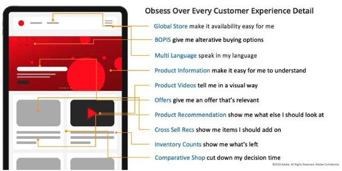
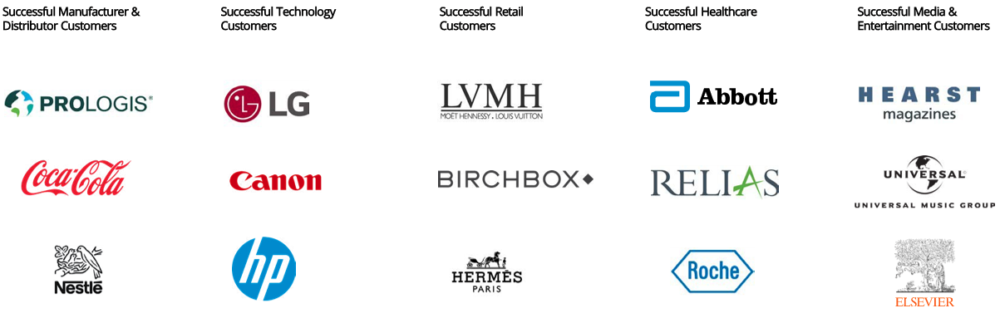

# What is ecommerce?

In the overlapping worlds of ecommerce—social selling and digital marketplaces—the customer experience gives consumers a choice to engage in the channel they prefer, so making the right choice on how you engage and sell online has never been more paramount. Ecommerce and online shopping are often used interchangeably, but at its core ecommerce is much broader than this. It embodies a concept for doing business online, incorporating a multitude of different services.

Ecommerce is experiencing monumental growth. It went from being a 1.3 trillion-dollar industry in 2014 to a 3.5 trillion-dollar industry in 2019. Experts predict that by 2023, it will reach more than 6.5 trillion, which means there is a tremendous opportunity for ecommerce brands to capitalize on conversion optimization. The power of ecommerce should not be underestimated as it continues to pervade everyday life and present significant opportunities for small, medium, and large businesses and online investors.

Whether you’re just starting your ecommerce business or you’ve been in the business for a while, you probably know that it’s hard to be successful, which is why we have compiled this guide on how to run a successful ecommerce business.

Here’s a quick summary of the types of ecommerce businesses out there according to each different category:

Here are the different ecommerce business models:

- Business-to-Business (B2B)
- Business-to-Consumer (B2C)
- Consumer-to-Consumer (C2C)
- Consumer-to-Business (C2B)

Here are the different ecommerce revenue models:

- Dropshipping
- Subscription
- Private labelling and manufacturing
- White labelling
- Wholesaling
- Rent and loan

Here are the different types of ecommerce website:

- Individual brand website (one seller)
- Online retailers (select number of sellers)
- Marketplaces (multiple sellers)

## Advantages and disadvantages

Ecommerce makes it possible for people to open the doors of their very own virtual stores. Selling online makes it easier for small, specialized stores and big brand outlets to reach a wide audience. However, just like traditional businesses, ecommerce has advantages and disadvantages.

### Advantages

- Ecommerce overhead is low in comparison to bricks and mortar
- Online stores are open 24/7
- Purchasing is instant
- Personalization and customized user experiences
- Global customer reach potential

### Disadvantages

- Competition online is fierce
- Shipping can be unpredictable

The advantages outweigh the disadvantages, which is why market, retailers, and merchant revenues are growing expediently.

## Customer challenges

Here are some common ecommerce challenges organizations encounter:

- You might use an outdated platform that makes visitors leave your site.
- Your site may be not responsive, forcing mobile visitors to head elsewhere.
- Your internal team might lack structure and skills to be able to effectively run a commerce platform.
- You might question whether your infrastructure is the right fit for your business.

Customer expectations are rising and there are always new growth techniques to surge your conversion rate. This playbook will look to outline and explain in more detail how to address some of these customer challenges and successfully run an ecommerce site to its full potential.

## Commerce industries

