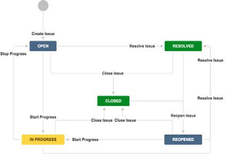

# Communication

Communication is critical to the success of an ecommerce project.

## Communication processes

Creating a strong communication process within any ecommerce team is about managing all assets and processes as efficiently as possible and investing in the people that matter. Part of the strategy that businesses need to adopt is about delegating tasks to the right people, or software, in their teams. In general, every ecommerce business needs to tackle three main areas: 

- Product
- Customer acquisition
- Customer retention

Most roles fall under these three areas.

Listed below are some of the process’s ecommerce businesses should adopt in order to operationally tackle, manage, and improve those three areas effectively.

- Create workflow and task management solutions that your team can easily access and understand
- Design an efficient onboarding process
- Create a workflow that employees can use across product management, ecommerce operations, order fulfillment, and distribution

## Communication tools

It is common knowledge that poor communication within any working relationship is detrimental to organizations and teams. Studies have shown that financial losses per year are in the millions due to inadequate communication between employees. It’s likely that staff take on varied roles and responsibilities, which leads to them being pulled in many directions. Fortunately, there is an array of technology available to help people stay open and connection through clear lines of communication.

We will explore some of these tools, which have been found to be very impactful within large and small organizations.

### JIRA

Application tools for project management and issue tracking have been around for quite some time now. Such tools simplify the communication process among employees and ensure the scalability of the project or platform. 

JIRA has been known to tick all the boxes when it comes to the exchange of information and fundamental project management. The application allows teams to share more knowledge and information, which lead to a better understanding of business objectives, goals, and tasks within any team. When used well it can improve the collaboration and efficiency within an organization.

The following list includes ways JIRA can be used within any organization:

- Manageable Agile workflows
- Unlimited custom fields and swim lanes
- Bugs and test management
- Seamless source and issue integration
- Search and filtering
- User mentions and multiple assignees
- Project planning
- Task management
- Resource management
- Resource plannings
- Advanced reporting
- Customizable JIRA boards
- Out-of-the-box Kanban and Scrum boards
- Advanced security and administration
- Integration with flexible REST APIs
- JIRA hosting
- Effectively import data from other systems

#### JIRA workflow example

JIRA allows teams to create and write detailed tasks, generate reports, customize workflows, and assign jobs across individuals relatively fast. 

Commerce Managers, Marketing and Development teams, even C-level stakeholders can track the daily, weekly, monthly, and yearly progress of any given JIRA task or project. The Atlassian project management tool comes in three versions including JIRA Align, JIRA Core, and JIRA Software.

The benefits of using JIRA within any ecommerce business is the ability for multiple teams to collaborate using one platform. Many times, companies witness the marketing, development, creative, and ecommerce teams all working in different silos. Having a project management tool like JIRA enables each team to represent different priorities. Issues can represent anything teams want to track and are all contained within different projects that are made up of recurring tasks teams need to complete. Each issue goes through a process called a workflow.

The right workflow can make or break communication lines. Teams can create their own workflows to define the steps an issue follows toward completion. Jira allows businesses to customize workflows to suit their requirements and obligations while easily matching how teams work most efficiently. 

As issues are tracked throughout a workflow, all members of the team, department, or even business gain visibility into their status. A workflow also ensures that an issue passes all the steps before it’s complete—that’s how teams remember all of these priorities.

### Confluence

Creating a rich knowledge and information bank can be tedious. It takes a willing team to come together and pay attention to creating processes around how documentation is managed. When done correctly, however, creating a proactive knowledge base can dramatically reduce the number of issues in your support queue and save your team hours of work.

Whether you are launching or maintaining a website or documenting fundamental ecommerce processes, Confluence is an interactive space where individuals from across the business can create, plan, and provide feedback on all types of documentation.

Ecommerce teams can create standardized templates and checklists for deployment preparations, product launches, how-to articles, test scripts, and troubleshooting. In addition, the Confluence application is an Atlassian product and integrates well with JIRA. The two applications can work together harmoniously. The content created is easily accessible to teams throughout the organization and allows everyone to collaborate on topics in one space.

### Stand-ups

In the world of start-ups, stand-ups were born. Businesses increasingly use meetings to review their processes. Research has found that in general employees prefer fewer meetings, but to have a clear line of communication and openness, getting people together occasionally is important for the success of any business and more specifically ecommerce operations.

Therefore, as a more casual alternative to long and rigid meetings, companies of all sizes have moved to a more relaxed stand-up style of meeting. The culture of stand-ups within any ecommerce team allows for short and quick discussions, where all members are given the chance to talk, goals are set, and strong team bonds maintained.

The use of stand-ups within any ecommerce team are particularly useful when planning for deployments, managing deliverables, and debugging issues.

## Team communication

Team communication skills are taught in many different settings, but company culture sets the tone.

Here are some tips for how to improve communication:

- Keep your messages clear, use simple language, and stay away from jargon. Although your teams may be expected to know ecommerce terminology, jargon can still impede understanding.
- Meet your team where they feel comfortable, whether that is through traditional written or video messages sent via email.
- Use JIRA and Confluence for project management, planning, and documentation
- Keep stand-ups short and impactful for the whole team
