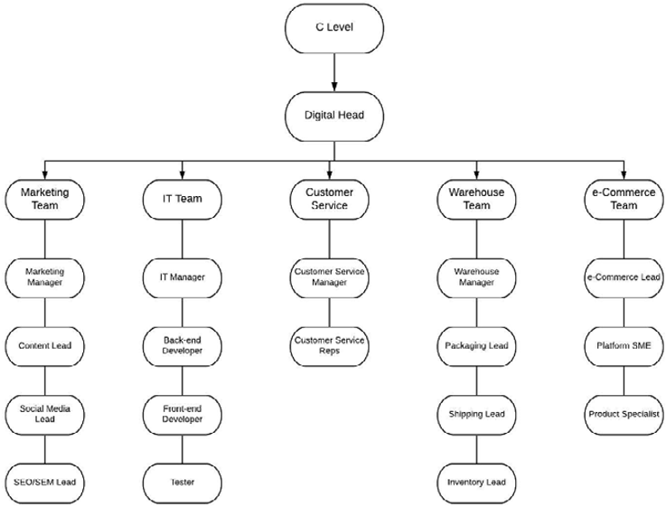
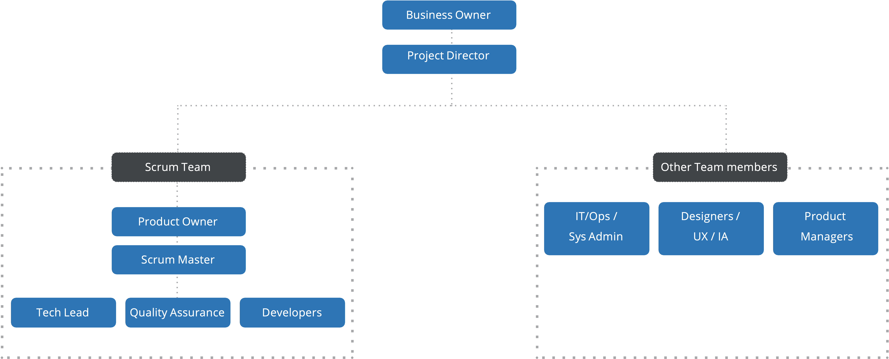

# Organizational structure

For digital implementation projects, there is usually a centralized team structure which is implemented. There are individual teams  which have a team lead which then reports to the head of digital, ecommerce lead or the product owner. 

The following diagram shows an example of how the organizational structure would look:

Benefits of this form of centralized model in a digital implementation project include:

- Promotes control and consistency
- Unifies budget and strategy
- Helps scalability
- Supports wider business

## Project-based structure

The following diagram shows an example of a recommended project-based organizational structure:

