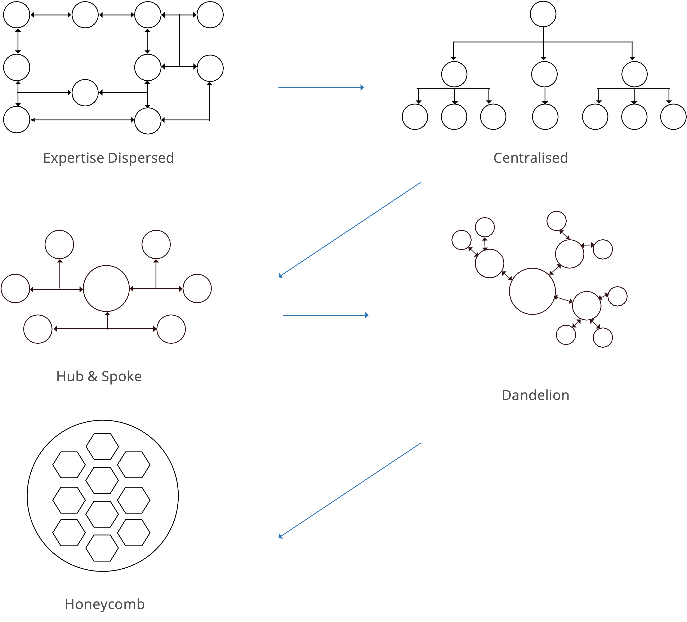

# Team structure

Team structure refers to a combination of either an individual team or a multi-team structure. Team structures are a fundamental part of any team process. A correctly enabled team increases effective collaboration, communication, support, leadership, problem-solving, and decision-making.

Team structure allows individuals to work together towards a common goal. There are different types of team structures that range from being hierarchical to being flexible, which work differently for different industries.

The following diagram summarizes the different team structures found within organizations:

>[!NOTE]
>
>As part of a typical ecommerce workflow, a centralized team is the most common of the five types displayed below. The honeycomb structure aligns best with Agile workflows.

