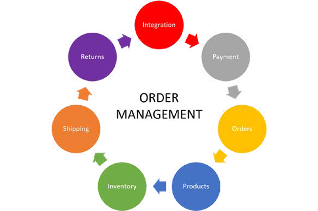

# Order management

For brand new businesses, order levels are low and it is easier to
complete orders at a lower cost. However, when demand increases orders increase and it becomes difficult to handle orders with a small team or by yourself at a lower cost. You might need a larger facility, like a warehouse or more than one warehouse depending on the nature of the business, which can be costly and requires more staff. This is where order management comes into the picture.

Order management helps meet the changing operational requirements for managing demand, inventory, packaging, and shipping. Integrating an Order Management System with the Platform can help businesses meet their changing requirements and drive customer satisfaction, customer retention, higher conversion rates, and brand loyalty. All these factors directly and indirectly impact the performance and revenue growth of your business.

Order management systems help centralize all the crucial data in one system, which provides a single view of all streams, including orders, products, customers, inventory, packing, returns, and payments so that you can easily meet customer expectations.

Order management is essential in any ecommerce business because it forms a chain and binds all of the factors together so that the business can do the following:

- Keep inventory in check be it in multiple warehouses
- Maintain the product stock level sow they are prepared for any promotions or sale period
- Provide multiple payment methods to the customer to enhance customer experience
- Provide order tracking making it convenient for the customer to check the order status and for their in-house customer service team to speed through any inquiries
- Provide support to all the departments in the business so that no one is misaligned
- Keep shipping in check to know if there is a requirement of more staff or shipping methods to speed up the order shipping
- Monitor return to understand why the returns re being made by the customers so that they can work on that and improve
- Helps to understand the overall experience of the customer if they were satisfied with their purchase or not and how can the business improve to better serve the customers

The correct Order Management system and the right use of it can do wonders for the organization in terms of revenue. It saves money and time, provides an overview of the different departments that are working together, and helps the business forecast demand and work on improving customer experience to increase conversion rates.

