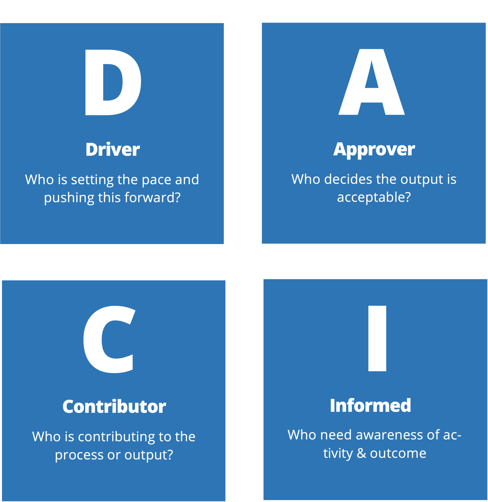

# Project management framework

The DACI model is a project management framework used to clearly define the roles and responsibilities of various stakeholders on a project, leading to effective and efficient group decisions. DACI stands for Driver, Approver, Contributor, and Informed. These roles make it clear who has authority in certain areas and situations, allowing a project to progress smoothly.

