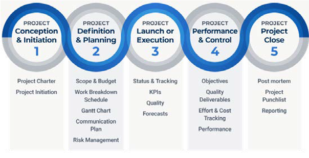
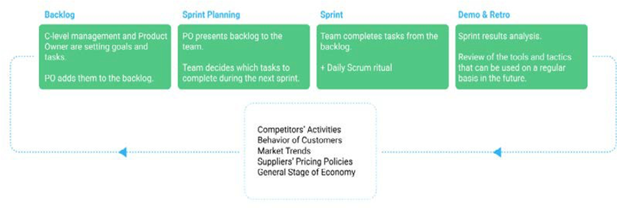

# Project management

Project management is the application of knowledge, skills, tools, and techniques to achieve goals and successfully meet project requirements.

The following diagram describes the five phases of project management and the project management life cycle:

The project management life cycle provides a timely and controlled delivery process that benefits a;; project stakeholders. The first step in delivering a successful ecommerce project is project management. The right approach and methodology is necessary for enabling the team to deliver the project effectively and efficiently.

Some teams choose the Scrum project management methodology for their ecommerce projects. The Scrum features mentioned below help to facilitate and manage the project:

- Periodization of tasks
- Periodization of backlog tasks before and during the sprint
- Daily team stand-ups
- Planning session for each sprint
- Sprint retrospectives

Scrum helps manage changes during the project, allows teams to show quick results, is flexible, and increases collaboration.

## Basic project plan

A basic ecommerce project management plan includes:

- **Analysis**—In the initial stage of a project, the business needs to conduct analysis, including market and competitor business analysis to understand the organization's strengths and weaknesses.

- **Requirements**—Define detailed requirements of what the organization wants at the end of the project in terms of enhancing existing skills and/or implementing new features and/or integrations.

- **Third-party providers**—In this stage, map out the required third-party integrations (for example, payment, shipping, ratings, and reviews).

- **Design**—Brainstorm design-specific requirements for templates and the company's brand book.

- **Migration**—Plan out the steps for migrating content and data.

- **Ecommerce platform**—Analyze and finalize the platform required for the business to meet the requirements.

## Best practices

Some best practices that businesses can refer to for project management include:

- Setting clear, precise, and trackable goals
- Monitoring time spent on tasks and resources to avoid waste
- Selecting the correct ecommerce tools required by the team, such as the ecommerce platform and communication tools
- Testing and iterating should happen constantly
- Tracking budget
- Keeping scope creep in check

There are many different aspects to consider when developing an ecommerce site. Project management provides the structure you need to track project goals, timelines,and deliverables and align team members on progress.
