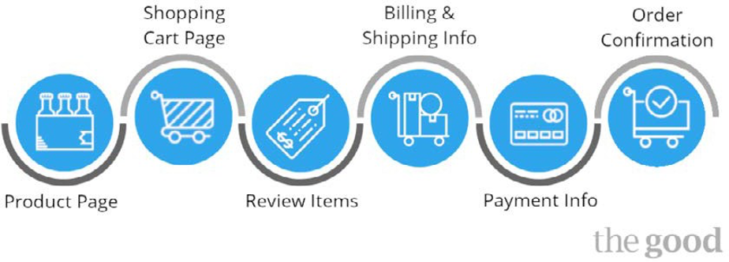
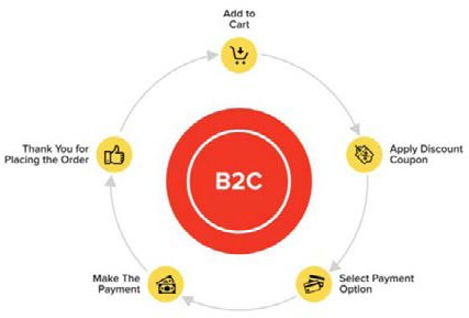
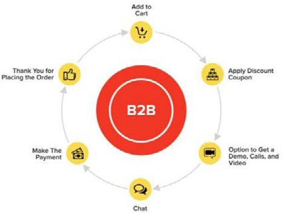

# Checkout flows and process

Checkout is a critical part of online shopping. This is where the real money is made. Retailers tend to focus more on the look and feel of the website and overlook the checkout flow, but both parts are equally important.

Checkout flow is like the finish line, where shoppers turn into customers making transactions. But even a small hitch in the checkout can have a huge negative impact on the conversion rate and ROI, thus, improving the conversion rate even slightly can help the increase ROI massively. Improving checkout flows and processes starts even before the checkout page.

## Product pages

Try to keep all the information before the page fold, such as product details, pricing, product images, reviews, and ratings. All of the factors that are needed for the customer to make a decision to purchase the product.

Add sections such as "You might like", which displays products that are related to the product that a customer is currently looking at. This is a strategy used to make the customer purchase more.

## Streamline checkout process

Try to have limited steps and fewer clicks on the checkout page to fast track the process. For example, checkout needs to include:

- Shipping
- Billing
- Payment

Implementing an easy and convenient checkout eliminates the risk of cart abandonment.

## Visual checkout flow

Display a visual checkout flow where the shoppers can see the preview of the number of steps involved to complete the purchase.

## Remove extras

Remove extra information, such as the minibag, search, and/or navigation bar. This helps the customer focus on the checkout process rather can navigating to another page.

Have clean and bold CTA buttons with a simple page design.

## Trust

Customers shopping online are always concerned about security. To provide assurance to customers, display the following on the site:

- Credibility accreditations such as Norton secured, MacAfee secure, and Google Trusted Store
- SSL certificates
- Payment method logos
- Ratings and reviews
- Policies
- Terms and conditions

## Checkout options

Provide different checkout options, like:

- Guest user
- Registered user
- Create an account

Do not force one type of option on the user.

## Shipping options

Retailers should provide different shipping methods to meet the needs of different customers.

Besides payment options, retailers can also provide options like [click and collect](click-collect.md).

## Payment details

Payment details should be placed at the end, right before confirming to place an order.

Provide an easy mode of entering payment details, like the name on the card and card number.

Provide an option for the user to save their credit details for the next purchase.

## Order summary

Provide a detailed order summary before the user confirms the purchase.

## Order confirmation

Display a thank you message with the order confirmation details to provide the customer with the confidence that they have successfully placed an order.

Some retailers also provide promotion messages if the user has checked out as a guest to promote signing up to be a registered user.

## Emails

Always follow up the order confirmation with an order confirmation email that outlines all of the order details and tracking facility.

Checkout is a driving factor to increase the conversion rate to in turn increase ROI. It is necessary to streamline the checkout process to provide a user-friendly, quick and convenient checkout experience. It is not one size fits all when it comes to the checkout flow and process, so it is essential for retailers to research, analyze, and test the best options.

## B2C vs B2B checkout

There is a difference between B2B and B2C checkout flows and processes.

### B2C

- Able to change quantity
- Able to delete product from cart
- Simple checkout
- Different payment options, such as credit card, and e-wallet
- Able to add coupon code to checkout

### B2B

- Able to change quantity
- Able to delete product from cart
- Simple checkout
- Different payment options such as purchase order, bank transfer, or check
- Simple process to reorder

