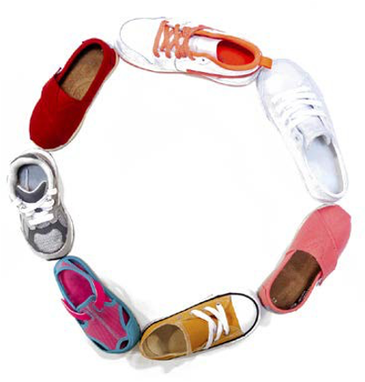

# Click and collect

Click and collect has become an integral part of omni-channel strategies because it promotes increase in footfall, customer experience, and ROI. Click and collect is no longer just for big supermarkets, it is becoming a part of both B2B and B2C organizations.

## Tips

Businesses should follow these ten tips to deliver a good click and collect service:

- Deliver
- Promotion
- Stock availability
- Store locator
- Mobile friendly
- Store options
- Fulfillment options
- Order status
- Additional cost
- Collection in-store

### Deliver

When deciding to implement click and collect, businesses must consider how they plan to deliver click and collect to customers, such as service types:

- **Online payment and collect in-store**—The user pays for the product online and after the payment is confirmed the store notifies the customer when the product is ready to be collected based on the customers store selection. Collecting payment first helps reserve the product.

- **Reserve product online, payment and collection in store**—In this service type the customer does not pay online when reserving a product. In this type of service, the customer can change their mind and might not purchase the product.

- **Integration**—After the delivery type is selected, businesses need to decide on integration structure (where the orders are sent, where the orders are fulfilled). Stock can be fulfilled from either a central warehouse or directly from individual stores.

- **Returns**—Returns can be complex. Businesses need to have a clear strategy to manage returns for delivered products and products ordered using click and collect. Businesses need to allow customers to return products they order through click and collect to provide end-to-end customer service.

## Promotion

Businesses need to  market their click and collect service. If no one is aware of the service, then it isn't useful and will not generate the required return on investment. Even though click and collect services are usually the same, it is still essential to explain to the customer the steps to use click and collect.

## Stock availability

Businesses need to display real-time stock levels to customers when they select click and collect. This displays the stock level to customers in their preferred store. For this to function properly, the warehouse and ecommerce platform must be integrated to keep the inventory levels in check and avoid customer complaints.

## Store locator

Businesses need to ensure that they display all of the store information from where the customers can collect their order through click and collect. The store should provide information, such as store address, store timing (including public holidays), and contact number.

## Mobile friendly

With the growth of mobile users, businesses should take design their ecommerce website to be responsive. Businesses should provide the same experience to customers on all devices.

## Store options

Some stores might not be easily accessible to some customers. It's a good idea to provide other locations for click and collect, such as the post office or convenience store.

## Fulfillment options

If all the products that a business sells on the website aren’t available for click and collect, then the business should display the shipping method provided for that product. This could be a bit inconvenient for customers, so it is better to offer click and collect for as many products as possible.

## Order status

Communication is key for customer service even when it comes to click and collect. Communicating the order status after purchase, such as where and when they should collect their order, and whether they must bring personal identification to collect their order is important. The status should not only be communicated though SMS or email, but also on the site under tracking order.

## Additional cost

Some brands charge an additional service cost if the order is less than a certain value for click and collect. However, research has shown that providing free click and collect increases footfall on the website and increases conversion rates, which in turn increases ROI.

## Collection in-store

Regardless of whether the business is B2B or B2C, it must provide the best customer service. It is essential to provide in-store information to customers, such as where the collection point is located in the shop. Designate a section in the store for click and collect. Ensure customers do not have to wait long to collect their order. Some brands also provide click and collect parking, where the user enters the details for click and collect parking and and the store employees bring their order to them.

These are just some examples of personalization. There are countless more features and capabilities that can be explored as per the requirement of the business. Keeping up with constantly changing market trends can be difficult, but it helps improve overall customer experience.
