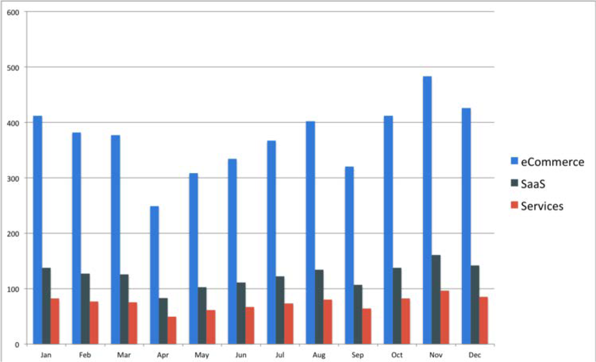

# Customer service

Ecommerce is digitally based and the only team who interacts with the real customer behind the transaction is the Customer Service team. Customers expect a high-quality experience and if they do not get that retailers could lose them as customers. Customer Service teams in the ecommerce industry receive the highest number of calls, messages, and emails compared to other industries.

Retailers need to be pro-active in terms of customer service because not only is the brand name at stake, but most importantly its the customer’s loyalty. For retailers to be successful in providing the best customer experience, there are some best practices that they can follow:

- **Multi-support channel**—Providing service through email or phone only is not enough in today’s era. Customer service needs to be provided on various channels, such as live chats, emails, phone calls, social media, and or text messages. Each of these has their own pros and cons that retailers needs to analyze.

- **Personalized service**—All customer activity is done online, which retailers can track to understand customer behavior. For example, when a customer reaches out to the Customer Service team, the team will have their information beforehand, such as their name, email address, order history, and returns. This helps the Customer Service provide quick and accurate service and also provides customers with personalized service.

- **Self-service**—Customers can also be provided with self-service, such as providing FAQ’s, privacy policy, terms and conditions, and forums.

Retailers should put themselves in the customer’s shoes to understand their problem and provide the best customer experience. Customer experience keeps the customer loyal and promotes the brand.

## B2B vs B2C

Customer service is important for both B2B and B2C businesses, but the concept of customer service is different between the two:

- B2B businesses tend to have involve a lot of stakeholder’s and more complex issues that take more time and effort to resolve, whereas B2C businesses usually consist of regular issues.

- B2B businesses have fewer customers, but it is essential to provide the best customer service to retain those customers. B2B products also tend to be more complex and larger so there is significant impact on the ROI.

- In B2C businesses, the Customer Service team talks to one person who made the transaction, whereas with B2B businesses there are multiple stakeholders, so the Customer Service team might receive calls from different stakeholders if there are any issues.

- B2B Customer Service teams must bond with the clients to have a deeper understanding of their requirements, whereas B2C businesses rarely have a relationship with clients

Retailers should put themselves in the customer’s shoes to understand their problem and provide the best customer experience. Customer experience keeps the customer loyal and promotes the brand.
