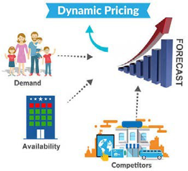

# Dynamic pricing management

Dynamic pricing is a responsive pricing strategy where the price changes based on the demand, supply, trend, and competition in real-time. It is not a new concept; it has been around for a while now but is surely taking over ecommerce. Dynamic pricing gives retailers the leverage to change prices to have a competitive advantage. For example, you can try decreasing the price of a product that isn't selling well to try increasing sales.

There are three factors that drive dynamic pricing, including:

- **Industry**—Retailers need to check what is the most basic price of a product among other brands.

- **Market**—What is the current supply and demand? What is the predicted supply and demand?

- **Customers**—What is the customer purchasing behavior? What is the price the customer is willing to pay for a product.

You need to look at every aspect when working on a dynamic pricing strategy.

## Advantages

Like any other strategy, dynamic pricing has advantages and disadvantages. Some of the benefits of applying a dynamic pricing strategy include:

- Allows retailers to gain insights on customer purchasing behavior and market trends

- Retailers can set different product prices based on the most basic price set for the product by other brands

- Allows retailers to analyze what price would be most acceptable for the customer to spend

- Helps to maximize ROI

- Provides retailers with a competitive advantage

## Disadvantages

Some of the disadvantages of dynamic pricing include:

- Not regularly updating the price. Even though software manages the price, it is essential that human interaction is available constantly

- Fluctuating prices often confuse customers (some customers might wait for the prices to change again or some customers might lose trust)

- Competition with other brands might increase initially when the strategy is applied

## Best practices

Some best practices that you can apply when implementing a dynamic pricing strategy include:

- Set a good pricing strategy that is more initial pricing based. Initial pricing is straightforward and helps you understand the market and the market pricing.

- Introducing a loyalty program can help introduce different dynamic pricing levels for different types of customers

- Analyze real-time demand for products when setting prices

- Apply a holistic approach when implementing dynamic pricing because a product can be different prices in different stores (for example, a hot Dog in IKEA costs less than buying a pack of buns at the supermarket)

The most effective way to benefit from implementing a dynamic pricing strategy is continuously learning about your customers, competitors, and the market.

## B2B vs B2C

Dynamic pricing differs between B2B and B2C businesses.

### B2B should

- Provide customized pricing for customers

- Automatic change in price based on the quantity

### B2C should

- Maintain consistency

- Maintain price

- Display promotions and discounts

- Terms and Conditions to be displayed
