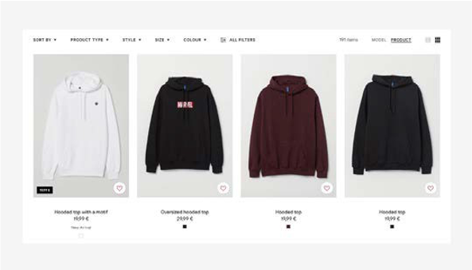
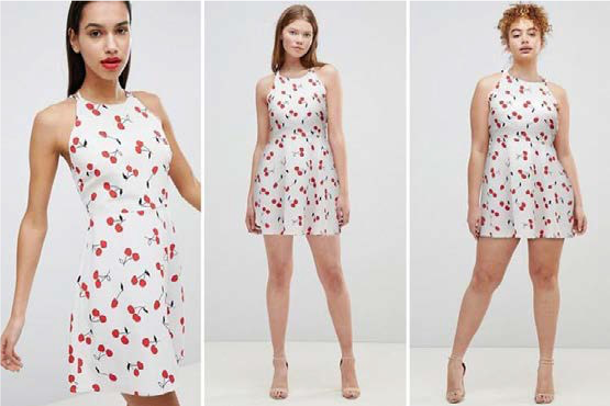
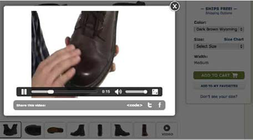

# Product images

Ecommerce is entirely based on the online experience. Customers visiting your website should be intrigued to purchase the products available, which will increase your conversion rate. Many factors play a role in increasing ROI. One such a factor is the product image. Product images play a major role in attracting and convincing customers to purchase a product. You can use the same product images for both B2B and B2C.

In reality, customers can feel and try the product, but when purchasing online they do not have an option to do so, therefore, it is necessary to provide detailed information about the product. Along with details, it is essential to have high-quality visuals of the product like images and videos to help customers understand the product before they decide to purchase. Product images are the first thing that customers see on your website, even before the product description, name, or price.

Different types of images can be used as per the requirement of the business.

## Product image on flat surface

## Product images with models

## Featured product images

## Lifestyle images

## User uploaded images

## Product packaging images

## Unboxed images

## Product video

## Best practices

- **Demo the product**—If the product has a defined purpose, then demo the product to show its functions and features.

- **Promote user-generated images**—Users uploading their images with the product as a review, which motivates other shoppers to purchase the product.

- **360-degree view of the product**—Uploading a 360-degree video or GIF of the product can provide a detailed view to the customer and motivate them to purchase the product.

- **Naming convention**—Make it a rule to follow a naming convention for the product image, which helps to minimize the error of uploading an incorrect image for a product and helps the team easily manage images.

- **Page load**—Do not upload images that will increase page load time. If a customer must wait for the image to display, they might leave the site.

- **Simple content**—Do not over-complicate the content. Try to keep the content simple and attractive where the focus is the product. For example, one best practice is to have the product image on a white background to enhance the product image.

- **Real product image**—When a customer purchases a product online, they expect to see the product as it is on the website. Avoid applying filters or enhancing the image to alter the way the product looks. It is important to be transparent with the customer, otherwise you could have a high rate of returns.

>[!TIP]
>
>Remember, the goal of product images is to show the customer what the product it is, how it looks, and motivate them to buy it.
