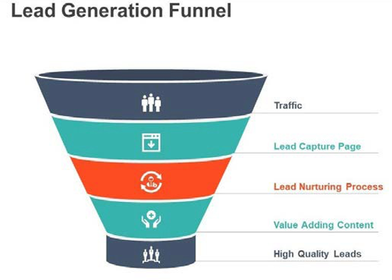

# Lead generation

In the ecommerce industry, a lead is anyone who shows interest in the brand and its products; be it clicking on the website, checking out an advertisement on social media, or exploring products. Generating a lead in the ecommerce industry is a critical part of the business because a lead today can be a customer tomorrow. Lead generation is a long process that takes time and requires patience.

The following diagram shows a simple workflow that retailers can use for lead generation:

## Best practices

Lead generation best practices include:

- **Unique content**—Retailers need to do their research and find out what customers like, what they are interested in, and what they want to purchase. Content needs to grab customer attention, intrigue them, and create a bond with them. Content is not only limited to videos and images, but also includes social media.

- **Online communities**—You can have online communication, such as an Instagram page or Facebook community where people can post reviews, questions, or concerns. The Customer Service team can actively be involved on social media.

- **Influencers**—You can pay influencers to promote your brand. Influencers have a fan base (a group of followers) who listen to them, which can be beneficial for your brand. You cancan either collaborate officially or send free products to the influencer for them to promote.

- **Social media**—Having a social media presence is important for brands nowadays. Brands need to ensure they make their presence felt by posting regularly, posting content to target different customers, making sure the content is correct, and always reposting to comments on original posts.

- **SEO**You need to have good SEO in place because SEO ranking increases site traffic and gives your brand a better chance getting noticed.

- **Paid campaigns**—You can focus on posting paid campaigns, which brings focus to your site.

- **Unhappy customers**—You should reach out to customers who are not satisfied.

Though lead generation might not be easy, it is necessary if you want your brand to succeed in the market and to have a competitive advantage.

## B2B vs B2C

Lead generation is different between B2B and B2C businesses:

- **Sales cycle**—Lead generation for B2B businesses is much longer compared to B2C businesses because B2B contracts are for long-term time periods compared to B2C transactions. The prices, time, and resources allocated for B2B transactions are greater. B2C sales cycles are much shorter and involves less less time, money, and resources.

- **Content**—B2B customers usually have more knowledge about products because they do more product research, whereas B2C customers typically purchase based on market trend content.

- **Audience**—B2C businesses reach out to a wide range of audiences whereas B2B businesses have specific audiences

- **Goal**—B2C businesses tend to attract customers from a market that is highly saturated, whereas B2B businesses build relationships with clients on trust. Both B2B and B2C businesses have the same end goal, which is to increase ROI.

- **Interaction**—B2C customers make purchase decisions individually, whereas multiple stakeholders are involved in the decision-making process for B2B purchases.

There is no set method of generating leads, but it is possible to increase lead generation by analyzing the methods that best suit the needs of the business and help to shape the organization.
