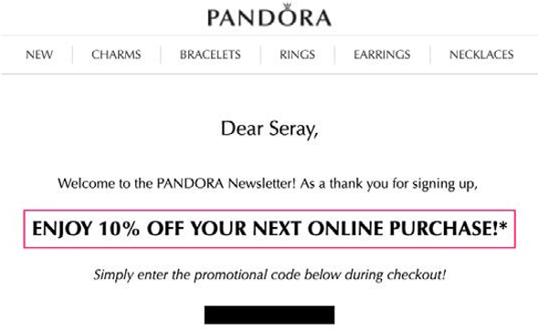
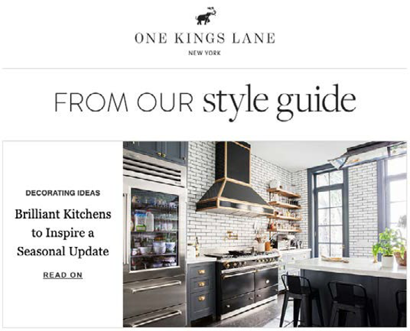
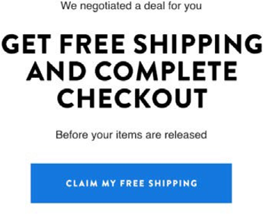
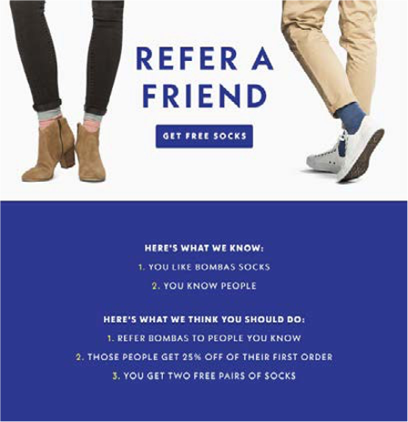
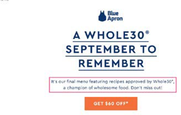
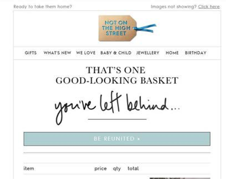
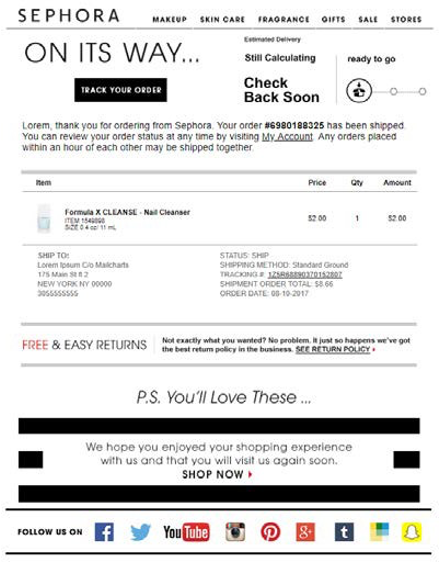
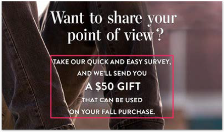

# Email marketing

Email marketing (in simple terms) is sending marketing messages to leads and current customers through emails to promote, attract, and sell products to customers. Marketing teams have full control over retrieving customer information and sending customers personalized content through direct email campaigns. Email acts as a tool that helps build a relationship between your customers and your brand.

Why you should consider email marketing:

- Lets you build a relationship with current and future customers

- Helps drive sales and increases conversion rate

- Helps accelerate business growth

- Does not require a third-party, such as Instagram or Facebook

## Welcome email

Making the first impression last is essential in an ecommerce business. If the first email you send to new customers is effective, it will leave a lasting impressions in the customer's memory. Try to keep the design simple and original. For example, some brands provide discounts in the email when the customer signs up.

## Curated email

Curated email is one of the best forms of email because it allows subscribers to learn more about the product. You can also send curated emails based on customer segmentation.

## Engagement email

Customers can easily overlook emails, but if emails are sent as engagement emails, the probability of a customer deleting it without looking at it is lower. Engagement emails can be in the form of a campaign that provides users with a promotion, such as free shipping.

## Referral email

Word of mouth is one of the best marketing strategies. For example, sending referral email to an existing customer. For example, "Refer a Friend and Receive $10!" Referral email motivates customers to spread the word organically, which helps you gain more customers.

## Discount email

Offering discounts through email is an effective marketing strategy. You should offer discounts to subscribers to retain their loyalty.

## Abandonment email

Customers abandon their carts for various reasons, including high shipping costs or unsatisfactory return policy. You can try converting those customers to successful shoppers by sending them a reminder email about the product that they left in their cart. In addition, you can offer incentives to complete their checkout, including free shipping, a discount, or a voucher for their next purchase. This helps increase the conversion rate.

## Order confirmation email

Order confirmation emails not only help boost sales, but also give customers confidence that they placed their order, which increases customer experience and loyalty.

## Survey email

After customers receive their orders, you should send a follow-up survey email to ask about their experience and suggestions of improvement. Some retailers also provide a gift voucher if customers complete the survey because most of the time customers do not complete surveys since there is no motivation for them to do so.

