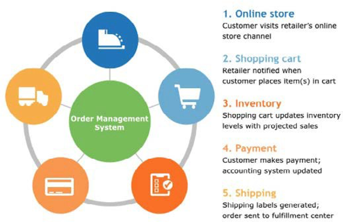

# Order management system (OMS)

Online shopping is increasing at a rapid rate and companies are competing to provide the best service to attract customers to their site. To have competitive advantage, retailers need to grow their digital footprint, which includes selling online, other marketplaces, and even partnerships.

An ecommerce OMS is the backend system responsible for managing online orders, including packaging, shipping, returns, and subscriptions. An OMS needs to allow retailers to be one step ahead of their competitors and to be more scalable, flexible, and adaptable. The OMS should allow the business to meet the customer demands and easily change with the market.

An OMS provides integration and automation through the customer order journey in the backend, which allows retailers to provide enhanced customer experiences. An OMS helps retailers process orders coming in from multiple channels and facilitate packing and shipping to different locations while providing customers with real-time updates though different mediums.

An OMS is important for an ecommerce site because it helps brands grow. Customers have high expectations, which leaves no room for error. Some of the reasons why an OMS is essential include:

- **Provides faster delivery**—In an age of next day or 2-day shipping, businesses need to look for ways to push their orders out faster as the window for completing orders is becoming narrower. An OMS gets immediately notified when an order is placed, and the OMS can choose the closest warehouse to the order destination to help expedite delivery. The OMS sends automated order information to the warehouse team to prepare and pack the order to ship using a cost-effective shipping method.

- **Limited errors**: An OMS helps reduce human errors. These errors can be time-consuming and expensive. An OMS notifies the team when inventory levels are low, when a product is not selling, or what product has the highest return rate. This helps the business to rectify shipping errors and analyze the reason for returns.

- **Increase in scalability**—An OMS scales according to the need of the business, unlike older manual systems. OMS software gives businesses the option to scale with the market.

- **More multi-channel possibilities**—In an era of multi-channel sales across websites, marketplaces, or partnerships (Facebook and Instagram), tracking orders can be complex because they are being shipped to several locations using one or more shipping methods. An OMS brings it together and increases customer experience.

## Key features

- Integrates with the company system or systems
- Eliminates manual processes
- Provides service internationally
- Generate reports to forecast and understand order data

Businesses/retailers need to select the appropriate OMS that best suits their business needs. Businesses should start with the following considerations:

- Understand their customer orders, products, inventory, shipping, and packing

- Decide how and when the OMS communicates with company systems during the order process

- Determine what the OMS should do when an order has been placed (for example, which company systems should it communicate with?) and what the next step should be after that communication

- Decide which tasks in the warehouse should be automated, such as calculating shipping costs, allocating the shipping method, packing slips, and updating inventory

- Communicate out of stock products to vendors, production team, and suppliers to restock the product

- Notify customers and internal teams about shipping progress

- Automate refunds, update inventory, and send information to customers and internal teams after a return

- Determine if the business can afford a full-fledged OMS (or parts of it)

- Plan a project to implement the OMS and train the team to use it

An OMS can help control costs, increase ROI, speed up the fulfillment process, and improve the customer and internal team experience.

Order management in B2B businesses is intricate compared to B2C business. B2B businesses usually have a higher cost when it comes to retaining customers because they have a different purchase cycle compared to B2C businesses. The B2B purchase cycle takes longer because it involves request for proposals (RFPs) and purchase orders (POs). B2B orders tend to be reorders where B2C orders tend to be high in volume and smaller in size.

## Process for B2B

- The sales representative enters the customer’s order details into the OMS or the customer can also place an order online, which will send the order details to the OMS

- The customer receives the order confirmation

- Products are allocated to the order

- The order details are sent to the warehouse where the products are packed

- The inventory is updated

- Order status is sent to the customer

- Order is shipped to the customer

Order management can be effective for B2B and B2C businesses where the OMS:

- Allows omnichannel or multichannel adoption

- Is usually cloud-based, which allows organizations to go paperless and helps improve overall efficiency

- Helps to centralize information from multiple channels

- Reduces complexity once it has been implemented

- Helps to track orders

- Improves customer experience

- Helps speed up the delivery process

When implementing an OMS, B2B businesses need to understand that they will not be able to serve customers such as B2C businesses. An OMS needs to be implemented differently for both B2B and B2C businesses depending on their requirements.
