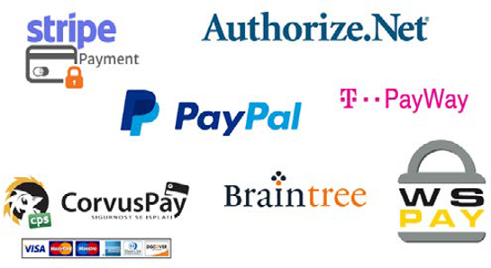

# Payment gateways

There was a time when cash was the main source of transactions, but the online world has taken over and online payment methods are replacing old payment methods. Everything is now online, which makes things easier and more accessible, including credit cards, e-wallets, and bank transfers.

A payment gateway is a service provider that connects and processes payments for ecommerce websites. They play a vital role in the customer buying experience and conversion rates. Complicated payment systems tend to make customers abandon their carts. It’s important to provide customers with an easy, user-friendly payment system where even if one payment method fails they have an alternative method to motivate them to complete the purchase.

## Review requirements

Retailers need to select the best payment gateway that meets their requirements. There are many payment gateways in the market, like Braintree and Stripe, but before decide decide on a payment gateway, ask yourself the following questions:

- What is my business requirement?
- Is it within my budget?
- How strong is the security on the payment gateway?
- Will there be any impact on my storefront UX/UI?
- How well does the payment gateway perform?
- How is the support service of the payment gateway after purchase?
- Which payment gateway provider suits me best?
- Does the payment gateway offer other functions, such as calculating tax, using geolocations, and calculating service fee?

There are some limitations of payment gateways that you need to be aware of, including:

- Not all types of cards are accepted by payment gateways.
- Some payment options might not be available for international shoppers.
- Security loopholes in the payment gateway. Customers tend to hesitate placing online orders due to security reasons.

When a business decides to integrate a payment gateway with their platform it is always better to see how it appears on the storefront, what kind of experience does it provide customers, and if it is user-friendly. Also, make sure that the security of the payment cannot be compromised. A good, secure working payment gateway provides a better customer experience.

## B2B and B2C considerations

B2B and B2C businesses have similar payment systems, but B2B businesses have more rules, regulations, and processes. B2B businesses tend to deal in larger volumes compared to B2C businesses.

B2C customers purchase products or services for individual use. Customers usually pay the same price as other customers and there is no bargaining involved. B2B customers include various
stakeholders, which makes approval more complex and expensive.

B2B customers have different orders and requirements, which need to be processed and approved by the sales representative or a sales representative needs to be involved when a customer purchases online using a request for proposal (RFP) or purchase order (PO).

B2C payments can be one-time and are of smaller value. Customers add products to their cart and checkout using a secure payment using a credit card or e-wallet.

Due to the high purchase value of B2B transactions, B2B businesses offer more payment options in addition to the standard options, including checks, bank transfers, and purchase orders.

Implementing the right payment options is based on the type of business and business requirements.
