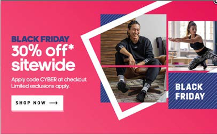

# Promotions

With most of the population moving to online shopping, retailers need to be one step ahead in providing the best customer experience. Retailers need to think about the best ways to get their products out in the market. This is where marketing strategy comes into play. In a general aspect, marketing strategy consists of six P’s:

- Product
- Price
- Promotion
- Place
- People
- Processes

Each of the six P’s is equally important, but to market products retailers need to use promotions as a tactic to increase traffic on the site and lead to higher conversion rates. Promotions help market products and services offered by the brand. There are various promotional levels, such as shipping, product, and order.

## Promotion types

Each of these promotion levels has different types of promotions, including:

- Giveaways
- flash sales
- Free samples
- Buy X for total
- Buy 1 get 1 free
- Bonus products
- Multi-purchase
- Cross-selling
- Bundles
- Product sets
- Coupons
- Promotional emails
- Free shipping
- Discount on shipping

Retailers face intense competition. To have a competitive advantage, retailers need to apply marketing strategies like promotions. Each retailer needs to analyze which promotions work best for them.
