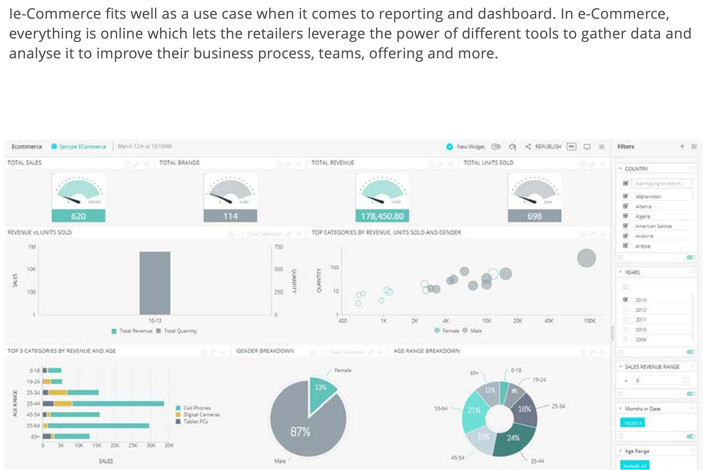
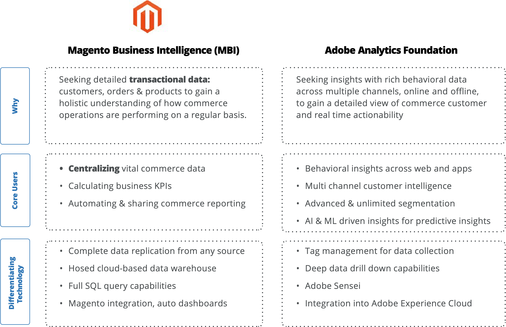

# Reporting and dashboards

Ecommerce fits well as a use case when it comes to reporting and dashboards. In ecommerce, everything is online, which lets retailers leverage the power of different tools to gather data and analyze it to improve their business processes, teams, product offerings, and more.

Every business has a different reporting requirements. For example, if you want to track a specific promotion, you can create a specific dashboard to see the progress of the promotion, such as how many people used the promotion, which products sold the best, and so on. You can also use a dashboard to track daily activities on the site, traffic, conversion rate, bestselling product, worst-selling product, and returns.

## Features

Some other features of reports and dashboards:

- Tracks ROI, which helps retailers make decisions and monitor progress

- Track sales to understand what on is generating the most sales

- Track site traffic in real-time and visualize the information

- Measure the success of site features and improve them to enhance customer service

- Monitor KPIs of each team

There is so much going on in an ecommerce business that it can be difficult to keep track. That’s where reports and dashboard can help. They consolidate all data in one place to provide an overview of the business to everyone. They also help retailers set new targets, identify new opportunities, and gain a competitive advantage.

## B2B options

The top four reports and dashboards B2B companies use include:

- **Company profile**—B2B businesses need to track their client company profiles to understand their purchase history, payment details, and which channel they used to purchase. This dashboard can help identify potential risks and issues.

- **Catalog**—A catalog report and dashboard helps B2B businesses view the performance of each product in the catalog, promotions, and inventory levels, which helps identify what kind of promotion works best and which products are in demand. This helps businesses stock up on inventory and gain a competitive advantage.

- **Quotes**—The B2B business model operates on quotes and pricing. B2B businesses must go through a process where they analyze a quote so that they can either approve it or attempt to negotiate. A quote report and dashboard helps improve your quote conversion rate by tracking the success rate, competition rates, performance, and overall customer retention.

- **Sales**—Even though B2B businesses can work online, a sales representative is still necessary to get things moving in terms of identifying quotes that need negotiation, tracking quotes that are getting close to expiring, tracking contracts that are up for renewal, tracking team performance, and helping streamline day-to-day business activities.

## Better together

Merchants looking for a way to correlate behavioral data with transactional ecommerce data can use Adobe Commerce Reporting and Adobe Analytics to can gain a more accurate understanding of how marketing activities impact core ecommerce metrics.

