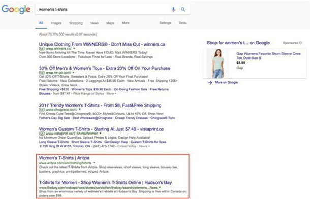
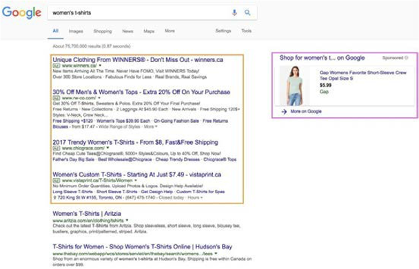

# Search engine optimization (SEO)

Search engine optimization (SEO) is a tool that helps you optimize your website based on specific keywords so that the site ranks higher in Google search results. Google ranks the websites based on whether the brand has answered all the search questions asked by customers. When customers search something on Google, they find different types of results. The following sections describe those results.

## Unpaid

See the results outlined in red in the following image:

## Paid

See the results outlined in orange in the following image:

>[!NOTE]
>
>Google shopping outlined in purple.

## Strategies

SEO strategy includes:

- **Keyword search**—Keywords used by customers to search

- **Site architecture**—Research is done on the keywords

- **SEO (technical)**—Ensuring SEO crawls the site

- **SEO on page**—Meta tags and content are used to attract customers

- **Analytics**—Tools, such as Google Analytics, are used to track SEO

B2B SEO campaigns are aimed at increasing brand awareness and lead generation, which leads to an increase in conversion rate. B2C SEO campaigns are aimed at attracting visitors to make immediate purchases. SEO has different uses and impacts in B2B versus B2C businesses. SEO can help increase traffic on your site, which will in turn increase sales and ROI. Set a simple SEO strategy to gain competitive advantage.
