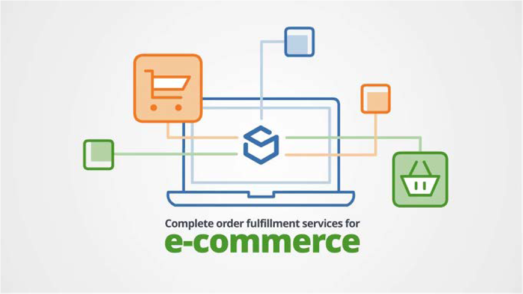

# Shipping and fulfillment

A lot of effort goes into providing customers with the best online experience. On the physical side of things, retailers should not overlook the importance of shipping. Shipping cannot just be handed over to any third party. You must do research, planning, and analysis. This is the final point in the customer experience journey, which is why you should get shipping and fulfilment right.

## Basic factors

Shipping and fulfilment have some basic factors that act as the foundation, including:

- **Shipping methods and cost**—Businesses need to analyze and divide the entire cost of shipping and determine whether to absorb shipping costs, pass costs on to customers, or share the cost? How will the business provide free shipping or shipping offers? How will products be shipped? Will there be more than one shipping method and shipping costs?

- **Product**—Each product is different in terms of the number of items, weight, destination, and durability. Businesses need to analyze these details to understand the total cost of shipping as different products have different shipping costs.

- **Packaging**—Packaging also plays an important role in understanding the shipping method and cost. For example, is the product fragile or is it packed as a gift?

- **Season**—What changes should be brought in during peak seasons, like click frenzy and festivals.

- **Carriers**—Which third-party shipping company best suits the business? What are the services provided by the shipping companies? What is the cost?

## Shipping methods

Before a business ships their product, the company needs to decide on shipping methods and costs. There are various options for shipping methods, including:

- **Free shipping**—Providing free shipping to customers might be the best customer experience, but might not suit the business.

- **Real-time rates**—Collaborating with third-party shipping providers allows retailers to post the shipping method and cost that the shipping company is currently charging. This allows customers to choose their preferred shipping method.

- **Flat rate**—One of the most popular shipping options. The trick here is to ensure that retailers do not overcharge or undercharge customers. This also works if the retailers have a standard product but can get complicated if the retailers have a variety of products.

- **Free shipping over an amount**—Retailers can provide free shipping when the customer purchases above a certain amount. Retailers need to calculate that amount to provide this service.

Shipping and fulfilment required team coordination both internally and externally. A shipping and fulfilment strategy should be shared with the entire organization so that they are aligned. For example, if the Marketing team wants to send out a promotion that includes free shipping, they need to align it with the shipping and fulfilment strategy and team to eliminate any negative customer experience.

## Best practices

When deciding on a shipping and fulfilment strategy, use the following best practices: 

- Assembling the right team with the right people who have the right skills
- Setting goals for teams to follow
- Selecting the correct shipping strategy that best suits the needs of the business
- Reviewing the strategy and reiterating when required

## B2B vs B2C

The following table describes the differences between B2B and B2C shipping and fulfilment:

| B2B                                                                                          | B2C                                                  |
|----------------------------------------------------------------------------------------------|------------------------------------------------------|
| Fulfillment and shipping takes longer to complete due to the costs involved and the quantity | Can be same day shipping and/or free shipping        |
| Requires one on one connection between the business and the client                           | Usually, shot term relationships                     |
| Usually, long term relationships                                                             | Business provides loyalty cards to retain customers  |
| Process can be long and complex                                                              | Promotions and campaigns offer provides to customers |
| Strong rules need to be applied                                                              | Basic rules can be applied                           |
| Returns can take time                                                                        | Returns can be quick                                 |
