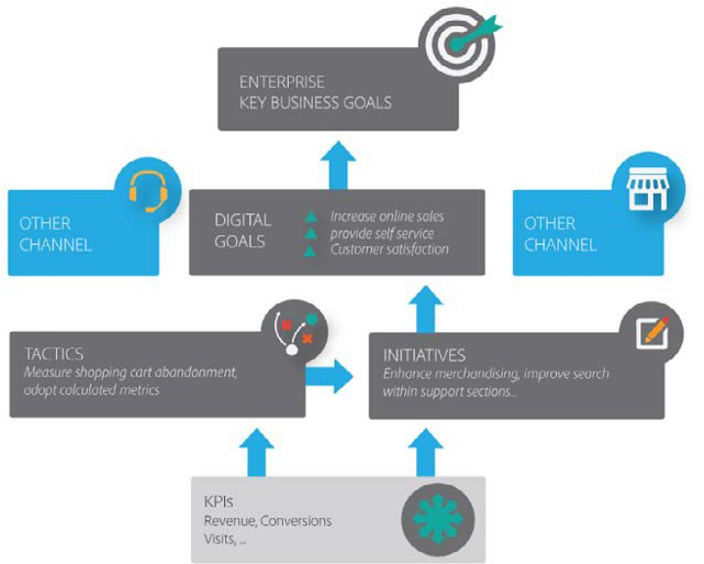

# Commerce strategy

Digital commerce is a rapidly moving force, that evolves expeditiously each year. While this can be exciting for individuals, it also comes with many challenges for organisations trying to navigate the lay of the land that is Commerce.

As commerce continues to evolve in both B2B and B2C, businesses are seeing drastic changes in customer behaviours and expectations, from the way they research a product/service, consider and complete a purchase, or show loyalty to a brand, to the way they communicate all of this to their peers. Customer behaviours and expectations can shift instantly, and businesses can struggle to adapt to new market trends and creating a digital strategy that is both realistic and achievable.

Therefore, the execution and planning of any digital strategy is key to any successful e-Commerce business.

The overall Commerce strategy of every business will be unique in nature, depending on maturity, team size and resources. Here is a strategy for unlocking your core commerce capabilities:

- Awareness
- Consideration
- Purchase
- Support

## Awareness

- Product catalog management
- Product Comparison
- Product Search and navigation
- Product information
- Personalized experience
- Product bundle management
- Promotions

## Consideration

- Product selection support and recommendations
- Customer specific pricing Product availability and inventory
- Price identification and price list management
- Self service quote request/RFQ
- Configure, price, quote
- Dynamic pricing

## Purchase

- Order creation
- Shopping cart & checkout marketplace
- Quote to order conversion
- Subscription services
- Online PO transaction and pay invoice online
- NextGen B2B integrated ordering (e.g., Punchout)
- Procurement workflow and integration

## Support

- Order management status & tracking
- Shipping and delivery status
- Retrieve invoices (order history)
- One-click reorder
- Returns management
- View accounts statements invoices & credits
- Automated renewals and replenishment
- Product registration/activation

## Objectives

The following list includes key objectives to consider when planning the digital strategy of your business:

- Consistency is important
- Regularly review customer analytics
- Improve personalisation online
- Interactive product visualisation
- Leverage new technology where applicable
- Artificial intelligence (AI)
- More delivery options
- Appropriately plan for upgrades and site maintenance

See the following diagram for a suggested commerce strategy framework:

