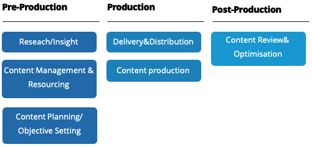
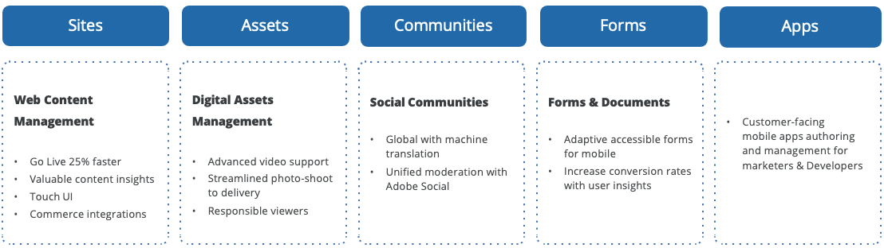

# Content strategy

Successful ecommerce content marketing plans do not come from brainstorming sessions, hunches, or inherited habits. Businesses must gather quantitative and qualitative data (some from sources they already own and some created or purchased) to plan for content that customers will find and value. With Adobe Experience Manager, you can leverage content managed in the AEM authoring environment to build highly engaging campaigns. You can easily publish marketing assets that you design, manage, and validate in Adobe Experience Manager across different channels.

## Framework for content strategy

### Pre-production

This stage involves starting with your user, understanding their needs, the development of personas, as well as a review and inventorying of existing assets and position. Content management, resourcing, and planning is designed to establish and maintain appropriate structures, organization, and resourcing.

### Production and execution

This stage involves creating content. This includes content creation, authoring, editing, asset production, and content optimization—accessibility, SEO, tagging and classifying, insourcing outsourcing in production, role of third-party tools and technology, and content re-use.

### Post-production

This stage involves the review and evaluation of content, adaptation, and optimization. This includes analytics evaluation, optimization, test, learn, and user experience.

Finally, the test, targeting, and strategy will give you the opportunity to identify the right content to be delivered to a specific segment of visitors with different preferences or needs and then create targeted experiences for each of them.

## Adobe Experience Manager

Whether you're managing basic web content or content to be released into social networks, Adobe Experience Manager helps deliver creative assets and other content across all channels where a customer might engage. With AEM, you can leverage content managed in the AEM authoring environment to build highly engaging campaigns. You can easily publish marketing assets that you design, manage, and validate in Adobe Experience Manager across different channels and platforms.

Adobe Experience Manager combines a number of infrastructure-level and application-level functions into a single integrated package. The offering addresses:

- **Sites**—Quickly create and deliver relevant websites and mobile apps and update the content anytime without burdening your IT department.
- **Assets**—Easily manage images, videos, and other assets across every digital channel to deliver personalized customer experiences.
- **Communities**—Build thriving communities and engaging conversations across all your social properties so you can inspire new levels of learning and customer loyalty.
- **Forms**—Integrate enterprise-level forms into your websites and mobile experiences and simplify the creation of forms and the completion of transactions.
- **Apps**—Create and deliver mobile apps with a solution that bridges the gap between marketers and IT so that marketers can easily update content (even after launch).

