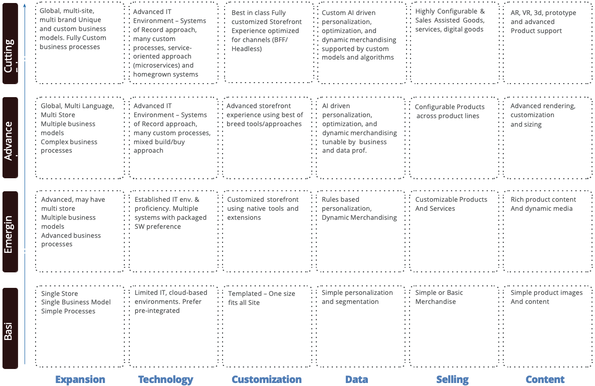

# Maturity model

A maturity model is a formula for businesses to use to determine what stage they're at with any given functional area or strategy. A useful and accurate maturity model helps businesses understand how to advance from one stage to another through their ecommerce roadmap.

Think of a maturity model as a robust report that helps you determine how to improve an area of the platform and serves as a roadmap for progress.

The following diagram summarizes the different needs across maturity levels:

## Levels of maturity

The following table summarizes the different levels of maturity:

| Variable | B2B |
-----------|----------|
| Crawl | The entry level for ecommerce maturity includes the easiest tasks to accomplish by a single marketer. The business normally progresses through to  build upon the basics to further enhance the customer experience.|
| Walk | At this level, organizations are starting to leverage past customer data  coming from multiple sources, needing multi-departmental collaboration.  Organizations within this level can use the full potential of campaigns managed by people and have a mature set of best practices, processes, and development streams. |
| Run | The highest level of maturity enables AI-powered campaigns across various  channels and uses predictive stock management to prevent churn and product  information management tools to enrich products. It is best achieved by organizations with an evolved data culture, development skills, and processes in house and offshore. |

{style="table-layout:auto"}

### Crawl

This is the initial phase for any business, the starting point. In this phase, you need to focus on delivering a presentable, easy to navigate, user-friendly, and simple checkout experience on an ecommerce platform equipped with basic features. You need to determine whether your business has an existing pricing system or if you need to create one.

If you need to create a pricing system, you need to understand the payment gateway providers in the market. Specifically, you need to determine which provider best suits your needs based on industry experience, cost, customer service, and security. Payment gateways process transaction payments independently from the website. When teams don't have to worry about storing payment details on the website, they can focus on site functionality.

After you decide on a payment gateway provider, you need to analyze the required payment methods. Focus on the methods that are popular with the customers. Being new to the ecommerce platform, some businesses choose to offer limited payment method options because each option requires a substantial upfront investment. At a minimum, businesses in the crawl phase offer credit and debit card payment options. They branch out to options like PayPal and Afterpay after they see there is traffic on the site and the traffic is leading to increased conversion rates.

Overall, businesses in the crawl phase should develop a well-integrated ecommerce system to get it started and off the ground before they expand to add more features.

### Walk

Businesses in the walk phase begin to develop the site based on existing customers, insights, and experience they have with an existing ecommerce site. In this phase, businesses can start implementing more complex features to provide new offerings to their customers to increase customer experience and customer loyalty.

Business in the walk phase have features like blogs, videos, feature sections, product variations, and product purchases are easily accessible on the web pages. In the walk phase, businesses already understand the purchase trend of their customers through data and feedback, which allows them to improve their process and pricing. Businesses in the walk phase are in a place where they can implement multiple payment methods such as credit/debit, more than one option for electronic wallet, and/or gift cards. Providing multiple payment options gives the customers the liberty to choose the one they are comfortable with. They also have the option to opt for a larger payment gateway provider who can manage more than one payment method.

Overall, businesses in the walk phase have the advantage of improving their site and payment methods based on customer data.

### Run

Businesses in the run phase have a complete understanding of their customers and their purchase behavior, which helps them set goals and expand their business. In the run phase, businesses can set a goal to achieve complex requirements, marketing, multiple global payment methods, or global shipping.

Having an in-depth understanding of customers, markets, and internal and external teams, businesses in the run phase can implement custom features that differentiate their site. For example, offer multiple payment methods, provide subscriptions services, or offer free shipping discounts.

Business can easily implement complex features because they have already gained market share and are confident that investing in these helps them improve their customer service and keeps their customers coming back.

## Elements of a maturity model

This section describes areas of an ecommerce maturity model that businesses would consider as part of their overall strategy.

### Action

Types of marketing activities that are in place:

- First session web layer
- Personalized recommendations on website
- Abandoned cart email

### Data

Data collection and management:

What data is available and how interconnected they are. What interactions and attributes are tracked? How is the data enriched from external sources?

- Data optimization and enrichment
- Page view tracking
- Complete cart interactions
- Updated product returns
- Advanced session and customer behavior tracking

### Insights

Analyses, trends, and data triggered alerts:

- Campaign evaluation based on product profit
- Recency, frequency, monetary
- AI-driven lead scoring
- Advanced reporting and dashboards

### Methodology

Processes the business follows:

Are you just trying out your luck with ad- hoc campaigns or are they based on customer behavior, historical purchases and predictions?

- Trigger based campaigns
- Campaigns based on predictions, i.e. potential churn
- Campaigns based on past behavior of customers
- Product information management

### Governance

Resources, team size and processes:

Have you established continuous support of optimization and knowledge sharing?

- Marketing team takes care of campaigns with support from ecommerce team
- Common use cases are documented
- Company-wide programs for idea generation

### Privacy

Security and privacy management:

Are you adding value to your customer's experience in exchange for the personal data they are providing you? Are you just aiming for the basics or do you compete in privacy and security?

- Privacy policy documents online
- Data flow processes mapped
- Customers can edit and extend their tracked data
- Hosting optimizations
