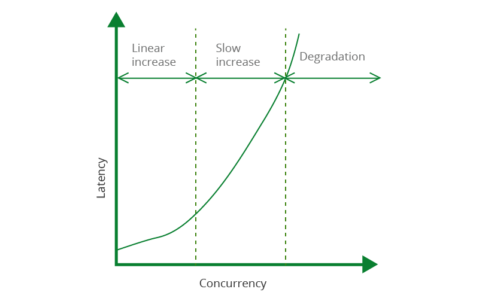
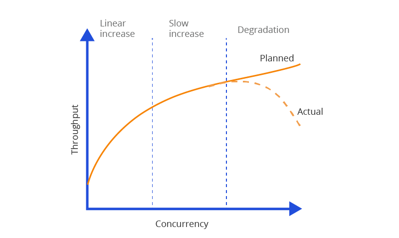
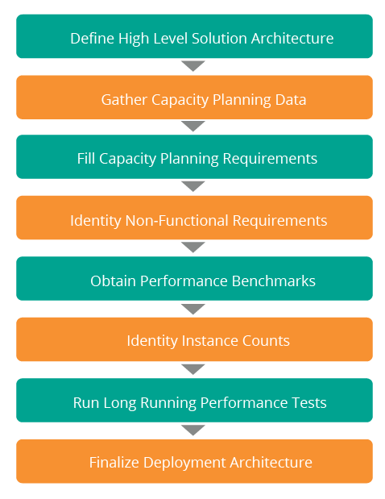

## Capacity Planning
## Benefits

- Keeping the cost low/avoid over-spend on resource
- Reliability
- Intelligent resource allocation
- Help in High Availability & scalability
- Avoid emergencies

## Terminology

### Latency

Additional time spend/delay between user's action and web application's response to that action.[Caching](https://devdocs.magento.com/guides/v2.4/frontend-dev-guide/cache_for_frontdevs.html?itm_source=devdocs&itm_medium=quick_search&itm_campaign=federated_search&itm_term=cach) is used to improve latency times.

 ###Throughput

``Throughput = number of completed requests / time to complete the requests``

Number of action per unit or number of processed over a given interval of time. For example if user perform 60 transactions in minute TPS would be 60/60 TPS = 1TPS.
considered an average of 1 TPS considering users uniformly accessing the system over 60 seconds.this of course means that we can also expect all users coming within a single second which means a 60 TPS max peak load

**Application server**

Not to confuse with a load balancer (Nginx), an application server is something that runs your Ruby,Node or PHP application listens to the TCP socket, accepts HTTP request, and returns the response from the application.

**Under-provisioned:** 

lack of capacity which leads to higher response time or more frequent 502 Bad Gateway responses.

**Over-provisioned:** 

running more capacity than you actually need and probably wasting money

**Availablity**

The availability of a system is determined by the following equation, which yields a percentage result.

``x = (n - y) * 100/n``

where 'n' is the total number of minutes in a given calendar month and 'y' is the total number of minutes that service is unavailable in a given calendar month.

| Availability(%)       | Downtime per year  | Downtime per month    |
| :---        |    :----:   |          ---: |
| 90%   | 36.5 days       | 72 hours   |
| 95%   | 18.25 days      | 36 hours       |
| 97%   | 10.96 days        | 21.6 hours    |
| 99%   | 3.65 days      | 7.20 hours       |
| 99.9%   | 8.76 hours        | 43.8 minutes    |
| 99.99%   | 52.56 minutes      | 4.32 minutes       |

[Clustering](https://devdocs.magento.com/cloud/architecture/pro-architecture.html?#pro-cluster-scaling) and Load balancing technique to achieve high availability by providing redundancy at software and hardware level

## Scalability

Scalability is the ability to handle requests in proportion to available hardware resources.system should ideally handle increase/decrease in requests without affecting the overall throughput

- Vertical scalability or Scale Up (increase performance of a server by increasing its memory, processing power)
- Horizontal scalability or Scale Out (deploy more instances of the same type of server)

## calculation

