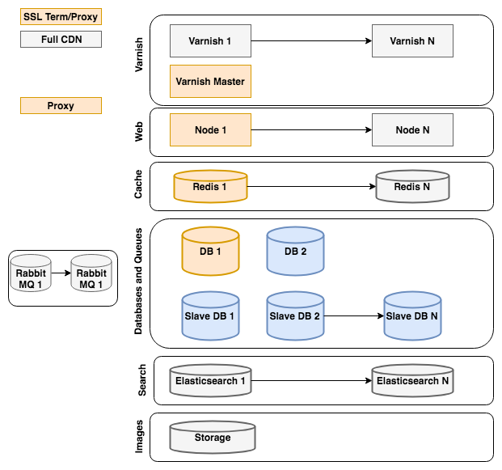

# Reference architecture

This topic describes a generic recommended setup for Adobe Commerce instances using plain servers hosted physically in a data center (not virtualized) in which resources are not shared with other users. Your hosting provider, especially if it specializes in Commerce high performance hosting, might recommend a different setup that is equally or more effective for your requirements.

For Adobe Commerce on cloud infrastructure environments, see [Starter architecture](https://experienceleague.adobe.com/en/docs/commerce-cloud-service/user-guide/architecture/starter-architecture).

## [!DNL Commerce] Reference architecture diagram

The [!DNL Commerce] Reference Architecture diagram represents the best practice approach to set up a scalable [!DNL Commerce] site.

The color of each element in the diagram indicates whether the element is part of Magento Open Source or Adobe Commerce and if it is required.

* Orange elements are required for Magento Open Source
* Grey elements are optional for Magento Open Source
* Blue elements are optional for Adobe Commerce

The following sections provide recommendations and considerations for each section of the Commerce Reference Architecture diagram.

### [!DNL Varnish]

* A [!DNL Varnish] cluster can scale to the traffic of a site
* Tune the instance size based on the number of cache pages needed
* On a high-traffic site, use a [!DNL Varnish] Master to ensure on-cache flush one request (at most) per web tier

### Web

* Enable scale of nodes for traffic and redundancy
* One node is master and runs cron
* Alternatively, use a dedicated Admin and worker nodes

### Cache

* Consider implementing a separate Redis instance for sessions
* You can have a Redis instance per cache
* Size your instance to contain the largest expected cache size

### Database and queues

* High-traffic sites can tune DB performance with slave DBs and split DBs for orders/carts (in Adobe Commerce)
* Consider using a slave DB to enable quick recovery and for data backups
* Low-traffic sites can store images in the DB

### Search {#search-heading}

* Tune the number of instances based on search traffic

### Storage

* Consider using GFS or GlusterFS for pub/media storage
* Alternatively, use DB storage for low-traffic sites

### Recommended [!DNL Varnish] reference architecture

Magento supports several full page caching engines (File, Memcache, Redis, [!DNL Varnish]) out of the box, along with expanded coverage through extensions. [!DNL Varnish] is the recommended full page cache engine.  [!DNL Commerce] supports many different [!DNL Varnish] configurations.

For sites that do not require high availability, we recommend using a simple [!DNL Varnish] setup with Nginx SSL termination.

![Simple [!DNL Varnish] Configuration with SSL Termination](../assets/performance/images/single-varnish-with-ssl-termination.png)

For sites that require high availability, we recommend using a 2-tier [!DNL Varnish] configuration with an SSL terminating load balancer.

![High availability two-tier [!DNL Varnish] configuration with SSL terminating load balancer](../assets/performance/images/ha-2-tier-varnish-with-ssl-term-load-balancer.png)
