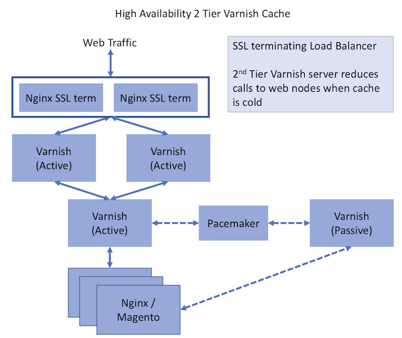

This topic describes a generic recommended setup for Adobe Commerce and Commerce Open Source instances using plain servers hosted physically in a data center (not virtualized) in which resources are not shared with other users. Your hosting provider, especially if it specializes in Commerce high performance hosting, might recommend a different setup that is equally or more effective for your requirements.

For Adobe Commerce on cloud infrastructure environments, see [Starter architecture](https://devdocs.magento.com/cloud/architecture/starter-architecture.html).

## Commerce Reference Architecture diagram

The Commerce Reference Architecture diagram represents the best practice approach to set up a scalable Commerce site.

The color of each element in the diagram indicates whether the element is part of Commerce Open Source or Adobe Commerce and if it is required.

*  Orange elements are required for Commerce Open Source
*  Grey elements are optional for Commerce Open Source
*  Blue elements are optional for Adobe Commerce

The following sections provide recommendations and considerations for each section of the Commerce Reference Architecture diagram.

### Varnish

*  A Varnish cluster can scale to the traffic of a site
*  Tune the instance size based on the number of cache pages needed
*  On a high-traffic site, use a Varnish Master to ensure on-cache flush one request (at most) per web tier

### Web

*  Enable scale of nodes for traffic and redundancy
*  One node is master and runs cron
*  Alternatively, use a dedicated Admin and worker nodes

### Cache

*  Consider implementing a separate Redis instance for sessions
*  You can have a Redis instance per cache
*  Size your instance to contain the largest expected cache size

### Database and queues

*  High-traffic sites can tune DB performance with slave DBs and split DBs for orders/carts (in Adobe Commerce)
*  Consider using a slave DB to enable quick recovery and for data backups
*  Low-traffic sites can store images in the DB

### Search

*  Tune the number of instances based on search traffic

### Storage

*  Consider using GFS or GlusterFS for pub/media storage
*  Alternatively, use DB storage for low-traffic sites

### Recommended Varnish Reference Architecture

Magento supports several full page caching engines (File, Memcache, Redis, Varnish) out of the box, along with expanded coverage through extensions. Varnish is the recommended full page cache engine.  Commerce supports many different Varnish configurations.

For sites that do not require high availability, we recommend using a simple Varnish setup with Nginx SSL termination.

For sites that require high availability, we recommend using a 2-tier Varnish configuration with an SSL terminating load balancer.

