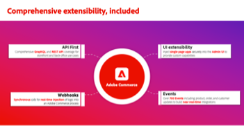
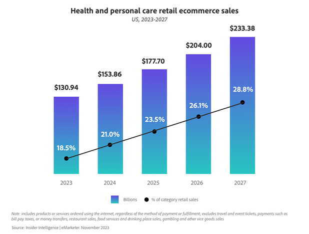
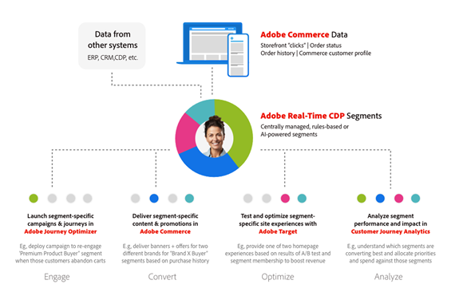
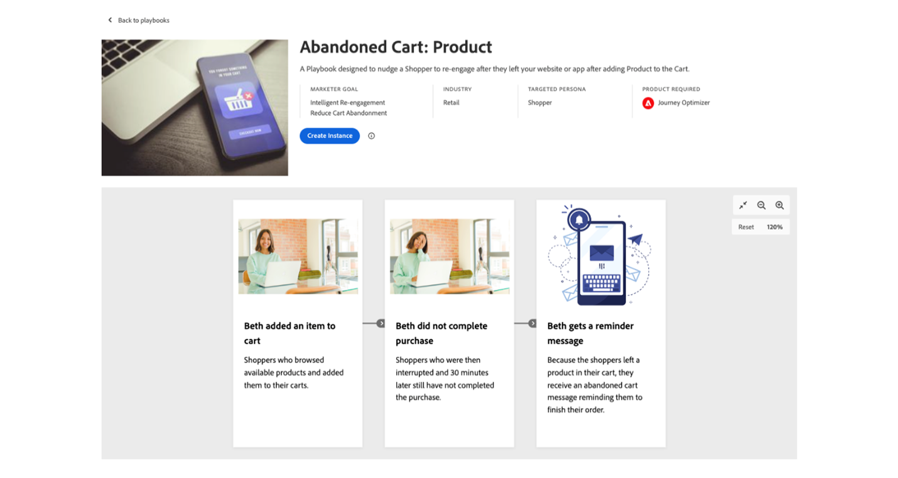
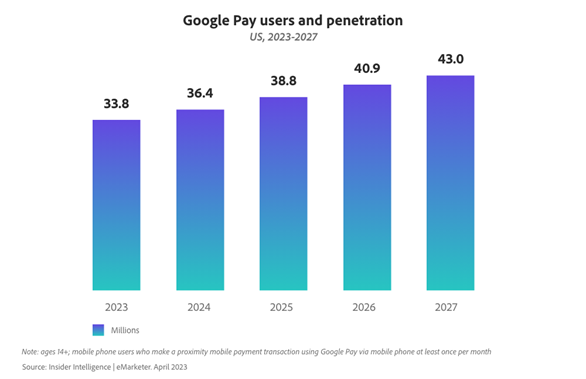
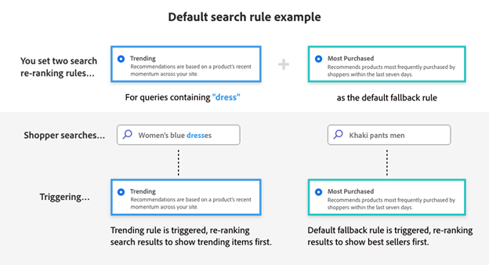
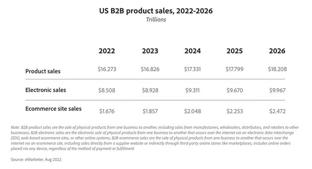
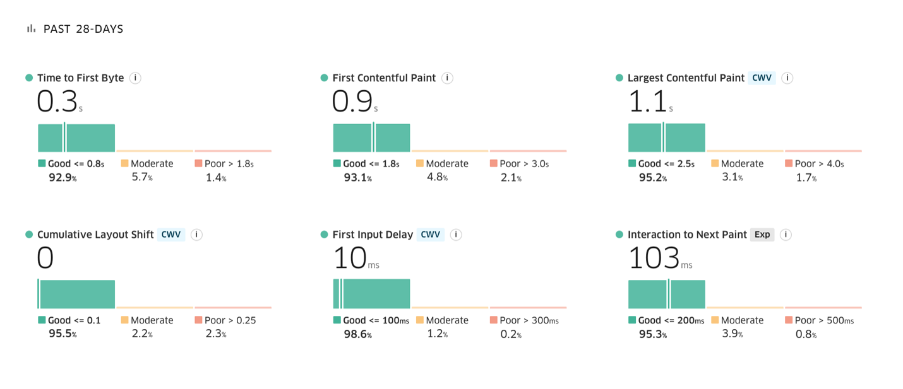
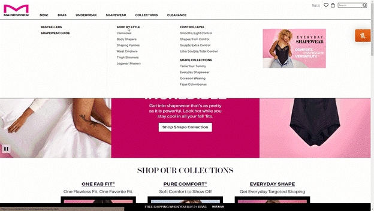

# February 2024 release summary

To help businesses continue to grow their ecommerce channels Adobe Commerce has released new capabilities that empower them to move faster and accelerate sales with an experience-led platform that combines a high-performance storefront and AI-powered personalization with simplified composable development.

## Simplified composable development with App Builder [!BADGE Available now]{type=Informative tooltip="Available now"}

Adobe Commerce is a composable ecommerce platform designed to launch ecommerce features faster, easily share data between third-party systems, and lower the cost of ownership for integrations and customizations.

Building composable applications requires highly extensible technology and the ability to orchestrate APIs, Events, & Data instead of building point to point integrations. Adobe Commerce provides:

- Comprehensive [API](https://developer.adobe.com/commerce/webapi/) coverage
- [Webhooks](https://developer.adobe.com/commerce/extensibility/webhooks/) to customize native commerce processes
- [Admin UI](https://developer.adobe.com/commerce/extensibility/admin-ui-sdk/) extensibility
- Over 700 [Events](https://experienceleague.adobe.com/docs/commerce-learn/tutorials/adobe-developer-app-builder/io-events/getting-started-io-events.html)

[Adobe Developer App Builder](https://experienceleague.adobe.com/docs/commerce-learn/tutorials/adobe-developer-app-builder/introduction-to-app-builder.html) for Adobe Commerce is a cloud-native extensibility platform to build custom capabilities and integrate with 3rd party solutions. It includes API orchestration with [API Mesh](https://experienceleague.adobe.com/docs/commerce-learn/tutorials/adobe-developer-app-builder/api-mesh/getting-started-api-mesh.html), scalable event-based data routing using [Adobe I/O Events](https://developer.adobe.com/events/docs/), and a [serverless runtime](https://developer.adobe.com/runtime/docs/guides/overview/howitworks/). With App Builder, developers can easily build apps and integrations while Adobe handles provisioning, scaling, and security of the App Builder infrastructure.

## Webhooks and AdminUI SDK enhancements [!BADGE Available now]{type=Informative tooltip="Available now"}

With our latest release we continue to lead the way in simplifying composable development for ecommerce businesses. [Webhooks](https://developer.adobe.com/commerce/extensibility/webhooks/release-notes/) can now be configured through the Admin UI making it even simpler to extend native commerce processes like checkout, add to cart, and more. Webhooks can also now be triggered conditionally. For example, you can trigger a shipping calculation webhook for the checkout process only for specific ZIP codes.

Also, developers now have more [granular control](https://developer.adobe.com/commerce/extensibility/admin-ui-sdk/release-notes/) to extend the Admin UI including adding additional columns, buttons, and mass actions to existing Admin panels.

Later this year we will increase the availability of API Mesh to over 200 global locations reducing network latency, delivering improved compute time, providing a better overall experience for shoppers.

## Integration starter kit & pre-built ERP integrations [!BADGE Available June 2024]{type=Informative tooltip="Available June 2024"}

Integrating an ecommerce platform with your ERP, OMS, or CRM is a mission critical requirement. Companies can spend tens of thousands of dollars building these integrations. To reduce the cost of integrating with back office systems and to improve reliability of real-time connections Adobe is introducing an integration starter kit. The kit includes reference integrations for commonly used commerce data like orders, products, and customers. It also includes onboarding scripts and a standardized architecture for developers to build on following best practices. The starter kit, currently in beta, is expected to reduce integration effort by up to 50%.

Later this year, we will also be releasing pre-built integrations to two common ERPs using the integration starter kit:

- [Microsoft Dynamics Finance & Operations](https://www.microsoft.com/en-us/dynamics-365/products/finance)
- [SAP S/4HANA](https://www.sap.com/products/erp/s4hana.html)

These reference integrations can easily be customized by developers to meet the needs of the business, lowering the time to market and the cost of integrations.

To get started building for Adobe Commerce, visit our [Learning Path](https://developer.adobe.com/commerce/extensibility/app-development/learning-path/).

## Subscription commerce powered by Zuora [!BADGE Available now]{type=Informative tooltip="Available now"}

According to financial services firm UBS, the subscription economy is on track to reach $1.5 trillion, up from $650 billion in 2021. Consumers and businesses alike are becoming more comfortable purchasing subscription products and services due to their convenience and value.

[placeholder for Zuora video]

To empower companies to add subscription revenue streams to their business and support existing recurring revenue business models, Adobe Commerce has partnered with Zuora — the industry leading subscription management platform — to launch the [Zuora Subscription Management for Adobe Commerce](https://commercemarketplace.adobe.com/zuora-revenue-management-with-subcriptions.html) extension.

The Zuora integration allows ecommerce businesses to:

- Launch subscription ecommerce on Adobe Commerce storefronts including native Luma theme storefronts and headless commerce implementations.
- Build subscription products directly within Adobe Commerce and sync product data to Zuora automatically.
- Price and package subscription products and services with over 50 pricing models, including recurring charges, one-time fees, and usage-based charges.
- Centralize complex billing operations and reduce manual processes. Use one billing system to unify provisioning data and consolidate invoices for subscriptions, physical goods, and other one-time purchases.
- Give customers the option to manage their subscription directly within the Adobe Commerce MyAccount experience.

Built on Adobe's App Builder framework, the [Zuora extension](https://commercemarketplace.adobe.com/zuora-revenue-management-with-subcriptions.html) received [Adobe Commerce App Assurance Program](https://developer.adobe.com/commerce/marketplace/guides/sellers/assurance/) recognition for following simplified composable development best practices including a React-native front-end architecture and use of Adobe I/O events and Adobe API Mesh to limit customizations within the core Adobe Commerce platform.

## Adobe Commerce's HIPAA-ready solution [!BADGE Available now]{type=Informative tooltip="Available now"}

Consumers are becoming more comfortable purchasing healthcare products and services online. In fact, according to Insider Intelligence, retail ecommerce sales for health and personal care products will be the fastest growing ecommerce segment in 2024 growing at 17.5% to reach $153 billion in ecommerce sales in the US.

When purchasing healthcare products and services, consumers expect their sensitive medical records and personal information to be highly protected. This is why Adobe Commerce has released a [HIPPA-ready](https://experienceleague.adobe.com/docs/commerce-admin/start/compliance/hipaa-ready-service.html) version of its cloud offering for healthcare and life sciences industries. Adobe Commerce now joins the [Adobe Experience Cloud for Healthcare](https://business.adobe.com/solutions/industries/healthcare.html) suite of solutions, allowing customers to deliver secure and exceptional patient experiences while honoring consumer preferences.

## Deeper integration between Adobe Commerce and Adobe Experience Platform [!BADGE Available June 2024]{type=Informative tooltip="Available June 2024"}

[Adobe Commerce Data Connection](https://experienceleague.adobe.com/docs/commerce-merchant-services/data-connection/overview.html) automatically collects, maps, and shares a range of Commerce data from storefront clicks to back-office order status and order history data. In the first half of this year, we will share even more data, including [Commerce customer profiles](https://experienceleague.adobe.com/docs/commerce-admin/customers/customer-accounts/manage/update-account.html), mobile app behavior, and custom attributes for back-office events to personalize campaigns and experiences at scale. For example, customers will be able to use real-time customer registrations to trigger welcome email campaigns in [Adobe Journey Optimizer](https://business.adobe.com/products/journey-optimizer/adobe-journey-optimizer.html).

Another way we are deepening our integrations to Adobe Experience Platform is a new Use Case Playbook. [Use Case Playbooks](https://business.adobe.com/blog/the-latest/unlock-value-faster-with-use-case-playbooks-for-adobe-real-time-cdp-and-journey-optimizer) are a library of ready-to-use implementation assets designed to help customers achieve faster time-to-value. The initial Adobe Commerce playbook — coming in the first half of 2024 — will enable customers to easily launch abandoned cart campaigns by guiding them through the data setup process. Once connected, customers can launch abandoned cart campaigns, saving them time and helping lift sales. We are also adding Commerce-specific dashboards in Adobe Experience Platform to help marketers analyze their Commerce data and identify opportunities for personalization.

Rich Commerce data can also personalize the Commerce experience itself. [Adobe Real-Time CDP](https://business.adobe.com/products/real-time-customer-data-platform/rtcdp.html) combines Commerce data with other sources to build detailed customer profiles and audience segments for targeting content and promotional offers in Adobe Commerce. In the first half of the year, we are expanding these [Audience Activation](https://experienceleague.adobe.com/docs/commerce-admin/customers/audience-activation.html) capabilities to allow marketers and merchandisers the ability to use Audiences defined in Adobe's Real-Time CDP in more places within the Adobe Commerce admin including [related products](https://experienceleague.adobe.com/docs/commerce-admin/marketing/promotions/product-relationships/product-related-rules.html), [promotions](https://experienceleague.adobe.com/docs/commerce-admin/marketing/promotions/cart-rules/price-rules-cart.html), and [content blocks](https://experienceleague.adobe.com/docs/commerce-admin/content-design/elements/dynamic-blocks/dynamic-blocks.html). Adobe Commerce will also release support for tracking of user behavior on native mobile app deployments of Adobe Commerce in addition to web channels.

## Payment Services for Adobe Commerce

Simplify payments with a native Adobe Commerce solution that increases shopper conversion and online revenue while maximizing operational efficiency.  With this SaaS service created and supported by Adobe, gain peace of mind knowing that your virtual doors will be open for business when your customers are ready to buy.

## Headless support for Payment Services [!BADGE Available now]{type=Informative tooltip="Available now"}

Adobe now has a [fully integrated payment services](https://business.adobe.com/products/magento/payment-services.html) solution within Adobe Commerce. This solution allows merchants to securely manage payments and order data in one place. In our latest release merchants can accept and process payments on headless storefront implementations such as Adobe Experience Manager and other custom front ends.

Payment services also offers right for you pricing options including Interchange++ for more competitive payment processing rates and [self-service onboarding](https://experienceleague.adobe.com/docs/commerce-merchant-services/payment-services/get-started/production.html#standard-onboarding) to Payment Services Basic providing payment processing capabilities to almost 200 regions worldwide.

## Google Pay for Payment Services [!BADGE Available 1H 2024]{type=Informative tooltip="Available 1H 2024"}

By July of this year, Adobe Commerce expects to release support for Google Pay, a leading digital wallet. According to Insider Intelligence, Google Pay is expected to reach [36 million consumers](https://forecasts-na1.emarketer.com/591373e4aeb8830e3829e400/5efc402eac4d4d07841472f9?_gl=1*qmtm8x*_ga*OTEwMjg4NjExLjE3MDY2MzQ2MTk.*_ga_XXYLHB9SXG*MTcwNjk3NjkzNS44LjAuMTcwNjk3NjkzNS42MC4wLjA.*_gcl_au*MTkwNzgzOTY5OS4xNzA2NjM0NjE5LjQ3MzE4MjY5LjE3MDY3MTcyMjUuMTcwNjcxNzIyNQ..) in 2024.The addition of Google Pay rounds out support for popular digital wallets including Apple Pay and PayPal.

## AI-Powered personalization with Live Search [!BADGE Available now]{type=Informative tooltip="Available now"}

Companies are seeking to personalize every part of the buying journey, from helping customers find the right products to delivering personalized campaigns, offers, and communications across all channels.

[Live Search, powered by Adobe Sensei](https://business.adobe.com/products/magento/live-search.html), helps you personalize how customers find exactly what they need so you can increase your conversion rates.

Our latest release of Live Search focuses on making these features easy to use and empowers you to fully customize the search experience to fit your unique needs. You can now apply [AI re-ranking rules](https://experienceleague.adobe.com/docs/commerce-merchant-services/live-search/live-search-admin/rules/rules-add.html) to cover all queries, not just specific searches. This new default search rule allows you to set targeted rules for your most popular searches. For example, a merchandiser can set a rule that any search query containing the phrase "dress" should be sorted by trending items algorithm. That same merchandiser can then use the most purchased algorithm for all other search queries. With this update, brands can set one rule to cover the long-tail of less searched-for queries, simplifying personalized merchandising.

We've also introduced new customization options for Live Search. You can design the Live Search UI features including color swatches, product detail page layout options, add to cart buttons, price sliders, and more using low code configuration tools. We provide full flexibility through our open code repository which serves as a best-practice reference implementation.

## B2B commerce [!BADGE Available April 2024]{type=Informative tooltip="Available April 2024"}

B2B ecommerce is another area of significant growth in online spending. In 2024, US B2B ecommerce sales are forecasted to reach [$2.048 trillion](https://www.insiderintelligence.com/content/us-b2b-ecommerce-forecast-2022-2026) — growing at 10.3% year over year.

Adobe Commerce has delivered mission critical B2B ecommerce features for years including company accounts, purchase approval rules, quote management, and customer price books. That's why B2B ecommerce leaders like [Watsco](https://business.adobe.com/content/dam/dx/us/en/resources/ebooks/building-better-experiences/building-better-experiences-and-bigger-profits.pdf), [SealedAir](https://business.adobe.com/customer-success-stories/sealed-air-case-study.html), [Sunbelt Rentals](https://business.adobe.com/customer-success-stories/sunbelt-rentals-case-study.html), [Transcat](https://business.adobe.com/customer-success-stories/transcat-case-study.html), [FoodServiceDirect.com](https://business.adobe.com/customer-success-stories/foodservicedirect-case-study.html), and [Univar Solutions](https://business.adobe.com/summit/2023/sessions/debunking-top-b2b-commerce-myths-s517.html) power their global B2B ecommerce channels on Adobe Commerce.  

We're excited to share that in April, we will deliver new quoting and company management features.

Company management features will allow businesses to configure any buyer company structure they need to support B2B2X, conglomerates, or buying team structures using Adobe's new parent/child account structures.

[add b2b commerce video] 

Building on our strong built-in quoting tool, B2B sellers can capture more revenue faster with new request for quote (RFQ) tools including draft quotes, duplicate quotes, split quotes, quote templates, and multi-admin access to quotes.

Both capabilities will be compatible with Adobe Commerce's native storefront architecture and headless commerce deployments via GraphQL APIs.

## Edge Delivery Services for Adobe Commerce [!BADGE Limited Availability starting after Adobe Summit]{type=Informative tooltip="Limited Availability starting after Adobe Summit"}

Research has shown that about [64% of shoppers](https://techreport.com/statistics/website-load-time-statistics-data) will head to a competitor's site to purchase a similar item if their web experience is poor. Conversely, for every 0.1 second improvement in site speed, businesses can expect a [9.2% increase in average order value](https://techreport.com/statistics/website-load-time-statistics-data).

In 2023, [Edge Delivery Services](https://business.adobe.com/products/experience-manager/sites/aem-sites.html) in Adobe Experience Manager was introduced to address these market trends by delivering faster, more engaging websites. We are now bringing this robust technology to Adobe Commerce via a new high-performance storefront.

To offer a truly powerful and complete commerce experience, this new storefront, will not only include the same benefits and capabilities delivered by Edge Delivery Services and document-based authoring, like a performance-first architecture, and out-of-the-box native experimentation; but will also leverage the scale and performance of Adobe Commerce SaaS Services, and the flexibility and convenience of drop-in components that will deliver the commerce capabilities needed to transact online. With these new tools and technology, ecommerce businesses will be able to create content faster and benefit from unparalleled website performance that can lead to increased conversion rates, improved search engine optimization (SEO) rankings, and better brand perception.

This new high-performance storefront has already been successfully piloted by several Adobe Commerce merchants  such as [Maidenform](https://business.adobe.com/blog/perspectives/how-hanesbrands-and-adobe-built-one-of-the-fastest-ecommerce-websites-in-the-world), a property of HanesBrands. The results speak for themselves. Maidenform pages consistently deliver Google Lighthouse scores of 100 and [Core Web Vitals results](https://www.rumvision.com/tools/core-web-vitals-history/www.maidenform.com/?path=/) far above the industry average.

_"It's a dream come true to be as responsive to the business as we have been. We're saying, 'Hey, you wanted something faster? Well, we may possibly have the fastest ecommerce site in the world.'"_

Leo Griffin, Vice President and Global Head of Consumer Technology, HanesBrands, Inc

You can catch the [official announcement](https://reg.adobe.com/flow/adobe/as24/sessions/page/catalog?tab.format=1643049381306001SAYb&search=masterclass&search.track=1601680652403006TXuG) of Edge Delivery Services in Adobe Commerce at Adobe Summit, and learn about our Limited Availability program in 2024. Additionally, we will also host a hands-on [lab session](https://reg.adobe.com/flow/adobe/as24/sessions/page/catalog?tab.format=1643049381306001SAYb&search=%5BL445%5D&search.track=1601680652403006TXuG&search.track=option_1636755664165) to go more in-depth into the inner workings and configuration of this new storefront offering.

## Adobe Experience Manager Assets Integration [!BADGE Beta available by June 2024]{type=Informative tooltip="Beta available by June 2024"}

Leading with experience means presenting shoppers with high-quality product images and videos that compel them to buy. Adobe Commerce is making it easier to create and manage these critical resources by integrating with [Adobe Experience Manager Assets](https://business.adobe.com/products/experience-manager/assets/aem-assets.html). Instead of having to manually map and update assets between the products, which is time consuming and prone to errors, customers will be able to use a new Rules Engine Service that automatically matches and attaches images and videos in Adobe Experience Manager Assets to corresponding products in Adobe Commerce. New or updated images added to Adobe Experience Manager Assets are automatically matched and shared, and users can leverage bulk matching capabilities to efficiently manage seasonal updates or new product line introductions.

A beta version of the New Rules Engine Service is expected to be released by June of this year. You can learn more about this integration with Adobe Experience Manager Assets integration in our [Adobe Commerce 2024 Roadmap Review](https://reg.adobe.com/flow/adobe/as24/sessions/page/catalog?tab.allsessions=1643149273691001NFtR&search=s432) breakout session at Adobe Summit.

## 2.4.7 general availability [!BADGE Available April 2024]{type=Informative tooltip="Available April 2024"}

Creating the most effective commerce experience is not only about merchandising, personalization, and fast storefronts. It's also reliant on the core platform that handles your product catalog, promotions, order processing, inventory availability, and more.

An ecommerce platform's core system is put to the test during the holiday season. For years, Adobe Commerce has delivered excellent holiday ecommerce performance for our customers. 2023 was no different. Between Thanksgiving and Cyber Monday, Adobe Commerce merchants captured $823 billion dollars in revenue in just 5 days. On Black Friday alone Adobe Commerce customers processed over 11 million orders.

Our commitment to performance continues with our upcoming release of our core platform in April. This new core release will support several key performance improvements including support for 100,000 active promotions, 10 million active coupons, the ability for multiple promotions to be redeemed against a single order, and caching of our GraphQL API responses. Adobe Commerce has released a [beta version](https://experienceleague.adobe.com/docs/commerce-operations/release/notes/overview.html) of our upcoming core platform update for developers to build and test against.

## Looking forward

As we move further into 2023, it is critical for ecommerce leaders to deliver experience-led commerce by improving storefront performance and using AI-powered personalization capabilities. Technology professionals must also move quickly using simplified, composable development frameworks. The entire team at Adobe Commerce is passionate about seeing ecommerce businesses thrive on our platform and our latest release highlights the expansive coverage of our platform.

Other ways to engage with Adobe Commerce:

- [Learn more about Adobe Commerce](https://business.adobe.com/products/magento/magento-commerce.html) or join us live at [Adobe Summit](https://business.adobe.com/summit/adobe-summit.html) in Las Vegas March 25-28
- Read the Adobe Commerce February 2024 [release blog post](https://business.adobe.com/blog/the-latest/adobe-commerce-continues-investment-in-composable-development-tools-and-ai-powered-personalization)
- Register for the Adobe Commerce Roadmap Webinar (March, 14 2024)
