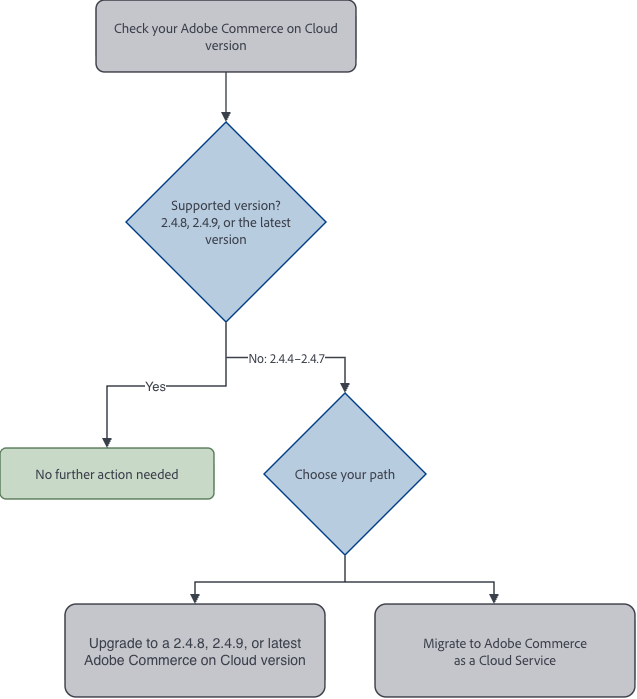

# Security and compliance: Required actions and deadlines

>[!NOTE]
>
> **Applies to:** Adobe Commerce on Cloud (PaaS) environments running Adobe Commerce versions 2.4.4 through 2.4.9.
>
> This guidance does not apply to [!DNL Adobe Commerce as a Cloud Service] (SaaS) environments or Adobe Commerce on-premises deployments.

Adobe Commerce on Cloud (PaaS) environments operate under a [shared responsibility model](../security-and-compliance/shared-responsibility.md): Adobe secures and maintains the platform, and customers keep their environments on supported software, apply patches promptly, audit third-party extensions, and secure custom code.

To align with industry best practices, Adobe is strengthening the security requirements for Adobe Commerce on Cloud. These requirements cover supported versions of Adobe Commerce and third-party software dependencies, each with a defined enforcement date.

This page outlines the actions all customers on Adobe Commerce on Cloud (version 2.4.4 to 2.4.9) need to take to ensure that their ecommerce environments remain secure, along with the enforcement dates, and what to expect when the security requirements are not met.

## Actions required to maintain a secure, compliant environment

To keep your ecommerce environment secure and compliant, make sure it uses:

1. Supported versions of all third-party software dependencies: PHP, MariaDB, Elasticsearch/OpenSearch, Redis, and RabbitMQ
1. A secure and supported version of Adobe Commerce on Cloud: version 2.4.8, 2.4.9, or the latest supported version

Adobe is enforcing these requirements because software that has reached end of vendor support no longer receives security updates or patches, leaving known vulnerabilities unresolved. Staying on supported software helps you maintain PCI compliance and protect your business and your customers' data.

To review your environment and plan any necessary work, follow the guidance in the following sections. If an environment does not meet the security requirements by the deadlines in [Table 1](#step-2-identify-any-required-dependency-upgrades) and [Table 2](#step-2-choose-upgrade-or-migrate-path), Adobe suspends inbound traffic to the affected environment, taking the storefront offline.

If your environments run supported versions of Adobe Commerce on Cloud and third-party software, you meet security requirements. You do not need to take any further action.

## Action 1: Upgrade third-party software dependencies {#upgrade-third-party-software-dependencies}

Check that your environments run vendor-supported versions of the following third-party software dependencies: PHP, MariaDB, Elasticsearch/OpenSearch, Redis, and RabbitMQ. If an environment uses an unsupported version of any dependency, upgrade that dependency.

### Step 1: Check your dependency versions

1. Sign in to the [Cloud Console](https://console.adobecommerce.com/).
1. Open the relevant project, then select the environment you want to review.
1. Check the service configuration for that environment in the `.magento/services.yaml` file, which defines the supported service names and versions used by Adobe Commerce on Cloud. For detailed instructions, see [Configure services](https://experienceleague.adobe.com/en/docs/commerce-on-cloud/user-guide/configure/service/services-yaml#view-configured-services-and-versions).

### Step 2: Identify any required dependency upgrades

Work with Adobe to schedule an upgrade to the target version shown in *Table 1* by the applicable deadline.

**Table 1: Software dependency upgrade requirements**

| Dependency | Current version | Minimum required target version | Enforcement date |
| --- | --- | --- | --- |
| PHP | 8.1 and below | 8.2 or higher | May 31, 2027 |
| MariaDB/Galera | 10.5 and below | 10.6 or higher | October 30, 2026 |
| MariaDB/Galera | Greater than 10.5 but lower than 10.11 | 10.11 or higher | May 31, 2027 |
| Elasticsearch | any version | OpenSearch:<br>2.19 for 2.4.4 and 2.4.5.<br>3 for 2.4.6 and above. | October 30, 2026 |
| OpenSearch | 1.x | 2.19 for 2.4.4 and 2.4.5.<br>3 for 2.4.6 and above. | May 31, 2027 |
| Redis | 5 and below | Valkey 8 or higher | May 31, 2027 |
| RabbitMQ | 3.9 and below | 3.13 or higher | October 30, 2026 |
| RabbitMQ | 3.10 through 3.12 | 4.3 or higher | May 31, 2027 |

>[!IMPORTANT]
>
>The specific Adobe Commerce release must also support the target version for the dependency. Check the [System requirements](https://experienceleague.adobe.com/en/docs/commerce-operations/installation-guide/system-requirements) before planning an upgrade.

### Step 3: Prepare for the software dependency upgrade

Adobe performs the required platform-dependency upgrades through a scheduled Support engagement. You, your development team, or your solution integrator plan, test, and validate Commerce application upgrades or migrations, including custom code, extensions, integrations, and business-critical workflows. Adobe provides tools and support to help with the process.

* **Get started:** Open a [support ticket](https://experienceleague.adobe.com/en/docs/support-resources/adobe-support-tools-guide/adobe-commerce-support/adobe-commerce-help-center-user-guide#support-case) listing the environments and the dependencies to upgrade. Submit your ticket at least 30 days before your enforcement date so Adobe can schedule the work.

* **Downtime:** Adobe confirms the expected window with you when scheduling.

* **Testing:** Upgrade and validate a non-production environment before production. At minimum, validate critical business workflows, including checkout, search, cart, and any custom integrations. These requirements apply to all your environments, so plan to upgrade every environment, not only production.

* **Compatibility:** Most of these changes are version upgrades within the same software and carry low risk. The following changes warrant closer attention:

  * **Elasticsearch to OpenSearch** and **Redis to Valkey** are migrations to different software, not version upgrades. Custom code, extensions, or configuration that reference the original service may also need updates.
  * Upgrading from **PHP 8.1 to 8.2** surfaces deprecations in custom code and third-party extensions.

If you use third-party extensions, confirm with your extension vendors that their current releases support your target software versions. If you work with a solution integrator, involve them early in upgrade planning, testing, and validation.

## Action 2: Upgrade or migrate your Adobe Commerce version {#upgrade-or-migrate-your-adobe-commerce-version}

Check which Adobe Commerce on Cloud version your environments run. If any environment is not on a supported version, you can upgrade to version 2.4.9 or the latest supported version, or migrate to [!DNL Adobe Commerce as a Cloud Service].

The following diagram summarizes this process:

{width="600" align="center"}

### Step 1: Determine whether your environment needs an upgrade

1. Sign in to your Adobe Commerce Admin panel.

   The version you are currently using appears in the bottom-right corner of any Admin page.

1. If the version is hidden from the Admin panel:

   * Connect to the [remote environment](https://experienceleague.adobe.com/en/docs/commerce-on-cloud/user-guide/develop/secure-connections#connect-to-a-remote-environment).
   * Use the Adobe Commerce [Command-line tool](https://experienceleague.adobe.com/en/docs/commerce-operations/configuration-guide/cli/config-cli) to check the version.

     ```shell
     bin/magento --version
     ```

Use this version to determine your next step:

* If your environment already runs a supported version—2.4.8, 2.4.9, or the latest supported version—no further steps are required for Action 2.
* If your environment runs an unsupported version—2.4.4 through 2.4.7—an upgrade or migration is needed. Continue to [Step 2](#step-2-choose-upgrade-or-migrate-path) to choose the path that best fits your environment.

### Step 2: Choose the upgrade or migration path {#step-2-choose-upgrade-or-migrate-path}

You can choose between two paths:

1. [Upgrade to a supported Adobe Commerce on Cloud version](#upgrade-to-a-supported-adobe-commerce-on-cloud-version)
1. [Migrate to Adobe Commerce as a Cloud Service (SaaS)](#migrate-to-adobe-commerce-as-a-cloud-service)

Your enforcement date stays the same no matter which path you choose.

**Table 2: Adobe Commerce on Cloud version upgrade requirements**

| Current version of Adobe Commerce on Cloud | Required action and reason | Enforcement date |
| --- | --- | --- |
| Version 2.4.4 or 2.4.5 | Apply the latest available security updates for your current release line while planning an upgrade to a supported Adobe Commerce on Cloud release—currently 2.4.9 or the latest supported version—or migrate to [!DNL Adobe Commerce as a Cloud Service]<br><br>Reason: Versions 2.4.4 and 2.4.5 receive only limited, isolated security fixes for the core application until May 31, 2027. This does not include quality fixes, compatibility support for application dependencies (for example, PHP), or platform dependency updates. See Adobe's [Lifecycle Policy](https://experienceleague.adobe.com/en/docs/commerce-operations/release/planning/lifecycle-policy). | June 1, 2027 |
| Version 2.4.6 or 2.4.7 | Continue using a supported version of your current release line while planning your next step.<br><br>Reason: Version 2.4.6 receives extended support through August 30, 2027, and only limited, isolated security fixes for the core application until May 31, 2028. Version 2.4.7 receives standard support through May 31, 2027, and extended support through May 31, 2028.<br><br>See Adobe's [Lifecycle Policy](https://experienceleague.adobe.com/en/docs/commerce-operations/release/planning/lifecycle-policy). | June 1, 2028 |
| Version 2.4.8 or 2.4.9 | No Adobe Commerce on Cloud version upgrade action is needed. The third-party software dependency deadlines in [Action 1](#upgrade-third-party-software-dependencies) still apply. | Not applicable |

To help you decide the best path, review the following comparison table.

**Table 3: Adobe Commerce on Cloud compared to [!DNL Adobe Commerce as a Cloud Service]**

| | Adobe Commerce on Cloud version 2.4.9<br>or the latest supported version | [!DNL Adobe Commerce as a Cloud Service] |
| --- | --- | --- |
| **What it is** | The current Adobe Commerce release with full security coverage, quality fixes, and platform dependency updates. | Adobe's fully managed commerce platform, built for continuous innovation without the upgrade overhead. [Learn more](https://experienceleague.adobe.com/en/docs/commerce/cloud-service/overview). |
| **Best for you if** | You want to keep the existing PaaS deployment model while managing your application upgrades, custom code, extensions, integrations, and patches. | You want to reduce recurring core-version upgrade work, lower your total cost of ownership, and receive ongoing platform updates managed by Adobe. |
| **Key benefit** | Meets the security requirements while preserving your existing setup. | Support for edge-delivery storefront experiences, Adobe-managed catalog and commerce services, native digital asset management, and access to available Adobe AI capabilities, all on infrastructure managed by Adobe. |

### Step 3: Get started on your chosen path

Once you have chosen your upgrade path, use the following resources to get started.

#### Upgrade to a supported Adobe Commerce on Cloud version

* **Upgrade Compatibility Report:** Adobe provides a detailed report identifying exactly what your upgrade to Adobe Commerce version 2.4.9 requires. [Generate your Upgrade Compatibility Report](https://supportinsights.adobe.com/commerce/tab/main).

* **Software dependency upgrade:** Since you cannot upgrade software dependencies directly, open a [support ticket](https://experienceleague.adobe.com/en/docs/support-resources/adobe-support-tools-guide/adobe-commerce-support/adobe-commerce-help-center-user-guide#support-case) for Adobe to handle the upgrade for you. For details, see [Configure services](https://experienceleague.adobe.com/en/docs/commerce-on-cloud/user-guide/configure/service/services-yaml).

#### Migrate to Adobe Commerce as a Cloud Service

Adobe provides tools that reduce the cost and time of migrating to [!DNL Adobe Commerce as a Cloud Service], at no cost to you. These tools apply to migration only. They are not used for Adobe Commerce on Cloud version upgrades. See the [migration overview](https://experienceleague.adobe.com/en/docs/commerce/cloud-service/migration/overview) for the full migration guide, including migration paths and phases.

* **Migration assessment:** Rates the migration complexity of your customizations. See the [Migration Assessment Tool overview](https://experienceleague.adobe.com/en/docs/commerce/cloud-service/migration/migration-tools/assessment).

* **Data migration:** The [bulk and incremental data migration tool](https://experienceleague.adobe.com/en/docs/commerce/cloud-service/migration/migration-tools/bulk-data/migration-tool) moves your data to your new [!DNL Adobe Commerce as a Cloud Service] environment.

* **AI-assisted migration and developer tools:** Adobe Developer App Builder and Commerce Storefront powered by Edge Delivery Services help accelerate storefront modernization and extension re-platforming.

## What happens if an environment is not updated?

If you need help upgrading dependencies or the Adobe Commerce on Cloud version, or migrating to [!DNL Adobe Commerce as a Cloud Service], contact your account team, or [Support Services](https://experienceleague.adobe.com/en/docs/support-resources/adobe-support-tools-guide/adobe-commerce-support/adobe-commerce-help-center-user-guide#support-case).

| Situation | What to expect |
| --- | --- |
| **Before the enforcement date** | Contact Adobe if you need help or more time to plan your upgrade or migration. |
| **On the enforcement date** | Environments that meet the applicable requirements do not require enforcement action. Environments that do not meet the requirements may have traffic suspended, which makes the storefront unavailable. |
| **After traffic suspension** | Environments that remain non-compliant may have their associated cloud services terminated and enter the decommissioning process. |

>[!IMPORTANT]
>
>Adobe provides advance notifications and a data-export window before environment deactivation so you can retrieve your data. After an environment is decommissioned, the hosted data and assets are permanently deleted and cannot be restored.

>[!MORELIKETHIS]
>
>* [Lifecycle policy](lifecycle-policy.md)
>* [Version upgrade enforcement policy for Adobe Commerce on Cloud](version-upgrade-enforcement-policy.md)
>* [Shared responsibility security and operational model](../security-and-compliance/shared-responsibility.md)
