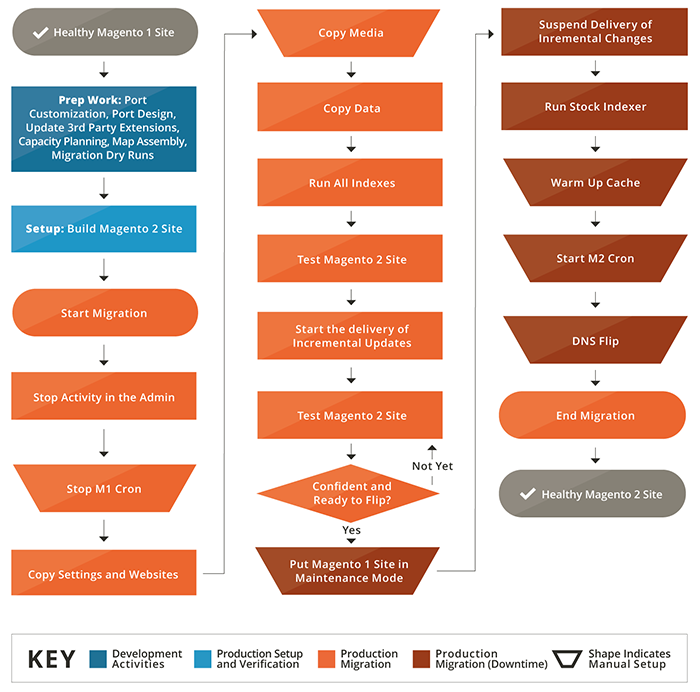

# How data migration works

This topic provides a high-level overview of how data is migrated from Magento 1 to Magento 2 using the [!DNL Data Migration Tool].

The [!DNL Data Migration Tool] is a command-line interface (CLI) tool used for transferring data from Magento 1 to Magento 2. The Tool verifies consistency between Magento 1 and 2 database structures (tables and fields), tracks the data transfer progress, creates logs, and runs data verification tests.

## Terminology

*  **Modes** - an ordered set of operations for migrating data from Magento 1.x to Magento 2.x.
*  **Steps** - the tasks in a mode that define the kinds of data to migrate.
*  **Stages** - the tasks in step that validate, transfer, and verify the data.
*  **Map files** - XML files that define the rules and connections between Magento 1.x and Magento 2.x data structures for completing the stages.

## Modes

The [!DNL Data Migration Tool] splits the migration process into three phases or *modes* in order to transfer and adapt data from Magento 1.x to Magento 2.x. The three modes are listed here and must be run in this order:

1. **Settings Mode**: migrates the system configuration and website-related settings.
1. **Data Mode**: migrates database assets in bulk.
1. **Delta Mode**: migrates incremental changes (changes since the last run), such as new customers and orders.

## Steps

The [!DNL Data Migration Tool] uses a list of *steps* within each mode to migrate a particular type of data. For example, in the Settings mode, there are two steps used to migrate all the settings data: the Stores step and the Settings step. Details about the specific data that is migrated in each of these steps (and for steps in the other modes), can be found in the [[!DNL Data Migration Tool] Technical Specification](technical-specification.md).

## Stages

Within each step are three *stages* that are always executed in this order to ensure that the data gets properly migrated:

1. **Integrity Check**: Compares the table field names, types, and other info to verify compatibility between Magento 1 and 2 data structures.
1. **Data Transfer**: Transfers the data table by table from Magento 1 and 2.
1. **Volume Check**: Compares the number of records between tables to verify that the transfer was successful.

## Map files

At the lowest level of the migration processes are the XML *map files*. The [!DNL Data Migration Tool] uses map files within the stages of a step to transform different data structures between the Magento 1.x and 2.x tables.

For example, when you transform data from a Magento Open Source 1.8.0.0 database to Magento Open Source 2.x.x, the map file accounts for the fact that a table was renamed, and renames it accordingly in the destination database. If there are no differences in data structure or data format, the [!DNL Data Migration Tool] transfers it as-is, including data from tables created by extensions, to the Magento 2 database.

When differences are not declared in map files, then the [!DNL Data Migration Tool] displays an error and does not start.

Mapping files are discussed in more detail in [[!DNL Data Migration Tool] Technical Specification].

## Migration flow diagram

[[!DNL Data Migration Tool] Technical Specification](technical-specification.md)

We are pleased you are considering moving from the world's #1 commerce platform --- Magento 1.x --- to the platform of the future, Magento 2. We are excited to share the details about this process, which we refer to as migration.

## Migration components

Magento 2 migration involves four components: data, extensions and custom code, themes, and customizations.

### Data

We have developed the **Magento 2 [!DNL Data Migration Tool]** to help you efficiently move all of your products, customers, and order data, store configurations, promotions, and more to Magento 2. This guide provides information on the tool and best practices for using it to migrate your data.

### Extensions and custom code

We have been working hard with the development community to help you use your Magento 1 extensions in Magento 2. Now we are proud to present the [Commerce Marketplace](https://commercemarketplace.adobe.com//), where you can download or purchase the latest versions of your favorite extensions.

More information on developing extensions for Magento 2 is available in the [PHP Developer Guide](https://developer.adobe.com/commerce/php/development/).

### Themes and customizations

Magento 2 uses new approaches and technologies that give merchants an unmatched ability to create innovative shopping experiences and scale to new levels. To take advantage of these advances, developers must make changes to their themes and customizations. Documentation is available online for creating Magento 2 [themes](https://developer.adobe.com/commerce/frontend-core/guide/themes/), [layouts](https://developer.adobe.com/commerce/frontend-core/guide/layouts/), and [customizations](https://developer.adobe.com/commerce/frontend-core/guide/layouts/xml-manage/).

## Migration efforts

Just like an upgrade between 1.x versions (for example, from v1.12 to v1.14), the level of effort to migrate from Magento 1 to Magento 2 depends upon how you have built your site and its level of customization.
However, we are constantly improving the [!DNL Data Migration Tool] (see the [Changelog](https://github.com/magento/data-migration-tool/blob/2.3/CHANGELOG.md) for more details); so the migration efforts are continuously decreasing.
