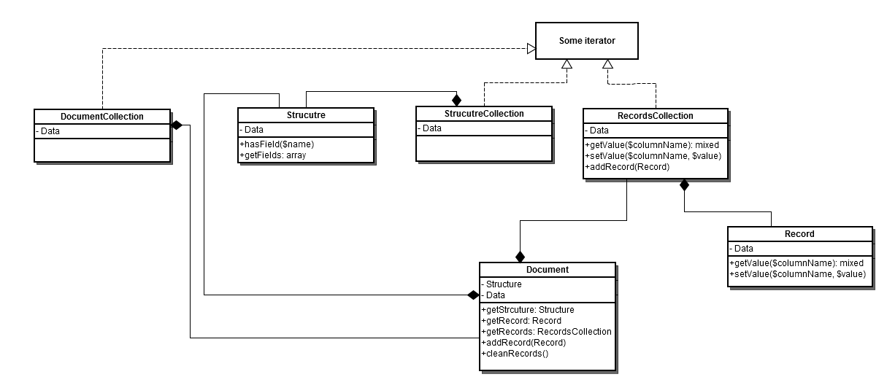

# [!DNL Data Migration Tool] technical specification

This section describes [!DNL Data Migration Tool] implementation details and how to extend its functionality.

## Repositories

To access the [!DNL Data Migration Tool] source code, see the GitHub [repository](https://github.com/magento/data-migration-tool).

## System requirements

The [system requirements](../../installation/system-requirements.md) for the [!DNL Data Migration Tool] are the same as for Magento 2.

## Internal structure

### Directory structure

The following diagram represents directory structure of [!DNL Data Migration Tool]:

```

├── etc                                    --- all configuration files
│   ├── opensource-to-opensource            --- configuration files for migration from Magento Open Source 1 to Magento Open Source 2
│   │   ├── 1.9.1.1
│   │   │   ├── config.xml.dist
│   │   │   └── map.xml.dist
│   │   ├── 1.9.2.0
│   │   │   ├── config.xml.dist
│   │   │   └── map.xml.dist
│   │   ├── ........
│   │   ├── class-map.xml.dist
│   │   ├── deltalog.xml.dist
│   │   └── settings.xml.dist
│   │   ├── ........
│   ├── opensource-to-commerce              --- configuration files for migration from Magento Open Source 1 to Adobe Commerce 2
│   ├── commerce-to-commerce                --- configuration files for migration from Adobe Commerce 1 to Adobe Commerce 2
│   ├── class-map.xsd
│   ├── config.xsd
│   ├── map.xsd
│   └── settings.xsd
├── src
│   └── Migration
│       ├── App                             --- application framework
│       ├── Console
│       ├── Handler                         --- handlers are used by map files
│       │   ├── AbstractHandler.php
│       │   ├── AddPrefix.php
│       │   ├── ConvertIp.php
│       │   ├── ........
│       ├── Logger
│       ├── Reader
│       ├── Mode
│       │   ├── AbstractMode.php
│       │   ├── Data.php
│       │   ├── Delta.php
│       │   └── Settings.php
│       ├── ResourceModel                   --- contains adapter for connection to data storage and classes to work with structured data
│       │   ├── Adapter
│       │   │   └── Mysql.php
│       │   ├── AbstractCollection.php
│       │   ├── AbstractResource.php
│       │   ├── AdapterInterface.php
│       │   ├── Destination.php
│       │   ├── Document.php
│       │   ├── Record.php
│       │   ├── Source.php
│       │   └── Structure.php
│       ├── Config.php
│       ├── Exception.php
│       └── Step                            --- functionality for migrating specific data
│           ├── Eav
│           │   ├── Data.php
│           │   ├── Helper.php
│           │   ├── InitialData.php
│           │   ├── Integrity.php
│           │   └── Volume.php
│           ├── Map
│           │   ├── Data.php
│           │   ├── Delta.php
│           │   ├── Helper.php
│           │   ├── Integrity.php
│           │   └── Volume.php
│           ├── UrlRewrite
│           │   ├── Version11300to2000.php
│           │   ├── Version11410to2000.php
│           │   └── Version191to2000.php
│           ├── ..........
└── tests
    ├── integration
    ├── static
    └── unit
```

## Entry Point

The script that runs the migration process is located at: `magento-root/bin/magento`.

## Configuration

The schema for the configuration `config.xsd` file is located in the `etc/` directory. The default configuration file (`config.xml.dist`) is created for each version of Magento 1.x. It is located in a separate directory under `etc/`.

The default configuration file can be replaced by a custom one (see [command syntax](migrate-data/overview.md#command-syntax)).

The configuration file has the following structure:

```xml
<config xmlns:xs="http://www.w3.org/2001/XMLSchema-instance" xs:noNamespaceSchemaLocation="config.xsd">
    <steps mode="settings">
        <step title="Settings step">
            <integrity>Migration\Step\Settings</integrity>
            <data>Migration\Step\Settings</data>
        </step>
    </steps>
    <steps mode="data">
        <step title="Map step">
            <integrity>Migration\Step\Map\Integrity</integrity>
            <data>Migration\Step\Map\Data</data>
            <volume>Migration\Step\Map\Volume</volume>
        </step>
        ...
    </steps>
    <steps mode="delta">
        <step title="Map step">
            <delta>Migration\Step\Map\Delta</delta>
            <volume>Migration\Step\Map\Volume</volume>
        </step>
        ...
    </steps>
    <source>
        <database host="localhost" name="magento1" user="root" password=""/>
    </source>
    <destination>
        <database host="localhost" name="magento2" user="root" password=""/>
    </destination>
    <options>
        <map_file>map-file.xml</map_file>
        <settings_map_file>settings-map-file.xml</settings_map_file>
        <bulk_size>100</bulk_size>
        <custom_option>custom_option_value</custom_option>
        <source_prefix />
        <dest_prefix />
        ...
    </options>
</config>
```

*  steps - describes all steps that are processed during migration

*  source - configuration for data source. Available source types: database

*  destination - configuration for data destination. Available destination types: database

*  options - list of parameters. Contains both mandatory (map_file, settings_map_file, bulk_size) and optional (custom_option, resource_adapter_class_name, prefix_source, prefix_dest, log_file) parameters

Change prefix option in case Magento was installed with prefix in database tables. It can be set for Magento 1 and Magento 2 databases. Use the "source_prefix" and "dest_prefix" configuration options accordingly.

Configuration data is accessible with the `\Migration\Config` class.

## Steps available operations

|Document|Field|
|---|---|
|`step`|Second-level node inside the Steps node. Description of the relevant step must be specified in the `title` attribute.|
|`integrity`|Specifies the PHP class responsible for the integrity check. Compares the table field names, types, and other info to verify compatibility between Magento 1 and 2 data structures.|
|`data`|Specifies the PHP class responsible for the data check. Transfers the data, table by table from Magento 1 to Magento 2.|
|`volume`|Specifies the PHP class responsible for the volume check. Compares the number of records between tables to verify that the transfer was successful.|
|`delta`|Specifies the PHP class responsible for the delta check. Transfers the delta from Magento 1 to Magento 2 after the full data migration.|

## Source database information attributes

|Document|Field|Required?|
|---|---|---|
|`name`|Database name of the Magento 1 server.|yes|
|`host`|Host IP address of the Magento 1 server.|yes|
|`port`|Port number of the Magento 1 server.|no|
|`user`|Username of the Magento 1 database server.|yes|
|`password`|Password of the Magento 1 database server.|yes|
|`ssl_ca`|Path to SSL Certificate Authority file.|no|
|`ssl_cert`|Path to SSL Certificate file.|no|
|`ssl_key`|Path to SSL Key file.|no|

## Destination database information attributes

|Document|Field|Required?|
|---|---|---|
|`name`|Database name of the Magento 2 server.|yes|
|`host`|Host IP address of the Magento 2 server.|yes|
|`port`|Port number of the Magento 2 server.|no|
|`user`|Username of the Magento 2 database server.|yes|
|`password`|Password of the Magento 2 database server.|yes|
|`ssl_ca`|Path to SSL Certificate Authority file.|no|
|`ssl_cert`|Path to SSL Certificate file.|no|
|`ssl_key`|Path to SSL Key file.|no|

## Connect using the TLS protocol

You can also connect to a database using the TLS protocol (i.e., using public/private cryptographic keys). Add the following optional attributes to the `database` element:

*  `ssl_ca`
*  `ssl_cert`
*  `ssl_key`

For example:

```xml
<source>
    <database host="localhost" name="magento1" user="root" ssl_ca="/path/to/file" ssl_cert="/path/to/file" ssl_key="/path/to/file"/>
</source>
<destination>
    <database host="localhost" name="magento2" user="root" ssl_ca="/path/to/file" ssl_cert="/path/to/file" ssl_key="/path/to/file"/>
</destination>
```

## Step internals

The migration process consists of steps.

Step is a unit that provides functionality required for migration some separated data. Step can consist of one or more stages (integrity check, data, volume check, and delta).

By default, there are several steps ([Map](#map-step), [EAV](#eav), [URL Rewrites](#url-rewrite-step), and so on). You can optionally add your own steps as well.

Steps related classes are located in the src/Migration/Step directory.

To execute a Step class, the class must be defined in config.xml file.

```xml
<config xmlns:xs="http://www.w3.org/2001/XMLSchema-instance" xs:noNamespaceSchemaLocation="config.xsd">
    <steps mode="mode_name">
        <step title="Step Name">
            <integrity>Migration\Step\StepName\Integrity</integrity>  <!-- integrity check stage of the step -->
            <data>Migration\Step\StepName\Data</data>
            <volume>Migration\Step\StepName\Volume</volume>
        </step>
        ...
    </steps>
    ...
</config>
```

Every stage class must implement StageInterface.

```php
class StageClass implements StageInterface
{
  /**
   * Perform the stage
   *
   * @return bool
   */
  public function perform()
  {
  }
}
```

If the data stage supports rollback, it should implement the `RollbackInterface` interface.

Visualization of the running step is provided by Symfony's ProgressBar component (see [Progress bar](https://symfony.com/doc/current/components/console/helpers/progressbar.html)). Access this component in a step as LogLevelProcessor.

Main methods for use are:

```xml
$this->progress->start();
$this->progress->advance();
$this->progress->finish();
```

## Step stages

### Integrity check

Each step has to check that the structure of data source (Magento 1 by default) and the structure of data destination (Magento 2) are compatible. If not - an error displays with entities that are not compatible. In case when fields have different datatypes (the same field has decimal datatype in Magento 1 and integer in Magento 2), a warning message displays (except when it was covered in Map file).

### Data Transfer

In case integrity check passed, transferring data is running. If errors appear, then rollback runs to revert to the previous state of Magento 2. If a step class implements the `RollbackInterface` interface, then the rollback method executes when there is an error.

### Volume check

After data has been migrated, Volume Check provides additional check that all data was transferred correctly.

### Delta delivery

Delta functionality is responsible for delivering the rest of data that was added after main migration.

## Running modes

The tool should be run in three different modes in particular order:

1. settings - migration of system settings
1. data - main migration of data
1. delta - migration of the rest of data that was added after main migration

Each mode has its own list of steps to be executed. See config.xml

### Settings migration mode

Settings migration mode of this tool is used to transfer following entities:

1. Websites, stores, store views.
1. Store configuration (mainly Stores->Configuration in M2 or System->Configuration in M1)

All store configuration keeps its data in core_config_data table in database. settings.xml file contains rules for this table that are applied during migration process. This file describes settings that should be ignored, renamed or should change their values. settings.xml file has the following structure:

```xml
<?xml version="1.0" encoding="UTF-8"?>
<settings xmlns:xs="http://www.w3.org/2001/XMLSchema-instance" xs:noNamespaceSchemaLocation="settings.xsd">
    <key>
        <ignore>
            <path>path/to/ignore*</path>
        </ignore>
        <rename>
            <path>path/to/rename</path>
            <to>new/path/renamed</to>
        </rename>
    <key>
    <value>
        <transform>
            <path>some/key/to/change</path>
            <handler class="Some\Handler\Class"/>
        </transform>
    </value>
</settings>
```

Under the node `<key>` there are rules that work with the 'path' column in the `core_config_data` table. `<ignore>` rules prevent the tool from transferring some settings. Wildcards can be used in this node. All other settings not listed in the `<ignore>` node are migrated. If the path to a setting changed in Magento 2, it should be added to `//key/rename` node, where the old path indicates in `//key/rename/path` node and new path indicates in `//key/rename/to` node.

Under the node `<value>`, there are rules that work with the 'value' column in the `core_config_data` table. These rules aim to transform value of settings by handlers (classes that implement `Migration\Handler\HandlerInterface`) and adapt it for Magento 2.

### Data migration mode

In this mode, most of the data is migrated. Before data migration the integrity check stages run for each step. If the integrity check passes, the [!DNL Data Migration Tool] installs deltalog tables (with prefix `m2_cl_*`) and corresponding triggers to the Magento 1 database and runs data migration stage of steps. When migration is completed without errors, the volume check checks data consistency. It can show a warning message if you migrate the live store. Do not worry, delta migration takes care of this incremental data. The most valuable migration steps are Map, URL Rewrite, and EAV.

#### Map Step

Map step is responsible for transferring most of data from Magento 1 to Magento 2. This step reads instructions from map.xml file (located in the `etc/` directory). The file describes differences between data structures of source (Magento 1) and destination (Magento 2). In case Magento 1 contains tables or fields that belong to some extension that does not exist in Magento 2, then these entities can be placed here to ignore them by Map Step. Otherwise, it displays an error message.

Map file has the next format:

```xml
<?xml version="1.0" encoding="UTF-8"?>
<map xmlns:xs="http://www.w3.org/2001/XMLSchema-instance" xs:noNamespaceSchemaLocation="map.xsd">
    <source>
        <document_rules>
            <ignore>
                <document>some_document2</document>
            </ignore>
            <rename>
                <document>some_document</document>
                <to>some_dest_document</to>
            </rename>
            <log_changes>
                <document key="primary_key">some_dest_document</document>
            </log_changes>
        </document_rules>

        <field_rules>
            <move>
                <field>some_document1.field1</field>
                <to>some_document1.field2</to>
            </move>
            <ignore>
                <field>some_document3.field8</field>
            </ignore>
            <transform>
                <field>some_document1.field1</field>
                <handler class="\Migration\Handler\Convert">
                    <param name="map" value="[value1:value2;value3:value4;value5:value6;]" />
                </handler>
            </transform>
        </field_rules>
    </source>
    <destination>
        <document_rules>
            <ignore>
                <document>some_document8</document>
            </ignore>
        </document_rules>

        <field_rules>
            <transform>
                <field>some_document5.field3</field>
                <handler class="\Migration\Handler\SetValue">
                    <param name="value" value="10" />
                </handler>
            </transform>
        </field_rules>
    </destination>
</map>
```

Areas:

*  *source* - contains rules of source database

*  *destination* - contains rules of destination database

Options:

*  *ignore* - document, field or datatype marked with this option is ignored

*  *rename* - describes name relations between documents with the different name. In a case when destination document name is not the same with the source document, you can use rename option to set source document name similar to destination table name

*  *move* - sets rule to move specified field from source document to destination document. NOTE: destination document name should be the same with the source document name. If source and destination document names are different - you need to use rename option for document that contains moved field

*  *transform* - is an option that allows user to migrate fields according to behavior described in handlers

*  *handler* - describes transformation behavior for fields. To call the handler, you need to specify a handler class name in a `<handler>` tag. Use the `<param>` tag with the parameter name and value data to pass it to handler

**Source** available operations:

|Document|Field|
|--- |--- |
|ignore rename|ignore move transform|

**Destination** available operations:

|Document|Field|
|--- |--- |
|ignore|ignore transform|

#### Wildcards

To ignore documents with similar parts (`document_name_1`, `document_name_2`), you can use wildcard functionality. Put `*` symbol instead of repeating part (`document_name_*`) and this mask covers all source or destination documents that meet this mask.

#### URL rewrite step

This step is complex because there are many different algorithms developed in Magento 1 which are not compatible with Magento 2. For different versions of Magento 1, there can be different algorithms. Thus under Step/UrlRewrite folder there are classes that were developed for some of particular versions of Magento and Migration\Step\UrlRewrite\Version191to2000 is one of them. It can transfer URL Rewrites data from Magento 1.9.1 to Magento 2.

#### EAV step

This step transfers all attributes (product, customer, RMA) from Magento 1 to Magento 2. It uses map-eav.xml file that contains rules similar to the ones in map.xml file for specific cases of processing data.

Some of the tables that are processed in the step:

*  `eav_attribute`
*  `eav_attribute_group`
*  `eav_attribute_set`
*  `eav_entity_attribute`
*  `catalog_eav_attribute`
*  `customer_eav_attribute`
*  `eav_entity_type`

### Delta migration mode

After main migration, additional data could have been added to the Magento 1 database (for example, by customers on storefront). To track this data, the Tool sets up the database triggers for tables in the beginning of migration process. For more information, see [Migrate data created by third-party extensions](migrate-data/delta.md#migrate-data-created-by-third-party-extensions).

## Data sources

To reach to the data sources of Magento 1 and Magento 2 and operate with its data (select, update, insert, delete) there are many classes in Resource folder. Migration\ResourceModel\Source and Migration\ResourceModel\Destination are main classes. All migration steps use it to operate with data. This data is contained in classes like Migration\ResourceModel\Document, Migration\ResourceModel\Record, Migration\ResourceModel\Structure etc.

Here is a class diagram of these classes:



## Logging

In order to implement output of migration process and control all possible levels PSR logger, which is used in Magento, is applied. `\Migration\Logger\Logger` class was implemented to provide logging functionality. To use the logger, you should inject it via constructor dependency injection.

```php
class SomeClass
{
    ...
    protected $logger;

    public function __construct(\Migration\Logger\Logger $logger)
    {
        $this->logger = $logger;
    }
    ...
}
```

After that you can use this class for logging of some events:

```php
$this->logger->info("Some information message");
$this->logger->debug("Some debug message");
$this->logger->error("Message about error operation");
$this->logger->warning("Some warning message");
```

There is a possibility to customize where log information should be written. You can do that by adding handler to logger using pushHandler() method of the logger. Each handler should implement `\Monolog\Handler\HandlerInterface` interface. As for now there are two handlers:

*  ConsoleHandler: writes messages to console

*  FileHandler: writes messages to log file that has been set in "log_file" config option

Also it is possible to implement any additional handler. There is a set of handlers in Magento framework. Example of adding handlers to logger:

```php
// $this->consoleHandler is the object of Migration\Logger\ConsoleHandler class
// $this->logger is the object of Migration\Logger\Logger class
$this->logger->pushHandler($this->consoleHandler);
```

To set additional data for logger (current mode, table name) you can use logger processors. There is one existing processor (MessageProcessor). It's created to add "extra" data for logging messages and are called each time when log method is executed. MessageProcessor has protected $extra var, which contain empty values for 'mode', 'stage', 'step' and 'table'. Extra data can be passed to processor as a second parameter (context) for log method. Currently additional data sets to processor in AbstractStep->runStage (pass current mode, stage, and step to processor) method and data classes where used logger->debug method (pass migrating table name). Example of adding processors to logger:

```php
// $this->processoris the object of Migration\Logger\messageProcessor class
// $this->logger is the object of Migration\Logger\Logger class
$this->logger->pushProcessor([$this->processor, 'setExtra']);
// As a second array value you need to pass method that should be executed when processor called
```

There is a possibility to set the level of verbosity. As for now there are three levels:

*  `ERROR` (writes only errors to the log)
*  `INFO` (only important information is written to the log, default value)
*  `DEBUG` (everything is written)

Verbosity log level can be set for each handler separately by calling `setLevel()` method. If you want to set verbosity level via command-line parameter, you should change 'verbose' option at application launch.

You can format log messages with the monolog formatter. To make formatter functionality work, you must specify the log handler using the `setFormatter()` method. Currently, we have one formatter class (`MessageFormatter`) that sets certain format (depends on verbosity level) during message handling (through the `format()` method executed from the handler).

Manipulating the logger (adding handlers and processors) and processing in verbose mode is performed in the `process()` method of the `Migration\Logger\Manager` class. The method is called when the application starts.

## Automatic tests

There are three types of tests in the [!DNL Data Migration Tool]: 

*  Static
*  Unit
*  Integration

They are located in the tool's `tests/` directory, which is the same as the type of test (unit tests are located in the `tests/unit` directory). To launch the test, you should have phpunit installed. Change the current directory to the test directory and launch phpunit. For example:

```bash
[10:32 AM]-[vagrant@debian-70rc1-x64-vbox4210]-[/var/www/magento2/vendor/magento/data-migration-tool]-[git master]
$ cd tests/unit
```

```bash
[10:33 AM]-[vagrant@debian-70rc1-x64-vbox4210]-[/var/www/magento2/vendor/magento/data-migration-tool/tests/unit]-[git master]
$ phpunit
PHPUnit 8.1.0 by Sebastian Bergmann.
....
```
