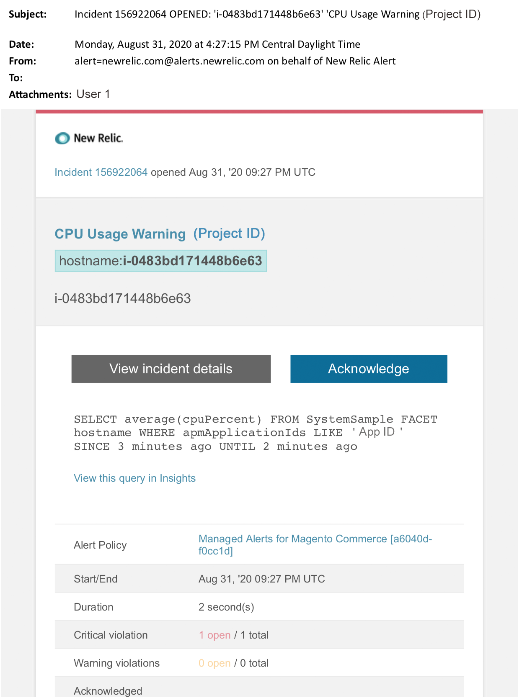

# Managed alerts for Adobe Commerce: CPU warning alert

This article provides troubleshooting steps when you receive a CPU warning alert for Adobe Commerce in New Relic. Immediate action is required to remedy the issue. The alert will look something like the following, depending on the alert notification channel you selected.

{width="500"}

## Affected products and versions

Adobe Commerce on cloud infrastructure Pro plan architecture

## Issue

You will receive an alert in New Relic if you have signed up to [Managed alerts for Adobe Commerce](managed-alerts-for-magento-commerce.md) and one or more of the alert thresholds have been surpassed. These alerts were developed by Adobe to give customers a standard set using insights from Support and Engineering.

 <u> **Do!** </u>

* Abort any deployment scheduled until this alert is cleared.
* Put your site into maintenance mode immediately if your site is completely unresponsive. For steps, refer to [Enable or disable maintenance mode](https://experienceleague.adobe.com/en/docs/commerce-operations/installation-guide/tutorials/maintenance-mode) in the Commerce Installation Guide. Make sure to add your IP to the exempt IP address list to ensure that you are still able to access your site for troubleshooting. For steps, refer to [Maintain the list of exempt IP addresses](https://experienceleague.adobe.com/en/docs/commerce-operations/installation-guide/tutorials/maintenance-mode#maintain-the-list-of-exempt-ip-addresses) in the Commerce Installation Guide.

<u>**Don't!**</u>

* Launch additional marketing campaigns which may bring additional pageviews to your site.
* Run indexers or additional crons which may cause additional stress on CPU or disk.
* Do any major administrative tasks (i.e., Commerce Admin, data imports/exports).
* Clear your cache.

## Solution

Follow these steps to identify and troubleshoot the cause.

1. Use [New Relic APM's Transaction page](https://docs.newrelic.com/docs/apm/applications-menu/monitoring/transactions-page-find-specific-performance-problems) to identify transactions with performance issues:
    * Sort transactions by ascending Apdex scores. [Apdex](https://docs.newrelic.com/docs/apm/new-relic-apm/apdex/apdex-measure-user-satisfaction) refers to user satisfaction to the response time of your web applications and services. [A low Apdex score](https://experienceleague.adobe.com/en/docs/commerce-knowledge-base/kb/troubleshooting/miscellaneous/troubleshoot-performance-using-new-relic-on-magento-commerce) can indicate a bottleneck (a transaction with a higher response time). Usually it is the database, Redis, or PHP. For steps, refer to New Relic [View transactions with highest Apdex dissatisfaction](https://docs.newrelic.com/docs/apm/new-relic-apm/apdex/apdex-measure-user-satisfaction/#apdex-dissat).
    * Sort transactions by highest throughput, slowest average response time, most time-consuming, and other thresholds. For steps, refer to New Relic [Find specific performance problems](https://docs.newrelic.com/docs/apm/applications-menu/monitoring/transactions-page-find-specific-performance-problems).
1. If you are still struggling to identify the source, use [New Relic APM's Infrastructure page](https://docs.newrelic.com/docs/infrastructure/infrastructure-data/infrastructure-ui-pages/infra-hosts-ui-page/) to identify resource heavy services. For steps, refer to New Relic [Infrastructure monitoring Hosts page: Processes tab](https://docs.newrelic.com/docs/infrastructure/infrastructure-ui-pages/infra-hosts-ui-page/#processes).
1. If you identify the source, SSH into the environment to investigate further. For steps, refer to [SSH into your environment](https://experienceleague.adobe.com/en/docs/commerce-cloud-service/user-guide/develop/secure-connections#ssh) in the Commerce on Cloud Guide.
1. If you are still struggling to identify the source:
    * Review recent trends to identify issues with recent code deployments or configuration changes (for example, new customer groups and large changes to the catalog). It is recommended that you review the past seven days of activity for any correlations in code deployments or changes.
    * Consider checking for and disabling flat catalogs. For steps, refer to [Slow performance, slow and long running crons](https://experienceleague.adobe.com/en/docs/commerce-knowledge-base/kb/troubleshooting/miscellaneous/slow-performance-slow-and-long-running-crons) in the Commerce Support Knowledge Base.
    * If you suspect that you are experiencing a DDoS attack, try blocking bot traffic. For steps, refer to [How to block malicious traffic for Adobe Commerce on Fastly level](https://experienceleague.adobe.com/en/docs/commerce-knowledge-base/kb/how-to/block-malicious-traffic-for-magento-commerce-on-fastly-level) in the Commerce Support Knowledge Base.
1. If the problem seems temporary, perform mitigation steps such as an upsize or place the site into maintenance mode. For steps, refer to [How to request temp resize](https://experienceleague.adobe.com/en/docs/commerce-knowledge-base/kb/how-to/how-to-request-temporary-magento-upsize) in the Commerce Support Knowledge Base, and [Enable or disable maintenance mode](https://experienceleague.adobe.com/en/docs/commerce-operations/installation-guide/tutorials/maintenance-mode) in the Commerce Installation Guide. If the upsize returns the site to normal operations, consider requesting a permanent upsize (contact your Adobe Account Team) or try to reproduce the problem in your Dedicated Staging by running a load test and optimize queries, or code that reduces pressure on services. For steps, refer to [Load and stress testing](https://experienceleague.adobe.com/en/docs/commerce-cloud-service/user-guide/develop/test/staging-and-production#load-and-stress-testing) in the Commerce on Cloud Guide.
