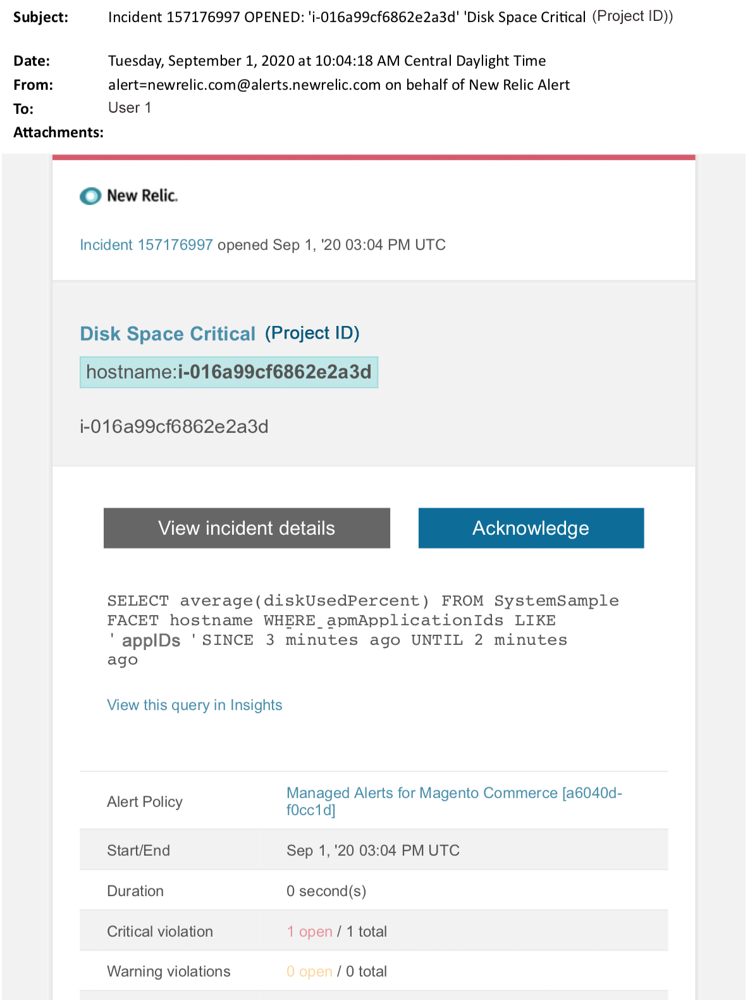

# Managed alerts for Adobe Commerce: Disk critical alert

This article provides troubleshooting steps when you receive a critical disk alert for Adobe Commerce in [!DNL New Relic]. Immediate action is required to remedy the issue. The alert will look something like the following, depending on the alert notification channel you selected.

{width="500"}

## Affected products and versions

Adobe Commerce cloud infrastructure on Pro plan architecture

## Issue

You will receive an alert in [!DNL New Relic] if you have signed up to [Managed alerts for Adobe Commerce](managed-alerts-for-magento-commerce.md) and one or more of the alert thresholds have been surpassed. These alerts were developed by Adobe to give customers a standard set using insights from Support and Engineering.

 <u> **Do!** </u>

* Abort any deployment scheduled until this alert is cleared.
* Put your site into maintenance mode immediately if your site is or becomes completely unresponsive. For steps refer to [Enable or disable maintenance mode](https://experienceleague.adobe.com/en/docs/commerce-operations/installation-guide/tutorials/maintenance-mode). Make sure to add your IP to the exempt IP address list to ensure that you are still able to access your site for troubleshooting. For steps, refer to [Maintain the list of exempt IP addresses](https://experienceleague.adobe.com/en/docs/commerce-operations/installation-guide/tutorials/maintenance-mode#maintain-the-list-of-exempt-ip-addresses).

 **Don't!**

* Launch additional marketing campaigns which may bring additional pageviews to your site.
* Run indexers or additional crons which may cause additional stress on CPU or disk.
* Do any major administrative tasks (i.e., Commerce Admin, data imports / exports).
* Clear your cache.

Your site may become non-responsive, (if you are not already experiencing a site outage) if you do any of the "Don't" actions before you have investigated and solved the cause of the alert.

## Solution

Follow these steps to identify and troubleshoot the cause.

>[!WARNING]
>
>Because this is a critical alert, it is highly recommended you complete **Step 1** before you try to troubleshoot the issue (Step 2 onwards).

1. Check if an Adobe Commerce support ticket exists. For steps, refer to [Track your support tickets](https://experienceleague.adobe.com/en/docs/commerce-knowledge-base/kb/help-center-guide/magento-help-center-user-guide#track-support-case) in the Commerce Support Knowledge Base. Support may have received a [!DNL New Relic] threshold alert, created a ticket and started working on the issue. If no ticket exists, create one. The ticket should have the following information:
    * Contact Reason: select **[!UICONTROL New Relic CRITICAL alert received]**.
    * Description of the alert.
    * [[!DNL New Relic] Incident link](https://docs.newrelic.com/docs/alerts/incident-management/view-event-details-incidents/). This is included in your [Managed alerts for Adobe Commerce](managed-alerts-for-magento-commerce.md).
1. In New Relic, review disks for highest use. For steps refer to Storage tab on New Relic [Infrastructure monitoring Hosts page: Storage tab](https://docs.newrelic.com/docs/infrastructure/infrastructure-ui-pages/infra-hosts-ui-page/#storage)
    * If in [!DNL New Relic] you see a slow increase in disk usage, try the following options:
    * Optimizing disk space by adjusting space allocation. For steps, refer to [Manage Disk space](https://experienceleague.adobe.com/docs/commerce-cloud-service/user-guide/develop/storage/manage-disk-space.html) in the Commerce on Cloud Guide. You may also need to request more disk space (contact your Adobe Account Team).
    * Clear up disk space for MySQL. Refer to [MySQL disk space is low](https://experienceleague.adobe.com/en/docs/commerce-knowledge-base/kb/troubleshooting/database/mysql-disk-space-is-low-on-magento-commerce-cloud) in the Commerce Support Knowledge Base for steps.
    * If [!DNL New Relic] shows rapidly increasing disk usage, this could indicate that there is a problem that has caused a file to increase very quickly in a directory. Do the following checks:
1. Check overall disk space to identify the problem by running the following command in the CLI/Terminal: `df -h`
1. After you identify a directory with unexpectedly large and increasing disk usage, you need to check the affected file system. The following example shows how to check the file directory `pub/media/`. This is the directory Commerce uses for storing logs and big media files. However, you should run this command for any directory that shows unexpected disk usage: `du -sch ~/pub/media/*`

If the output from the terminal shows a file in one of these directories rapidly increasing in disk usage and you know that the file's content is not needed, consider removing the file. If you are not comfortable taking this action, [submit an Adobe Commerce support ticket](https://experienceleague.adobe.com/en/docs/commerce-knowledge-base/kb/help-center-guide/magento-help-center-user-guide#support-case).
