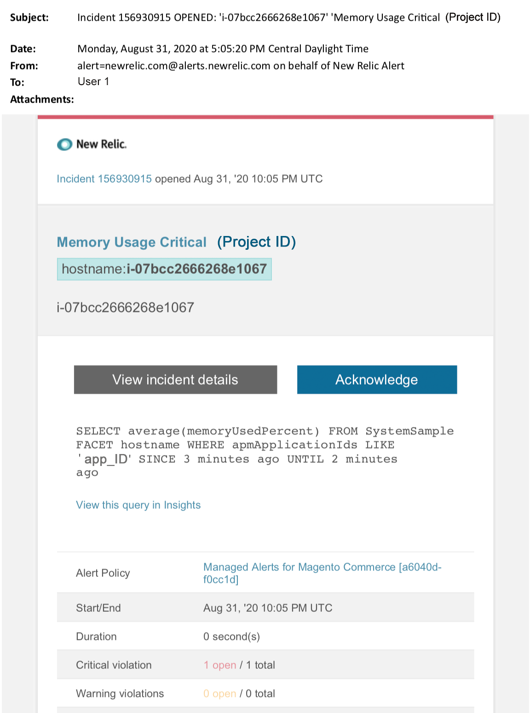

# Managed alerts on Adobe Commerce: Memory critical alert

This article provides troubleshooting steps when you receive a memory critical alert for Adobe Commerce in New Relic. Immediate action is required to remedy the issue. 

{width="500"}

## Affected products and versions

All versions of Adobe Commerce on cloud infrastructure Pro plan architecture.

## Issue

You will receive a managed alert in New Relic if you have signed up to [Managed alerts for Adobe Commerce](managed-alerts-for-magento-commerce.md) and one or more of the alert thresholds have been surpassed. These alerts were developed by Adobe to give customers a standard set using insights from Support and Engineering.

 <u> **Do!** </u>

* Abort any deployment scheduled until this alert is cleared
* Put your site into maintenance mode immediately if your site is or becomes completely unresponsive. For steps, see [Enable or disable maintenance mode](https://experienceleague.adobe.com/en/docs/commerce-operations/installation-guide/tutorials/maintenance-mode) in the Commerce Installation Guide. Make sure to add your IP to the exempt IP address list to ensure that you are still able to access your site for troubleshooting. For steps, see [Maintain the list of exempt IP addresses](https://experienceleague.adobe.com/en/docs/commerce-operations/installation-guide/tutorials/maintenance-mode#maintain-the-list-of-exempt-ip-addresses) in the Commerce Installation Guide.

 <u>**Don't!**</u>

* Launch additional marketing campaigns which may bring additional pageviews to your site.
* Run indexers or additional crons which may cause additional stress on CPU or disk.
* Do any major administrative tasks (i.e., Commerce Admin, data imports/exports).
* Clear your cache.

Your site may become non-responsive, (if you are not already experiencing a site outage) if you do any of the "Don't" actions before you have investigated and solved the cause of the alert.

## Solution

Follow these steps to identify and troubleshoot the cause.

>[!WARNING]
>
>Because this is a critical alert, it is highly recommended you complete **Step 1** before you try to troubleshoot the issue (Step 2 onwards).

1. Check if an Adobe Commerce support ticket exists. For steps, see [Track your support tickets](https://experienceleague.adobe.com/en/docs/commerce-knowledge-base/kb/help-center-guide/magento-help-center-user-guide#track-support-case) in the Commerce Support Knowledge Base. Support may have already received a New Relic threshold alert, created a ticket and started working on the issue. If no ticket exists, create one. The ticket should have the following information:
    * Contact Reason: select "New Relic CRITICAL alert received"
    * Description of the alert
    * [New Relic Incident link](https://docs.newrelic.com/docs/alerts-applied-intelligence/new-relic-alerts/alert-incidents/view-violation-event-details-incidents). This is included in your [Managed alerts for Adobe Commerce](managed-alerts-for-magento-commerce.md).

1. Use [New Relic APM's Infrastructure page](https://docs.newrelic.com/docs/infrastructure/infrastructure-ui-pages/infra-hosts-ui-page/) to identify top memory intensive processes. For steps, refer to New Relic [Infrastructure monitoring Hosts page: Processes tab](https://docs.newrelic.com/docs/infrastructure/infrastructure-ui-pages/infra-hosts-ui-page/#processes):
    * If services like Redis, MySQL, or PHP are the top sources of memory consumption, try the following:
1. Check that you are on the latest versions. Newer versions can sometimes fix memory leaks. If you are not on the latest version, consider upgrading. For steps, refer to [Change Services](https://experienceleague.adobe.com/docs/commerce-cloud-service/user-guide/configure/service/services-yaml.html) in the Commerce on Cloud Guide.
1. If the problem with the service is not version related, try the following:
1. **MySQL**: Check for issues like long running queries, Primary keys not defined, and duplicate indexes. For steps, refer to [Most Common database Issues in Adobe Commerce on cloud infrastructure](https://experienceleague.adobe.com/docs/commerce-operations/implementation-playbook/best-practices/maintenance/resolve-database-performance-issues.html) in the Commerce Implementation Playbook.
1. **Redis**: If Redis is a top source of memory consumption, [submit a support ticket](https://experienceleague.adobe.com/en/docs/commerce-knowledge-base/kb/help-center-guide/magento-help-center-user-guide#support-case).
1. **PHP**: If PHP is a top source of memory consumption, review running processes by running `ps aufx` in the CLI/Terminal. In the terminal output you will see cron jobs and processes that are currently being executed. Check the output for the processes' execution time. If there is a cron with a long execution time, the cron may be hanging. For troubleshooting steps, see [Slow performance, slow and long running crons](https://experienceleague.adobe.com/en/docs/commerce-knowledge-base/kb/troubleshooting/miscellaneous/slow-performance-slow-and-long-running-crons) and [Cron job stuck in "running" status](https://experienceleague.adobe.com/en/docs/commerce-knowledge-base/kb/troubleshooting/miscellaneous/cron-job-is-stuck-in-running-status) in the Commerce Support Knowledge Base.
1. If you are still struggling to identify the source of the problem, use [New Relic APM's Transaction page](https://docs.newrelic.com/docs/apm/applications-menu/monitoring/transactions-page-find-specific-performance-problems) to identify transactions with performance issues:
    * Sort transactions by ascending Apdex scores. [Apdex](https://docs.newrelic.com/docs/apm/new-relic-apm/apdex/apdex-measure-user-satisfaction) refers to user satisfaction to the response time of your web applications and services. A [low Apdex score](managed-alerts-for-magento-commerce-apdex-warning-alert.md) can indicate a bottleneck (a transaction with a higher response time). Usually it is the database, Redis, or PHP. For steps, refer to New Relic [View transactions with highest Apdex dissatisfaction](https://docs.newrelic.com/docs/apm/new-relic-apm/apdex/view-your-apdex-score#apdex-dissat).
    * Sort transactions by highest throughput, the slowest average response time, most time-consuming, and other thresholds. For steps, refer to New Relic [Find specific performance problems](https://docs.newrelic.com/docs/apm/applications-menu/monitoring/transactions-page-find-specific-performance-problems). If you are still struggling to identify the issue, use [New Relic APM's Infrastructure page](https://docs.newrelic.com/docs/infrastructure/infrastructure-ui-pages/infra-hosts-ui-page/).
1. If you cannot identify the cause of increased memory consumption, review recent trends to identify issues with recent code deployments or configuration changes (for example, new customer groups and large changes to the catalog). It is recommended that you review the past 7 days of activity for any correlations in code deployments or changes.
1. If the above methods do not help you find the cause and/or solution within a reasonable time, request an upsize or place site into maintenance mode if you have not already. For steps, see [How to request temp resize](https://experienceleague.adobe.com/en/docs/commerce-knowledge-base/kb/how-to/how-to-request-temporary-magento-upsize) in the Commerce Support Knowledge Base, and [Enable or disable maintenance mode](https://experienceleague.adobe.com/en/docs/commerce-operations/installation-guide/tutorials/maintenance-mode) in the Commerce Installation Guide.
1. If the upsize returns the site to normal operations, consider requesting a permanent upsize (contact your Adobe Account Team), or try to reproduce the problem in your Dedicated Staging by running a load test and optimize queries, or code that reduces pressure on services. See [Load and stress testing](https://experienceleague.adobe.com/en/docs/commerce-cloud-service/user-guide/develop/test/staging-and-production#load-and-stress-testing) in the Commerce on Cloud Guide.
