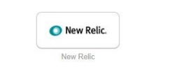
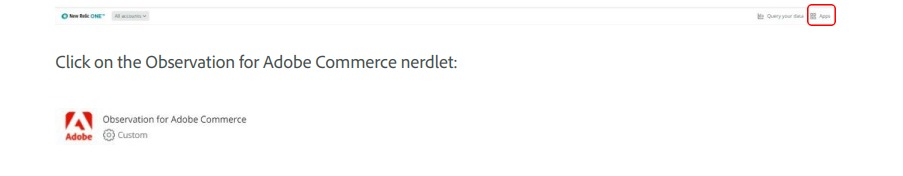

# Accessing the [!DNL Observation for Adobe Commerce] nerdlet

To use the [!DNL New Relic Observation for Adobe Commerce] nerdlet, ensure you have access to [!DNL New Relic].

1. Go to the [!UICONTROL Okta] home page (for internal Adobe users only).
1. Select the [!UICONTROL New Relic applet] (for internal Adobe users only).

    

1. Authenticate through [!UICONTROL Okta] (for internal Adobe users only).
1. From the [!DNL New Relic] home page, select the Apps menu item.

    
