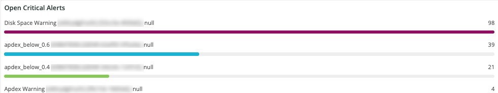
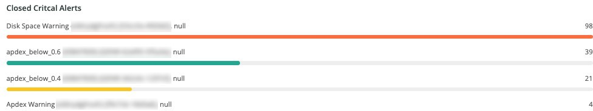
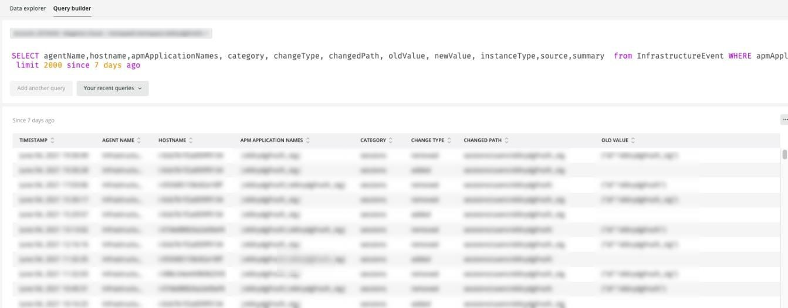

# The Alerts tab

This tab provides a range of alerts, including open and close critical alerts.

## Open alert details

This frame shows a count of the open critical alerts across the selected timeframe. The alerts will include Adobe-created alerts and any created by the partner or merchant.

## Closed critical alerts

This frame shows a count of the closed critical alerts across the selected timeframe. The alerts will include Adobe-created alerts and any created by the partner or merchant.

## Critical alert details

This frame shows a count of the critical alert details across the selected timeframe, including timestamp, condition name, and whether the alert event is open or closed.

## Infrastructure alert details

This frame shows applications, hosts, and other infrastructure events across the selected timeframe. 

