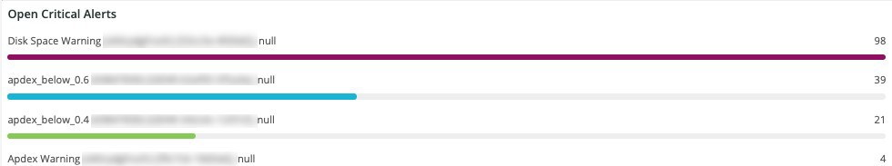
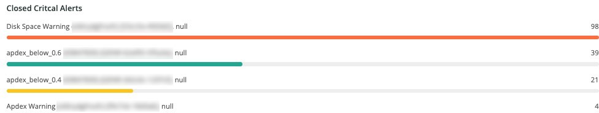
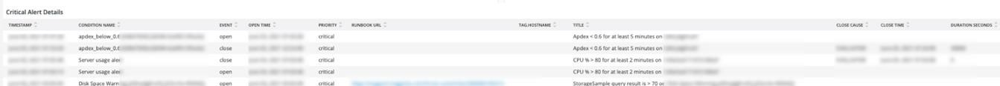
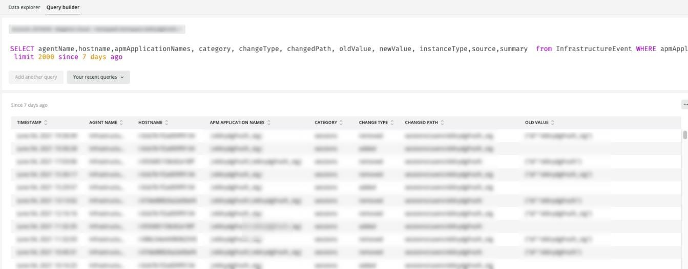

# The [!UICONTROL Alerts] tab

The [!UICONTROL Alerts] tab provides a range of alerts, including open and close critical alerts.

## [!UICONTROL Open Alert Details]

The **[!UICONTROL Open Alert Details]** frame shows a count of the open critical alerts across the selected timeframe. The alerts will include Adobe-created alerts and any created by the partner or merchant.

## [!UICONTROL Closed Critical Alerts]

The **[!UICONTROL Closed Critical Alerts]** frame shows a count of the closed critical alerts across the selected timeframe. The alerts will include Adobe-created alerts and any created by the partner or merchant.

## [!UICONTROL Critical Alert Details]

The **[!UICONTROL Critical Alert Details]** frame shows a count of the critical alert details across the selected timeframe, including timestamp, condition name, and whether the alert event is open or closed.

## [!UICONTROL Infrastructure Alert Details]

The [!UICONTROL Infrastructure Alert Details] frame shows applications, hosts, and other infrastructure events across the selected timeframe. 

