# The [!UICONTROL bots] tab

This tab has information that explains how to identify if and what [!DNL bots] are causing site problems.

## High level overview of [!DNL bots]:

* A [!DNL bot] is a piece of software that runs repetitive automated tasks. With artificial intelligence and machine learning evolution, the tasks, methods, and interactions of [!DNL bots] are changing. There are *good* [!DNL bots] that benefit sites by crawling and adding them to internet search engines. This results in internet users being guided to the site through search engine results. A *good* [!DNL bot] typically respects boundaries placed on the [!DNL bot] by a `robots.txt` file or settings in a search engine console. Boundaries can restrict access to the site or parts of the site.
* Malicious [!DNL bots] ignore the `robots.txt` file or they may spoof a good [!DNL bot] through the request user agent field of the HTTP request data. Some things that malicious [!DNL bots] do:
    * Add load to a site to deny legitimate users access to the site.
    * Scrape and reuse content without permission.
    * Register fake accounts to flood email services or addresses or redirect to other sites ([!DNL SPAM bots]).
    * Create fake views ([!DNL Viewbots]).
    * Buy up products or tickets ([!DNL Focused bots]).
* Managing [!DNL bots]
    * [!DNL Observation for Adobe Commerce] has views of [!DNL bot] traffic:
        * It shows total non-cached [!DNL bot] activity which displays the load that a [!DNL bot] is adding to a site and when that load is happening.
        * It shows the [!DNL bots] that are generating errors. Typically if a [!DNL bot] is adding load that causes site problems, that [!DNL bot] or IP address has the highest frequency of errors.
        * It shows [!DNL bot] names (request user agent field values) and IP addresses to manage through:
            * [!DNL Fastly] (rate-limiting or [!DNL VCLs] which block IP addresses, ranges, or [!DNL bots] by name value).
            * Adding good [!DNL bot] information to the `robots.txt field` to restrict or limit the rate of site access.
            * Managing [!DNL Bing] or [!DNL Google bots] through the search engine console.

## [!UICONTROL Total Bot traffic by bot name]:

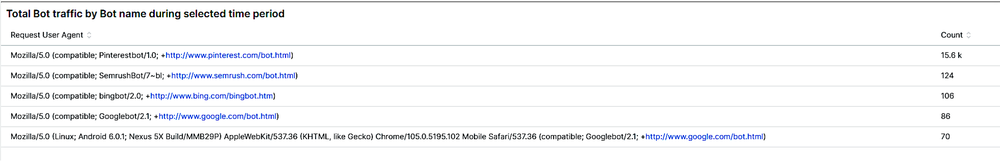

* The **[!UICONTROL Total Bot traffic by bot name during selected time period]** table contains the aggregated count of non-cached requests where the [!UICONTROL request_user_agent] field has a string of [!DNL bots] in the value. This may or may not be the named [!DNL bot] as the [!UICONTROL request_user_agent] field value can be spoofed. The value under the [!UICONTROL Count] column is the most important.

## [!UICONTROL Total Bot Traffic by Bot name/IP address]

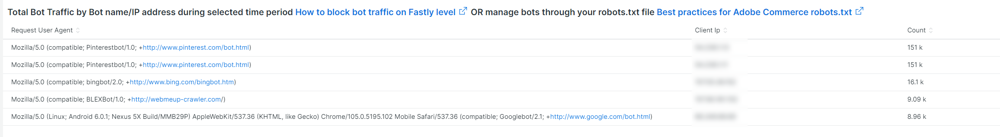

* The **[!UICONTROL Total Bot Traffic by Bot name/IP address during selected time period How to block bot traffic on Fastly level OR manage bots through your robots.txt file Best practices for Adobe Commerce robots.txt]** table shows the same data as the previous table, but adds IP addresses making the requests on behalf of the named [!DNL bot]. As malicious [!DNL bots] spoof good [!DNL bots], the IP address(es) should be verified through websites that identify abusive IP addresses or through *whois* services or [!DNL DNS lookups]. For example, [!DNL Google] publishes their [[!DNL googlebot] IP addresses](https://developers.google.com/search/apis/ipranges/googlebot.json) and [!DNL Microsoft] has a verifying tool for [[!DNL Bingbots]](https://www.bing.com/webmasters/help/Verify-Bingbot-2195837f).

## [!UICONTROL Graph - Bots with HTTP status errors]

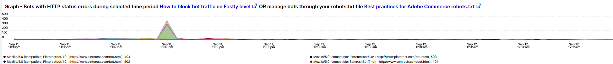

* The **[!UICONTROL Graph - Bots with HTTP status errors during selected time period How to block bot traffic on Fastly level OR manage bots through your robots.txt file Best practices for Adobe Commerce robots.txt]** graph shows errors on [!DNL bots] that declare themselves in the request user agent field. This does not necessarily mean that the error is caused by volume from the [!DNL bot] or other traffic. The errors could be that the [!DNL bot] is requesting information that does not exist or there is another problem in the request.
* If there is a spike of errors on IP addresses during site instability or outage, they could be suspects in the site problem.

## [!UICONTROL Table - IPs that do not identify as bots]

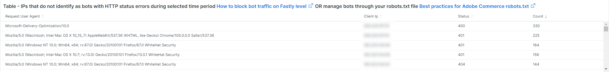

* The **[!UICONTROL Table - IPs that do not identify as bots with HTTP status errors during selected time period How to block bot traffic on Fastly level OR manage bots through your robots.txt file Best practices for Adobe Commerce robots.txt]** table will show IP requests with non-200 http status codes that DO NOT self-identify as [!DNL bots] in the request user agent field. These IP addresses could be malicious IP addresses, especially if the counts are high for the selected time period.
* If the non-200 http status code counts are low and the IP address ranges are not similar, the addresses might not be contributing to the site issues.

## [!UICONTROL Table – Cache Status 'ERROR']

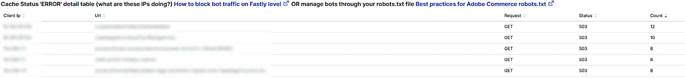

* When IP addresses are generating a high frequency of errors, ask what are they doing? The **[!UICONTROL Table – Cache Status 'ERROR' detail table (what are these IPs doing?) How to block bot traffic on Fastly level OR manage bots through your robots.txt file Best practices for Adobe Commerce robots.txt]** table will show the requested URL along with the HTTP status value for requests that have a cache status [!UICONTROL ERROR] value. The frequency is faceted by URL so the count may be low. Remember that the IP address may be making thousands of requests during the selected time period. This is a view against up to 2000 requests during the time frame (the record display limit).

## [!UICONTROL Show 5XX status distribution]

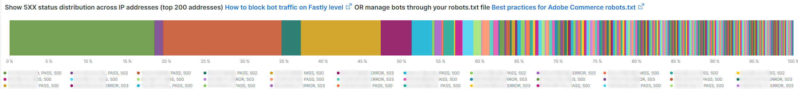

* The **[!UICONTROL Show 5XX status distribution across IP addresses (top 200 addresses) How to block bot traffic on Fastly level OR manage bots through your robots.txt file Best practices for Adobe Commerce robots.txt]** frame is powerful. It shows the IP addresses that have 5XX http status codes during the selected time period. If an IP address is making a high volume of requests and the site is impacted to the point where it cannot handle the traffic, then the IP addresses that are making the highest frequency of requests will typically have the highest volume of errors. 5XX http status codes typically indicate a site that is struggling to respond to requests.
* The wider the bar, the larger the % of errors that the IP address has in the total number of 5xx errors during that time period. Note: an IP address might have multiple segments in the graph if it has multiple http status codes (example 502 and 503 http statuses).
* Typical distribution would be indicated toward the right side of the bar where the IP addresses are equal in width or there would be a few wide bars with very low counts.
* If you hover over the bar segment, it will show the number of the indicated errors during the selected time period.

## [!UICONTROL IP cache status (MISS, PASS, ERROR) and HTTP status]

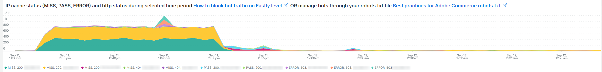

* This **[!UICONTROL IP cache status (MISS, PASS, ERROR) and HTTP status during selected time period How to block bot traffic on Fastly level OR manage bots through your robots.txt file Best practices for Adobe Commerce robots.txt]** frame shows the HTTPS status code count and non-cached requests by IP across the selected time frame. This indicates the proportional load from each IP address and the total volume. It will show the IP addresses with the most requests.

## [!UICONTROL Fastly Cache Summary for selected time period]

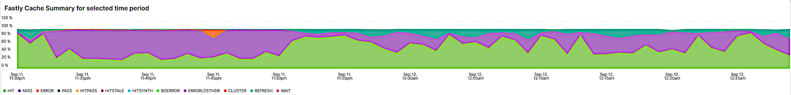

* If you click on the [!UICONTROL Error] icon in the below graph, you can compare the last two graphs to each other. This can help indicate where load contributes to site problems.

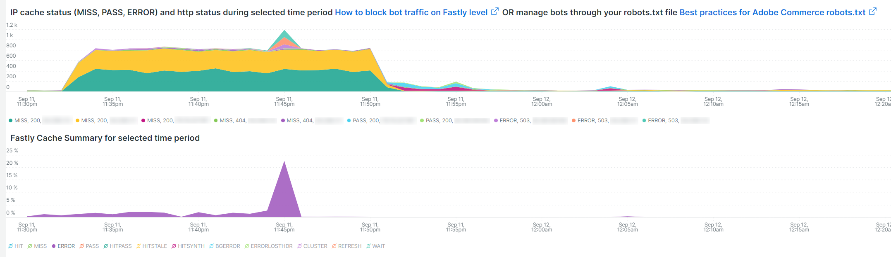

## [!UICONTROL Graph - IPs that do not identify as bots]

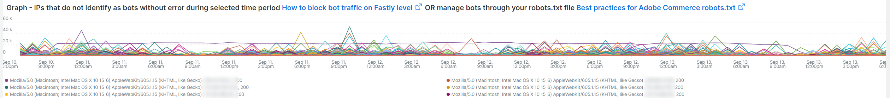

* The **[!UICONTROL Graph - IPs that do not identify as bots without error during selected time period How to block bot traffic on Fastly level OR manage bots through your robots.txt file Best practices for Adobe Commerce robots.txt]** frame shows the request user agent field, the IP address, and status code for requests where the request user agent field does not indicate a [!DNL bot]. This frame may show high frequency requests from any IP address but pay attention to high frequency requests, especially during a period of time where the site may have issues.

## [!UICONTROL Graph - Suspicious Non-Bot traffic]

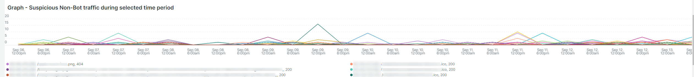

* The **[!UICONTROL Graph - Suspicious Non-Bot traffic during selected time period]** graph looks for a request user agent value of Go-http-client but will be extended to look at other suspicious request user agent values. This request user agent value is used by sites for connecting from services and may be valid but is also used by malicious [!DNL bots].

## [!UICONTROL Graph - Bot traffic by Bot name]

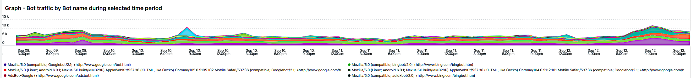

* The **[!UICONTROL Graph - Bot traffic by Bot name during selected time period]** frame is showing the same data as the Total Bot traffic by [!DNL Bot] name during selected time period table at the top of the tab. It is showing the data via the timeline so that you can see when the requests by the [!DNL bots] are being made and their distributions.

## [!UICONTROL Graph - Top 250 Bot Names and IP addresses]

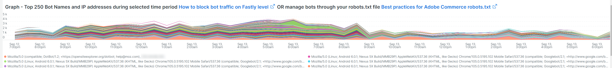

* The **[!UICONTROL Graph - Top 250 Bot Names and IP addresses during selected time period How to block bot traffic on Fastly level OR manage bots through your robots.txt file Best practices for Adobe Commerce robots.txt]** frame is showing the same data as the Total [!DNL Bot] Traffic by Bot name/IP address during selected time period table at the top of the tab. It is showing the data via the timeline and faceting it by IP address. This shows when the requests by the [!DNL bots] are made, which IP is making requests, and the distributions of the requests.

## [!UICONTROL Blocked Bot name / IP addresses (in Fastly)]

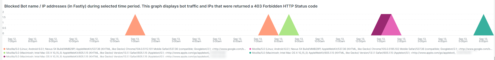

* The **[!UICONTROL Blocked Bot name / IP addresses (in Fastly) during selected time period. This graph displays bot traffic and IPs that were returned a 403 Forbidden HTTP Status code]** frame shows the bot name and IP addresses that are blocked. You can see in this graph how all requests are blocked in [!DNL Fastly] going forward.

## [!UICONTROL Blocked non-Bot name / IP addresses (in Fastly)]

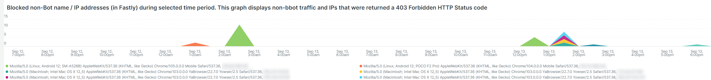

* The **[!UICONTROL Blocked non-Bot name / IP addresses (in Fastly) during selected time period graph displays non-bot traffic and IPs that were returned a 403 Forbidden HTTP Status code]** frame shows IP addresses that do not identify as a [!DNL bot] that have been blocked through [!DNL Fastly].

## [!UICONTROL This table shows the number of user agents per IP address, number of successful, unsuccessful and blocked requests:]

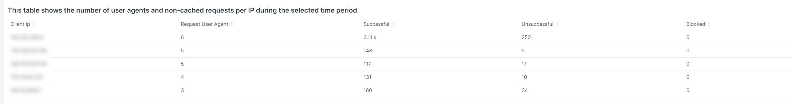

* Malicious [!DNL bots] often spoof other [!DNL bots] through the value of the [!UICONTROL Request User Agent] field. This table shows how many unique values the IP address has in that field. The higher the value in the [!UICONTROL Request User Agent] field, the more suspicious the IP address is.

## [!UICONTROL IP with non-200 status errors]

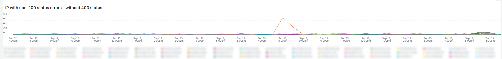

* The **[!UICONTROL IP with non-200 status errors – without 403 status]** frame is showing the distribution across the selected timeframe of IP addresses with HTTP status codes other than 200. When you see higher values on a single IP or group of IP addresses, they require further investigation.

## [!UICONTROL IP with 403 status codes:]

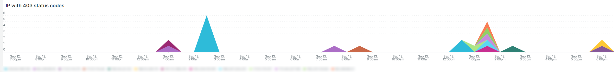

* The **[!UICONTROL IP with 403 status codes]** frame shows non-cached requests without [!UICONTROL cache_status=ERROR] that have a HTTP status that is 403. This may show that the origin server is the source of the 403 (unauthorized) rather than a block from [!DNL Fastly].

## [!UICONTROL Top 5 with non-200 status codes]

* The **[!UICONTROL Top 5 with non-200 status codes showing cache_status]** table is showing at an IP / status level the counts of each with the [!UICONTROL cache_status] value.

## [!UICONTROL Pageview Latency will show as spikes]

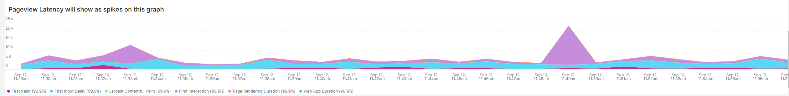

* The **[!UICONTROL Pageview Latency will show as spikes on this graph:]** frame shows page load / API response latency that may be in line with the [!DNL bot] traffic.
