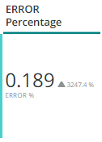
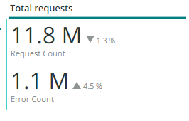
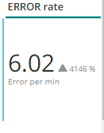
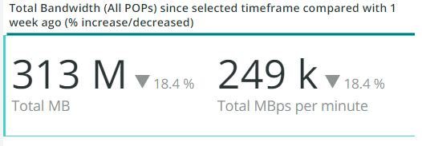
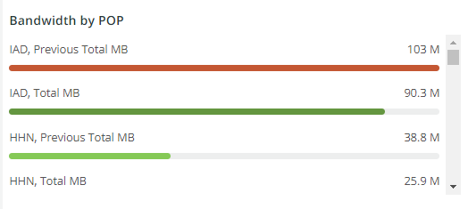
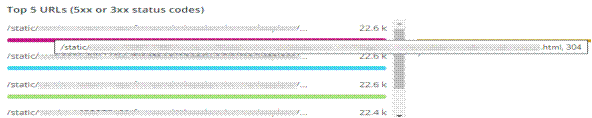
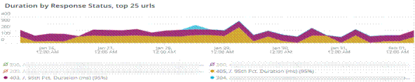
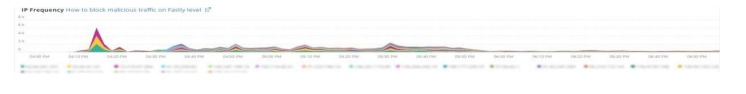

# The [!UICONTROL CDN] tab

This tab has information that is focused on the [!DNL content delivery network (CDN)]. In the case of Adobe Commerce Cloud, this is the [!DNL Fastly] service.

## [!UICONTROL HIT rate]

The [!UICONTROL HIT rate] frame shows the number of cacheable requests that resulted in [!UICONTROL HITS] at the last minute. This indicates successful caching. The arrow to the right will show the percentage above or below the same time a week ago.

## [!UICONTROL HIT Processing]

This [!UICONTROL HIT processing] box shows the number of cacheable requests that resulted in [!UICONTROL HITS] during the week.

## [!UICONTROL MISS rate]

This [!UICONTROL MISS rate] box shows the number of misses of cacheable requests at the last minute. A miss is when the request is not cached, and the request has to be passed to the origin server to serve the content. The value to the right is the comparison of increase/decrease to the number of minutes per minute one week prior.

## [!UICONTROL MISS time]

## [!UICONTROL HIT Ratio]

## [!UICONTROL Error Percentage]

The [!UICONTROL Error Percentage] box displays the value of the ERROR percentage of requests and shows the relative increase/decrease compared to the same time one week prior.

## [!UICONTROL Total Requests]

## [!UICONTROL ERROR rate]

## [!UICONTROL Fastly Cache Average Response for selected time period in seconds]

The [!UICONTROL Fastly Cache Average Response] frame shows the duration in seconds of the cacheable requests, meaning that if a cache_response is a MISS, it displays the average for missed cached responses for the selected time.

## [!UICONTROL Fastly Cache Average Response for selected time period in seconds, faceted by POP]

## [!UICONTROL Total Bandwidth (All POPs) during the selected time frame, compared with 1 week ago (% increase/decrease)]

## [!UICONTROL Requests – Since selected time frame compared with one week ago]

The [!UICONTROL Requests – Since selected time frame compared with one week ago] frame is similar to the summary box for ‘Total Requests’ at the top but shows the prior weeks requests counts. These are all requests, not just cacheable requests (where is_cacheable is true).

## [!UICONTROL Response Count]

## [!UICONTROL Bandwidth by POP]

## [!UICONTROL Top 5 URLs (5xx or 3xx status codes)]

The [!UICONTROL Top 5 URLs] view shows the top 5 URLs that are experiencing 5xx or 3xx error responses. Due to the space constraint, you’ll need to mouse over the URL to see the specific error code associated with that URL. (example in the red box of the figure above).

## [!UICONTROL Top 25 URLs (200 status)]

The [!UICONTROL Top 25 URLs] frame will show the URLs that returned a 200 status by count during the selected time frame.

## [!UICONTROL Duration by Response Status]

The [!UICONTROL Duration by Response Status] graph displays the error responses by count during the selected timeframe, faceted by the error status code.

## [!UICONTROL Duration by Response Status, top 25 urls]

The [!UICONTROL Duration by Response Status, top 25 URLs] graph shows the top 25 URLs by the duration of response in seconds. You may need to hover the mouse over the URL to see the entire path. Also, to remove all but one URL, click on that URL. You can then add other URLs back by clicking on them individually. If you wish to remove individual URLs, you can hold the key and click on each URL to remove them from the graph.

## [!UICONTROL Duration by Response Status, top 25 non-200 status]

The [!UICONTROL Duration by Response Status, top 25 non-200 status] graph is similar to the last one except that the focus is on non-200 status codes or error status codes. It will show the error code and then the URL. You may need to hover the mouse over the URL to see the entire path. Also, to remove all but one URL, click on that URL. You can then add other URLs back by clicking on them individually. If you wish to remove individual URLs, you can hold the key and click on each URL to remove them from the graph.

## [!UICONTROL Error Count by POP timeline]

The [!UICONTROL Error Count by POP timeline] graph displays the error statuses’ count along the selected timeframe timeline, faceted by the error code.

## [!UICONTROL Duration by Response status, top 25 client IP, non-200 status]

The [!UICONTROL Duration by Response status, top 25 client IP, non 200 status] graph shows the IP addresses by the average duration across the selected time frame where there were status error codes.

## [!UICONTROL IP Frequency]

The [!UICONTROL IP Frequency] frame counts the (‘MISS’ and ‘PASS’) statuses for each IP from the [!DNL Fastly] logs. Web requests with these statuses will reach the origin server and will add load to the server. It shows the top twenty addresses in frequency. This frame can be used to detect IP attacks or sources of heavy load on a website. This graph is also present on the summary tab and is placed here for easy comparison to more details on the [!DNL Fastly] log information displayed on this tab.

