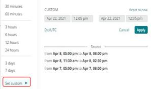
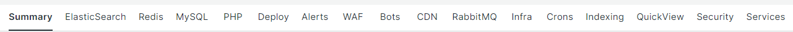

# Choosing the [!UICONTROL focus] tabs

The power of [!DNL Observation for Adobe Commerce] comes from aligning a huge volume of differing data views on the same timeline. [!DNL Observation for Adobe Commerce] can present [!DNL New Relic] agents with a collected data sample and a visual view of system and application logs. If you think about troubleshooting complex problems, it is always about half-splitting data. When looking at an issue on a timeline, the first question is, "When did this occur?" Of immediate concern is everything that happened prior to that moment. If you know the exact time of when the issue occurred on the timeline, you can select a timeline immediately before the issue. You may not know the details of the issue other than your site is down or slow. With Adobe Commerce, potential suspects include component services, resource levels, and the number of processes running.

The **[!UICONTROL focus]** tabs display information that may help you focus on areas causing or contributing to your issue. You can also continually add data signals to [!DNL Observation for Adobe Commerce]. Data signals can be [!DNL New Relic] collected data or counts of critical phases, or error messages from logs. As error messages are identified as correlated to site issues, they can be added to the [!DNL Observation for Adobe Commerce] queries to help improve its display of critical information.

