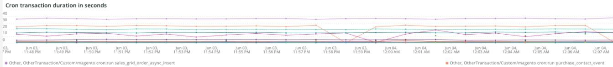
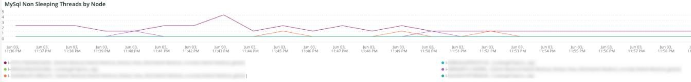
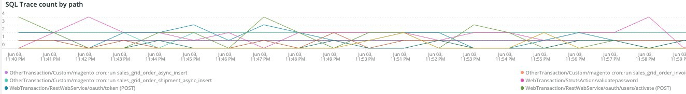
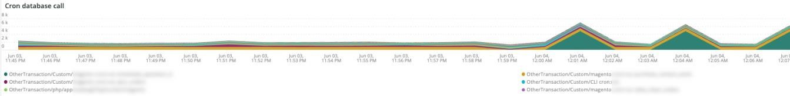
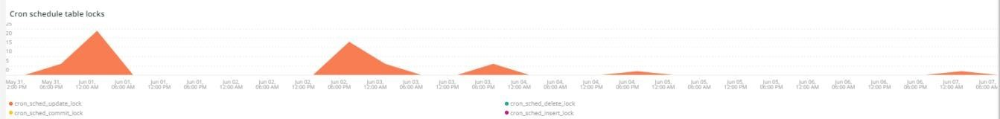
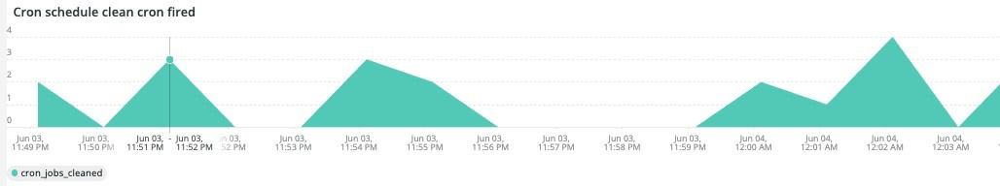
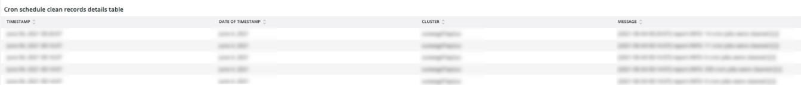
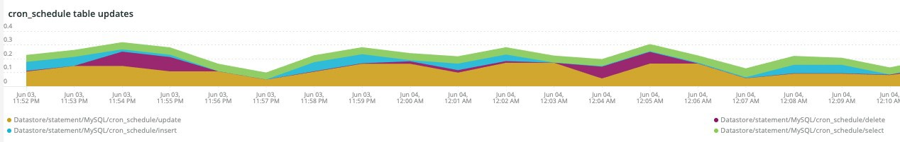
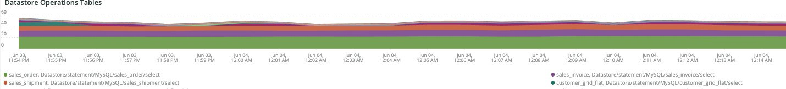

# The [!UICONTROL Cron] tab

This tab is an attempt to quickly isolate issues and causes of cron problems.

## [!UICONTROL Cron transaction duration in seconds]

The **[!UICONTROL Cron transaction duration in seconds]** frame displays crons transaction duration in seconds. This will display transactions that have long runtimes. A deeper dive into APM will show more details on what query the transaction/operation may be running.

## [!UICONTROL MySql Non Sleeping Threads by Node]

This frame shows the MySql Non-Sleeping threads by node across the selected timeframe.

## [!UICONTROL SQL Trace count by path]

This frame looks at MySql trace counts by path, which can help trace SQL statements across a selected timeframe.

## [!UICONTROL Cron database call]

This frame looks at the number of crons calling to the database across a selected timeframe.

## [!UICONTROL Cron schedule table locks]

This frame looks at cron schedule table locks across a selected timeframe.

## [!UICONTROL Cron schedule clean cron fired]

The **[!UICONTROL Cron schedule clean cron fired]** frame looks at the number of crons cleaned up across a selected timeframe. If no data is displayed in this frame, it could indicate a problem with crons running correctly. If the cron job schedule is not cleaned, crons will not run optimally and may take longer to run.

## [!UICONTROL Cron schedule clean records details table]

The **[!UICONTROL Cron schedule clean records details table]** table provides details on the job to clean records from the `cron_schedule` table across a selected timeframe.

## [!UICONTROL cron_schedule table updates]

This frame looks at the number of cron scheduled table updates across a selected timeframe. High activity on the delete or updating of this table may indicate an issue with crons. Also, crons update this table when they run and complete, so if there is no activity on this table and there are crons configured, there could be a problem with crons.

## [!UICONTROL Datastore Operations Tables]

This frame looks at database table operations, including `SELECT`, `DELETE`, and `UPDATE` across a selected timeframe. This frame shows the database tables with the highest operation frequency against them.
