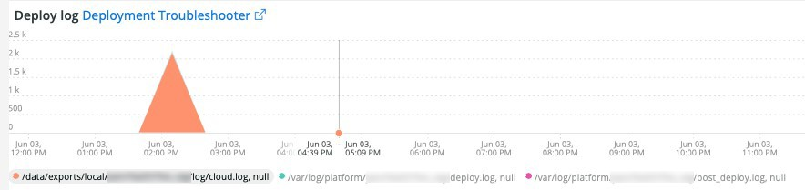
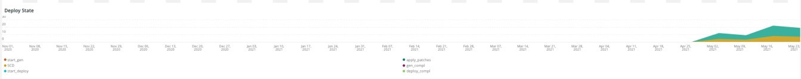
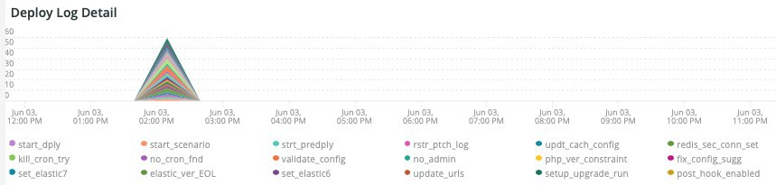
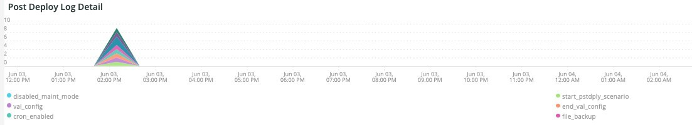
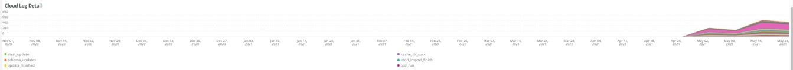
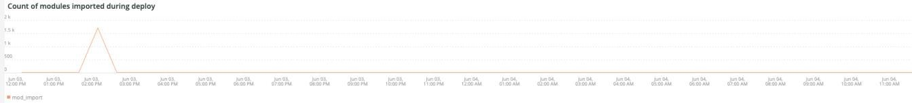
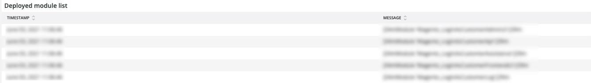

# The [!UICONTROL Deploy] tab

This tab is an attempt to isolate issues and causes of deployment problems quickly.

## [!UICONTROL Deploy log Deployment Troubleshooter]

The **[!UICONTROL Deploy log Deployment Troubleshooter]** frame shows a count of deploy log events that occurred across the selected timeframe. The intent is to provide an at-a-glance view of deployment activity and determine the complexity of the deployment by the count. The more logged messages, the more complex the deployment typically is.

## [!UICONTROL Deploy State]

The **[!UICONTROL Deploy State]** frame shows the deploy events that occurred across the selected timeframe. The parser for this frame is looking for these specific signals:

* '%NOTICE: Starting generate command%') as 'start_gen'
* '%git apply /app/vendor/magento/ece-tools/patches%') as 'apply_patches'
* '%Set flag: .static_content_deploy%') as 'SCD'
* '%NOTICE: Generate command completed%') as 'gen_compl'
* '%NOTICE: Starting deploy.%') as 'start_deploy'
* '%NOTICE: Deployment completed%') as 'deploy_compl'
* '%NOTICE: Starting post-deploy.%') as 'start_pdeploy'
* '%NOTICE: Post-deploy is complete%') as 'pdeploy'
* '%deploy-complete%') as 'cl_deploy_compl'

## [!UICONTROL Deploy Log Detail]

The **[!UICONTROL Deploy Log Detail]** frame shows the deploy log message summary details that occurred across the selected timeframe. The frame is parsing for the following strings in the deployment logs:

* '%NOTICE: Starting deploy.%') as 'start_dply'
* '%INFO: Starting scenario(s): scenario/deploy.xml%') as 'start_scenario'
* '%NOTICE: Starting pre-deploy%') as 'strt_predply'
* '% INFO: Restoring patch log file%') as 'rstr_ptch_log'
* '%INFO: Updating cache configuration.%') as 'updt_cach_config'
* '%INFO: Set Redis slave connection%') as 'redis_sec_conn_set'
* '%INFO: Static content deployment was performed during build hook, cleaning old
content%') as'scd_build_hk'
* '%INFO: Clearing pub/static%') as 'clr_pub_static'
* '%NFO: Clearing redis cache:%') as 'clr_redis_cach'
* '%INFO: Clearing var/cache directory%') as 'clr_var_cach'
* '% NOTICE: Enabling Maintenance mode%') as 'enable_maint_mode'
* '%INFO: Disable cron%') as 'disable_cron'
* '%INFO: Trying to kill running cron jobs and consumers processes%') as 'kill_cron_try'
* '%INFO: Running Magento cron and consumers processes were not found.%') as
'no_cron_fnd',
* %NOTICE: Validating configuration%') as 'validate_config'
* '%The following admin data is required to create an admin user during initial
installation%') as 'no_admin'
* '%recommended PHP version satisfying the constraint%') as 'php_ver_constraint'
* '%WARNING: Fix configuration with given suggestions:%') as 'fix_config_sugg'
* '%WARNING: [2003] The directory nesting level value for error reporting has not been
configured.%') as'nest_err_reporting'
* '%NOTICE: End of validation%') as 'end_validation'
* '%NOTICE: Starting update.%') as 'start_update'
* '%INFO: Updating env.php.%') as 'update_php_env'
* '%INFO: Updating env.php DB connection configuration.%') as 'update_php_env_db'
* '%INFO: Updating env.php AMQP configuration%') as 'update_php_env_amqp'
* '%INFO: Set search engine to: elasticsearch7%') as 'set_elastic7'
* '%elasticsearch 6.5.4 has passed EOL%') as 'elastic_ver_EOL'
* '%INFO: Set search engine to: elasticsearch6%') as 'set_elastic6'
* '%INFO: Updating secure and unsecure URLs%') as 'update_urls'
* '%INFO: Running setup upgrade.%') as 'setup_upgrade_run'
* '%INFO: Post-deploy hook enabled. Cron enabling, cache cleaning and pre-warmingoperations are postponed%') as 'post_hook_enabled'
* '%NOTICE: Maintenance mode is disabled.%') as 'maint_mode_disabled'
* '%INFO: Scenario(s) finished%') as 'scenario_finished'
* '%WARNING: Command maintenance:enable finished with an error. Creating a maintenanceflag file%') as'enable_maintenance_fail'
* '%MySQL server has gone away%') as 'MySQL_has_gone_away'

## [!UICONTROL Post Deploy Log Detail]

The **[!UICONTROL Post Deploy Log Detail]** frame shows the post-deploy log details that occurred across the selected timeframe. This frame is focused on particular log messages that contain the following strings:

* '%Disabled maintenance mode%') as 'disabled_maint_mode'
* '%INFO: Starting scenario(s): scenario/post-deploy.xml%') as 'start_pstdply_scenario'
* '% NOTICE: Validating configuration%') as 'val_config'
* '% NOTICE: End of validation%') as 'end_val_config'
* '%INFO: Enable cron%') as 'cron_enabled'
* '% INFO: Create backup of important files.%') as 'file_backup'
* '%INFO: Successfully created backup%') as 'file_backup_success'
* '%INFO: Starting page warming up%') as 'pg_warmup_start'
* '%INFO: Warmed up page:%') as 'warmed_up_pg'
* '%ERROR: Warming up failed:%') as 'warm_up_pg_err'
* '% INFO: Scenario(s) finished%') as 'scenario_finished'

## [!UICONTROL Cloud Log Detail]

The **[!UICONTROL Cloud Log Detail]** frame shows the cloud log details that occurred across the selected timeframe. The following strings are parsed and returned with the 'AS' label below:

* '%DEBUG: /bin/bash -c "set -o pipefail; php ./bin/magento setup:upgrade%') as 'start_update'
* '%Schema creation/updates:%') as 'schema_updates'
* '%Nothing to import.%') as 'mod_import_finish'
* '%NOTICE: End of update.%') as 'update_finished'
* '%DEBUG: Running step: deploy-static-content%') as 'scd_run'
* '% NOTICE: Skipping static content deploy. SCD on demand is enabled.%') as 'scd_ondemand'
* '%INFO: Clearing%') as'clr_dirs'
* '%DEBUG: Step "deploy-static-content" finished%') as 'scd_finished'
* '%NOTICE: Skipping static content compression. SCD on demand is enabled.%') as 'scd_compression_run',
* '%INFO: Clearing var/cache directory%') as 'clr_var_cach'
* '%DEBUG: Step "compress-static-content" finished%') as 'scd_compression_finished'
* '%DEBUG: Running step: deploy-complete%') as 'deploy_finished'
* '%INFO: Post-deploy hook enabled. Cron enabling, cache cleaning and pre-warming
operations are postponed to post-deploy stage.%') as 'Post_deploy_hook_enabled'
* '%NOTICE: Maintenance mode is disabled.%') as 'maint_mode_disabled'
* '%INFO: Scenario(s) finished%') as 'scenario_finished'
* '%post-deploy.xml%') as 'post_deploy_start'
* '%NOTICE: Validating configuration%') as 'validate_config'
* '%WARNING: [2003] The directory nesting level value for error reporting has not been
configured.%') as'nest_err_reporting'
* '%NOTICE: End of validation%') as 'end_validation'
* '%INFO: Enable cron%') as 'enable_cron'
* '%INFO: Create backup of important files%') as 'create_backup'
* '%DEBUG: Step "backup" finished%') as 'backup_finished'
* '%INFO: Starting page warming up%') as 'warmup_start'
* '%ERROR: Warming up failed:%') as 'warm_up_fail'
* '%DEBUG: Step "warm-up" finished%') as 'warmup_finished'
* '% DEBUG: Step "time-to-first-byte" finished%') as 'ttfb_finished'
* '%INFO: Scenario(s) finished%') as 'post_deploy_finished'
* '%DEBUG: Running step: pre-build%') as 'run_pre-build'
* '%DEBUG: Flag .static_content_deploy has already been deleted%') as 'scd_flag_del'
* '%DEBUG: Step "pre-build" finished%') as 'pre-build_completed'
* '%NOTICE: Applying patches%') as 'apply_patches'
* '%has been applied%') as 'patches_applied'
* '%DEBUG: Step "apply-patches" finished%') as 'apply_patches_complete'
* '%Deploy using quick strategy%') as 'quick_strategy_deploy'
* '% NOTICE: Running DI compilation%') as 'di_compliation_start'
* '%NOTICE: End of running DI compilation%') as 'di_compliation_finished'
* '%NOTICE: Generating fresh static content%') as 'gen_frsh_static_content'
* '%magento setup:static-content:deploy%') as 'scd_executing'
* '%NOTICE: End of generating fresh static content%') as 'gen_frsh_static_cont_finished'
* '%INFO: Starting scenario(s): scenario/build/transfer.xml%') as 'start_transferxml'
* '%INFO: Trying to kill running cron jobs%') as 'kill_crons'
* '%INFO: Clearing redis cache:%') as 'clear_redis_cache'
* '%INFO: Checking if db exists and hastables%') as 'db_check'
* '%WARNING: [2010] Elasticsearch service is installed at infrastructure layer but is not
used as asearch engine.%') as'es_not_used'
* '%NOTICE: Starting update.%') as 'starting_update'
* '%INFO: Set search engine to: mysql%') as 'mysql_search'
* '%SQLSTATE[HY000] [2006] MySQL server has gone away%') as 'mysql_gone'

## [!UICONTROL Count of modules imported during deploy]

The **[!UICONTROL Count of modules imported during deploy]** frame shows the number of modules imported during deployment across the selected timeframe. 

## [!UICONTROL Deployed module list]

The **[!UICONTROL Deployed module list]** frame shows deployed modules across the selected timeframe.

