# The [!UICONTROL Elasticsearch] tab

## Cluster Status Summary:

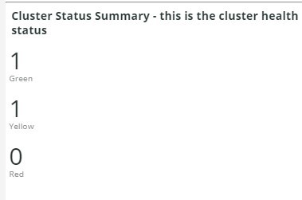

Over the selected time frame, this frame shows the color statuses that the Elasticsearch cluster has
gone through. In this example, during the selected time frame, the cluster was in a Green status once
and in a Yellow status once during the selected timeframe.

## Active Primary Shards:

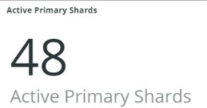

The Active Primary Shards frame will show differing numbers depending on the number of active
primaryshards for the selected account’s Elasticsearch service.

From Elasticsearch: The definitive Guide [2.x]

“In Dynamically Updatable Indices, we explained that a shard is a Lucene index and that an
Elasticsearch indexis a collection of shards. Your application talks to an index, and Elasticsearch
routes your requests to the appropriate shards. A shard is the unit of scale. The smallest index you can have is one with a single shard. This may be more thansufficient for your needs—a single shard can hold a lot of data—but it limits your ability to
scale.”

When an index is created, there are several shards created with that index. By default, five primary
shards areallotted to each new index, meaning that an index can be spread across 5 nodes (one
shard per node). There are also replica shards. These are primarily for failover. Replica shards can serve read requests.

## Active Shards in Cluster:

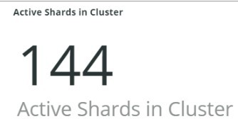

Active Shards in Cluster - ALL primary and replica shards in an Elasticsearch cluster.

## Index health - this will show the index name and color status

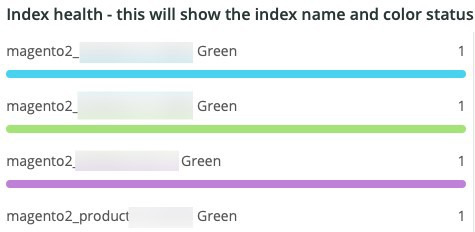

This frame will show the index name and the index color status count. Scrolling down the table, you
will see the same index name with Yellow and Red color statuses. The number that follows the
27 index name is the count of the status color. If it is zero, there were no instances of the index being in that color status during theselected time frame.

## Elasticsearch Status by node information:

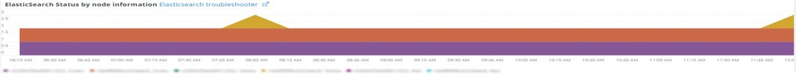

This frame shows the Elasticsearch cluster status by Color, by node. This will help indicate which
node in theElasticsearch cluster is returning what status during the selected time frame

## Elasticsearch index information:

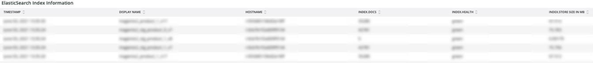

This table shows the index name, what node it is on, the number of indexed documents, the index
health,and the index size in MB at a particular time.

## Elasticsearch process CPU %:

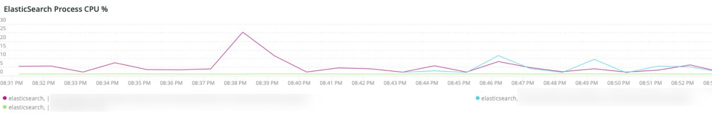

This frame shows the process CPU % by the Elasticsearch process over the selected time frame.

## Elasticsearch Memory garbage collection

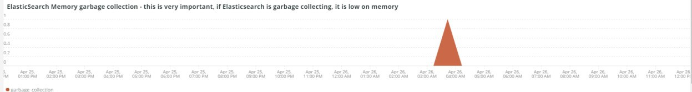

Elasticsearch is a Java process. If it runs low on allocated memory, it will initiate garbage collection to free up memory. If garbage collection is frequent, it is an indication that there may be too many indices or shards for the allocated memory. There may be an opportunity to clean up the indices and shards or Elasticsearch may need more memory.

## Elasticsearch Index information:

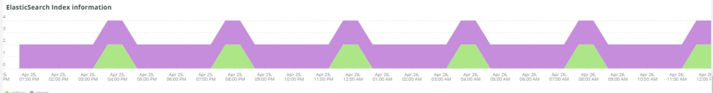

As indexes are created and updated, the index health may change.

## Elasticsearch Index Size:

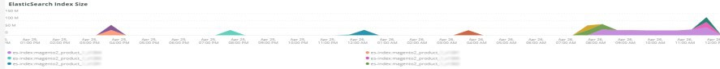

This frame indicates the index name and size across the selected time frame. It may indicate
problems withhow a site is indexing.

## Elasticsearch Errors:

This frame will display errors with Elasticsearch like running out of space, switching from Yellow to Red status, when all shards fail, when there are parameter issues with searches, version errors and when all nodes are unavailable.

## Elasticsearch Unassigned Shards:

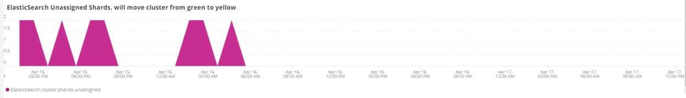

Unassigned shards will cause a cluster to move from Green status to Yellow status.
