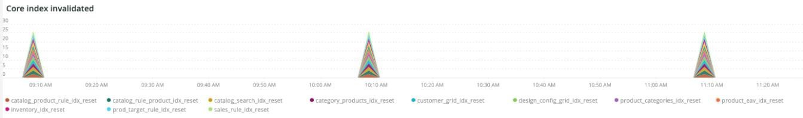

# The [!UICONTROL Indexing] tab

The [!UICONTROL Indexing] tab attempts to explain issues with indexing and identify potential causes.

## [!UICONTROL Core index invalidated]

The [!UICONTROL Core index invalidated] frame looks at indexing invalidation across a selected timeframe. If indexing is happening at the same time as other resource-intensive crons, it will place a heavy load on the site resources.

* '%Catalog Product Rule indexer has been invalidated%') as 'catalog_product_rule_idx_reset'
* '%Catalog Rule Product indexer has been invalidated%') as 'catalog_rule_product_idx_reset'
* '%Catalog Search indexer has been invalidated%') as 'catalog_search_idx_reset'
* '%Category Products indexer has been invalidated%') as 'category_products_idx_reset'
* '%Customer Grid indexer has been invalidated%') as 'customer_grid_idx_reset'
* '%Design Config Grid indexer has been invalidated%') as 'design_config_grid_idx_
* '%Product Categories indexer has been invalidated%') as 'product_categories_idx_reset'
* '%Product EAV indexer has been invalidated%') as 'product_eav_idx_reset'
* '%Product Price indexer has been invalidated%') as 'product_price_idx_reset'
* '%Stock indexer has been invalidated%') as 'stock_idx_reset'
* '%Inventory indexer has been invalidated%') as 'inventory_idx_reset'
* '%Inventory indexer has been invalidated%') as 'inventory_idx_reset'
* '%Sales Rule indexer has been invalidated%') as 'sales_rule_idx_reset'

## [!UICONTROL Core index rebuilds]

This frame looks at core index rebuilds across a selected timeframe. Here are the strings that are parsed from the logs to indicate index rebuild completion.

* '%Catalog Product Rule index has been rebuilt%') as 'catalog_product_rule_idx'
* '%Catalog Rule Product index has been rebuilt%') as 'catalog_rule_product_idx'
* '%Catalog Search index has been rebuilt%') as 'catalog_search_idx'
* '%Category Products index has been rebuilt successfully%') as 'category_products_idx'
* '%Customer Grid index has been rebuilt%') as 'customer_grid_idx'
* '%Design Config Grid index has been rebuilt%') as 'design_config_grid_idx'
* '%Product Categories index has been rebuilt%') as 'product_categories_idx'
* '%Product EAV index has been rebuilt%') as 'product_eav_idx'
* '%Product Price index has been rebuilt%') as 'product_price_idx'
* '%Stock index has been rebuilt%') as 'stock_idx'
* '%Inventory index has been rebuilt successfully%') as 'inventory_idx'
* %Product/Target Rule index has been rebuilt successfully%') as 'prod_target_rule_idx'
* '%Sales Rule index has been rebuilt successfully%') as 'sales_rule_idx'

## [!UICONTROL catalogsearch index table(s)]

This frame looks at catalogsearch index tables across a selected timeframe. This query is looking at the duration of any datastore operations against tables with ‘%catalogsearch%’ in the table name.

## [!UICONTROL product index table(s)]

This frame looks at product index tables across a selected timeframe. This query is looking at the duration of any datastore operations against tables with ‘%product%’ in the table name.
