# The [!UICONTROL MySQL] tab

## [!UICONTROL MySQL% free storage by node]

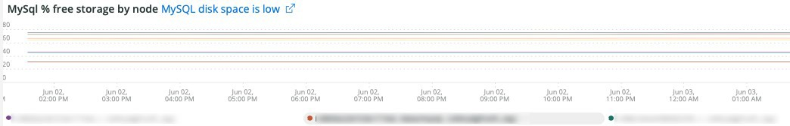

Many problems are caused by MySQL running out of storage in the storage assigned to MySQL (`datadir` MySQL configuration setting, default is `/data/mysql`) or the `tmpdir` running out of space. The default `tmpdir` (MySQL setting) is `/tmp`. This frame looks at the `/, /tmp` (if defined as a separate mount) and the `/data/mysql` % of free storage. Starting in MySQL version 5.7 (MariaDB version 10.2), uncompressed tmp tables are written to a tmp tablespace in the `/data/mysql` directory in the file (ibtmp1). This file auto expands without limit by default. As it is a tablespace, it will not decrease in size and will reset to 12MB when MySQL restarts.

## [!UICONTROL MySQL Connections by Node]

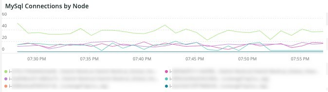

The **[!UICONTROL MySQL Connections by Node]** frame indicates periods of database node outages or high volumes of connections.

## [!UICONTROL MySQL Node Summary]

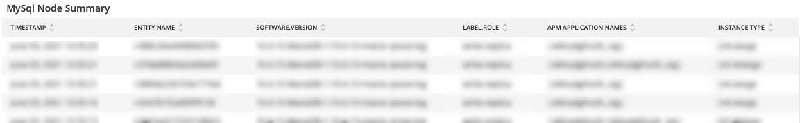

The **[!UICONTROL MySQL Node Summary]** table shows database node details such as software version and instance type (size). 

## [!UICONTROL Galera Number of Nodes in cluster]

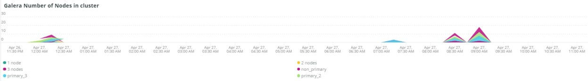

The **[!UICONTROL Galera Number of Nodes in cluster]** frame displays information from the MySQL logs. As nodes join and leave a cluster, only the messages for the selected timeframe will be shown. If a node leaves the cluster before the timeframe, no message will exist during that timeframe. If you suspect that the database may be running short of a node, expand the timeframe to a larger period to see if you can see additional information. If there is information during the time period that indicates less than all nodes in the [!DNL Galera] cluster, expand the timeframe to see if you can determine when the node left the cluster.

## [!UICONTROL MySQL shutdowns and starts]

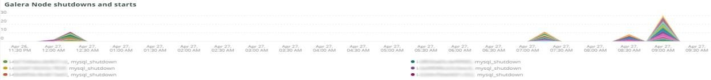

The **[!UICONTROL MySQL shutdowns and starts]** frame detects when there is a shutdown of a node. [!DNL Galera] nodes will be evicted and will self-evict from the [!DNL Galera] node. This will typically result in a restart of the MySQL service.

## [!UICONTROL Galera log]

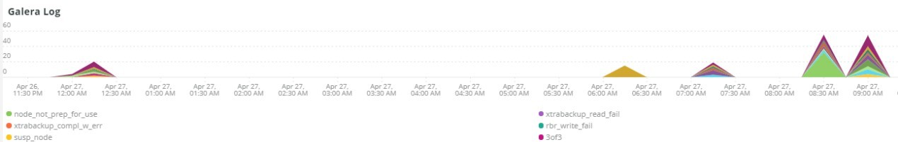

The **[!UICONTROL Galera log]** frame shows counts of particular signals from the MySQL logs concerning [!DNL Galera] nodes, their states, and the state changes of the [!DNL Galera] cluster.

* '%1047 WSREP has not yet prepared node for application use%') as 'node_not_prep_for_use'
* '%\[ERROR\] WSREP: Failed to read from: wsrep_sst_xtrabackup-v2%') as 'xtrabackup_read_fail'
* '%\[ERROR\] WSREP: Process completed with error: wsrep_sst_xtrabackup-v2 %') as 'xtrabackup_compl_w_err'
* '%\[ERROR\] WSREP: rbr write fail%') as 'rbr_write_fail'
* '%self-leave%') as 'susp_node'
* '%members = 3/3 (joined/total)%') as'3of3'
* '%members = 2/3 (joined/total)%') as'2of3'
* '%members = 2/2%') as '2of2'
* '%members = 1/2%') as '1of2'
* ‘%members = 1/3%') as '1of3'
* ‘%members = 1/1%') as '1of1'
* '%\[Note\] /usr/sbin/mysqld (mysqld 10.%') as'sql_restart'
* '%Quorum: No node with complete state:%') as 'no_node_count'
* '%WSREP: Member 0%') as 'mem_0'
* '%WSREP: Member 1.0%') as 'mem_1'
* '%WSREP: Member 2%') as'mem2'
* '%WSREP: Synchronized with group, ready for connections%') as 'ready'
* '%/usr/sbin/mysqld, Version:%') as 'mysql_restart_mysql.slow'
* '%\[Note\] WSREP: New cluster view: global state:%') as 'galera_cluster_view_chng'

## [!UICONTROL Galera Log by Host]

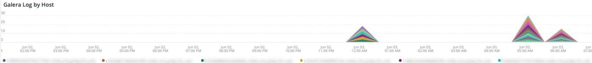

The **[!UICONTROL Galera Log by Host]** frame is the same as the **[!UICONTROL Galera log]** frame, except that it is broken out by node to help with troubleshooting. 

## [!UICONTROL Database performance]

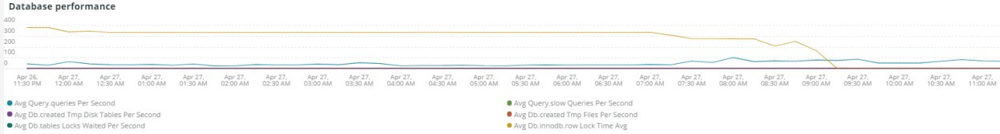

The **[!UICONTROL Database performance]** frame shows database performance during specific requests. You can see each metric by clicking on them in the colored icons below the graph. Many of the metrics called out in [Monitoring MySQL Database Performance with New Relic](https://newrelic.com/blog/how-to-relic/how-to-monitor-mysql) are found in this frame.

* average(query.queriesPerSecond)
* average(query.slowQueriesPerSecond)
* average(db.createdTmpDiskTablesPerSecond)
* average(db.createdTmpFilesPerSecond)
* average(db.tablesLocksWaitedPerSecond)
* average(db.innodb.rowLockTimeAvg)
* average(db.innodb.rowLockWaitsPerSecond)

## [!UICONTROL Transaction Database Call Count]

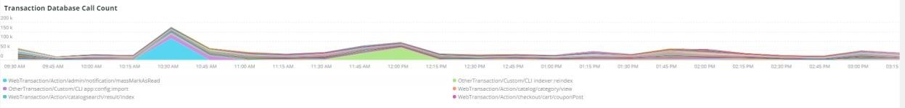

The **[!UICONTROL Transaction Database Call Count]** frame shows the number of database calls made by each transaction facet. This seems to be row-focused and not statements.

## [!UICONTROL Cron_schedule table updates]

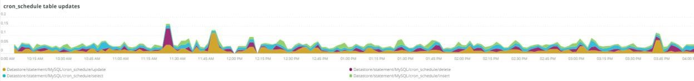

The **[!UICONTROL Cron_schedule table updates]** frame displays the maximum duration of database updates to the cron_schedule table for the selected time period.

## [!UICONTROL Slow Query Traces]

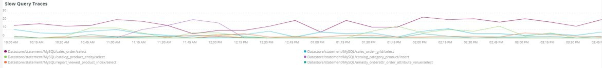

The **[!UICONTROL Slow Query Traces]** frame displays the table and request type where slow query traces exist. A slow query trace is created for query transactions that take longer than 5 seconds. Of importance for this frame are the update queries. If a table is being updated by `UPDATE`, `DELETE`, and `INSERT` statements, they may lock tables for a period of time.

Even `SELECT` statements may lock rows if used with FOR UPDATE.

## [!UICONTROL Datastore Operations tables]

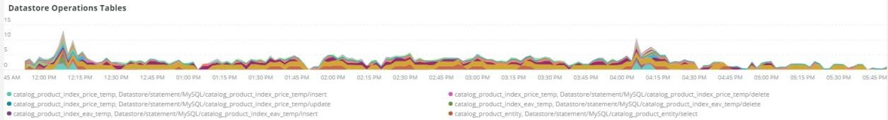

## [!UICONTROL Cron table change]

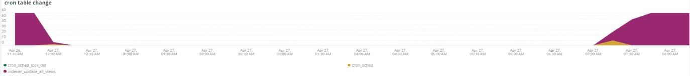

The **[!UICONTROL Cron table change]** frame is looking for "could not acquire lock for cron job:" error messages, along with a specific PHP memory error and locks involving the `cron_schedule` table. If the `cron_schedule` table is locked (for example, by a `DELETE` query being run against it), it will block other crons from running.

## [!UICONTROL Deadlocks]

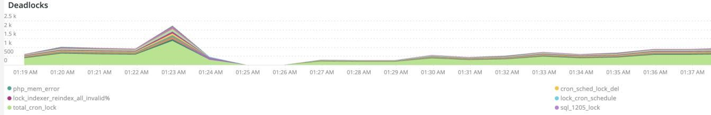

The **[!UICONTROL Deadlocks]** frame is looking at the following strings parsed from the MySQL logs.

* '%PHP Fatal error: Allowed memory size of%') as php_mem_error
* '%get lock; try restarting transaction, query was: DELETE FROM \`cron_schedule%') as cron_sched_lock_del
* '% lock for cron job: indexer_reindex_all_invalid%') as 'lock_indexer_reindex_all_invalid%'
* '% lock for cron job: cron_schedule%') as 'lock_cron_schedule'
* '% lock for cron job:%') as 'total_cron_lock'
* '%General error: 1205 Lock wait timeout exceeded%') as 'sql_1205_lock'
* '%ERROR 1213 (40001): Deadlock found when trying to get lock%') as 'sql_1213_lock'
* '%SQLSTATE[40001]: Serialization failure: 1213 Deadlock found%') as 'sql_1213_lock2'
* '% lock for cron job: indexer_update_all_views%') as 'lock_indexer_update_all_views'
* '% lock for cron job: sales_grid_order_invoice_async_insert%') as 'lock_sales_grid_order_invoice_async_insert',
* '% lock for cron job: staging_remove_updates%') as 'lock_staging_remove_updates'
* '% lock for cron job: sales_grid_order_shipment_async_insert%') as 'lock_sales_grid_order_shipment_async_insert'
* '% lock for cron job: amazon_payments_process_queued_refunds%') as 'lock_amazon_payments_process_queued_refunds'
* '% lock for cron job: sales_send_order_shipment_emails%') as 'lock_sales_send_order_shipment_emails'
* '% lock for cron job: staging_synchronize_entities_period%') as 'lock_staging_synchronize_entities_period'
* '% lock for cron job: indexer_clean_all_changelogs%') as 'lock_indexer_clean_all_changelogs'
* '% lock for cron job: magento_targetrule_index_reindex%') as 'lock_magento_targetrule_index_reindex'
* '% lock for cron job: newsletter_send_all%') as 'lock_newsletter_send_all'
* '% lock for cron job: newsletter_send_all%') as 'lock_newsletter_send_all'
* '% lock for cron job: sales_send_order_emails%') as 'lock_sales_send_order_emails'
* '% lock for cron job: sales_send_order_creditmemo_emails%') as 'lock_sales_send_order_creditmemo_emails'
* '% lock for cron job: sales_grid_order_creditmemo_async_insert%') as 'lock_sales_grid_order_creditmemo_async_insert'
* '% lock for cron job: bulk_cleanup%') as 'lock_bulk_cleanup' 
* '% lock for cron job: flush_preview_quotas%') as 'lock_flush_preview_quotas'
* '% lock for cron job: sales_send_order_invoice_emails%') as 'lock_sales_send_order_invoice_emails'
* '% lock for cron job: sales_send_order_invoice_emails%') as 'lock_sales_send_order_invoice_emails'
* '% lock for cron job: captcha_delete_expired_images%') as 'lock_captcha_delete_expired_images'
* '% lock for cron job: magento_newrelicreporting_cron%') as 'lock_magento_newrelicreporting_cron'
* '% lock for cron job: outdated_authentication_failures_cleanup%') as 'lock_outdated_authentication_failures_cleanup'
* '% lock for cron job: send_notification%') as 'lock_send_notification'
* '% lock for cron job: magento_giftcardaccount_generage_codes_pool%') as 'lock_magento_giftcardaccount_generage_codes_pool'
* '% lock for cron job: catalog_product_frontend_actions_flush%') as 'lock_catalog_product_frontend_actions_flush'
* '% lock for cron job: mysqlmq_clean_messages%') as 'mysqlmq_clean_messages'
* '% lock for cron job: catalog_product_attribute_value_synchronize%') as 'lock_catalog_product_attribute_value_synchronize'
* '% lock for cron job: ddg_automation_importer%') as 'lock_ddg_automation_importer' 
* '% lock for cron job: ddg_automation_reviews_and_wishlist%') as 'lock_ddg_automation_reviews_and_wishlist'
* '% lock for cron job: captcha_delete_old_attempts%') as 'lock_captcha_delete_old_attempts'
* '% lock for cron job: catalog_product_outdated_price_values_cleanup%') as 'lock_catalog_product_outdated_price_values_cleanup'
* '% lock for cron job: consumers_runner%') as 'lock_consumers_runner' 
* '% lock for cron job: ddg_automation_customer_subscriber_guest_sync%') as 'lock_ddg_automation_customer_subscriber_guest_sync'
* '% lock for cron job: get_amazon_capture_updates%') as 'lock_get_amazon_capture_updates' 
* '% lock for cron job: get_amazon_authorization_updates%') as 'lock_send_get_amazon_authorization_updates'
* '% lock for cron job: temando_process_platform_events%') as 'lock_temando_process_platform_events'
* '% lock for cron job: ddg_automation_status%') as 'lock_ddg_automation_status' 
* '% lock for cron job: ddg_automation_status%') as 'lock_ddg_automation_status' 
* '% lock for cron job: sales_clean_orders%') as 'lock_sales_clean_orders'
* '% lock for cron job: catalog_index_refresh_price%') as 'lock_catalog_index_refresh_price'
* '% lock for cron job: magento_reward_balance_warning_notification%') as 'lock_magento_reward_balance_warning_notification'
* '% lock for cron job: analytics_update%') as 'lock_analytics_update'
* '% lock for cron job: messagequeue_clean_outdated_locks%') as 'lock_messagequeue_clean_outdated_locks'
* '% lock for cron job: messagequeue_clean_outdated_locks%') as 'lock_messagequeue_clean_outdated_locks'
* '% lock for cron job: staging_apply_version%') as 'lock_staging_apply_version'
* '% lock for cron job: magento_reward_expire_points%') as 'lock_magento_reward_expire_points'
* '% lock for cron job: yotpo_yotpo_orders_sync%') as 'lock_yotpo_yotpo_orders_sync'
* '% lock for cron job: catalog_event_status_checker%') as 'lock_catalog_event_status_checker'
* '% lock for cron job: ddg_automation_campaign%') as 'lock_ddg_automation_campaign'
* '% lock for cron job: visitor_clean%') as 'lock_visitor_clean'
* '% lock for cron job: scconnector_verify_website%') as 'lock_scconnector_verify_website'
* '% lock for cron job: ddg_automation_email_templates%') as 'lock_ddg_automation_email_templates'
* '% lock for cron job: aggregate_sales_report_order_data%') as 'lock_aggregate_sales_report_order_data'
* '% lock for cron job: ddg_automation_catalog_sync%') as 'lock_ddg_automation

## [!UICONTROL DB Statistics]

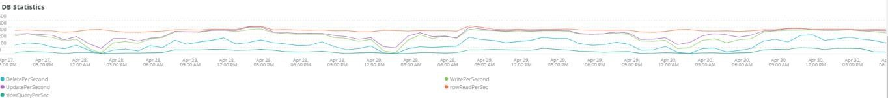

The **[!UICONTROL DB Statistics]** frame displays deletes, writes, rows read, updates, and slow queries per second.

## [!UICONTROL Request frequency]

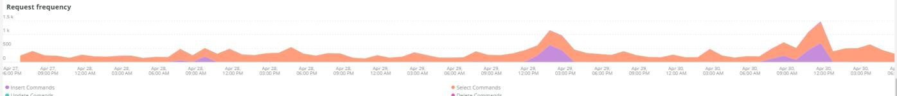

## [!UICONTROL Database Errors]

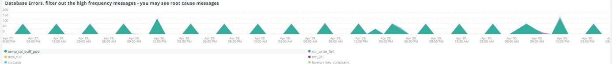

The **[!UICONTROL Database Errors]** frame shows a variety of database [warnings and errors](https://mariadb.com/kb/en/mariadb-error-codes/).

* '%Memory size allocated for the temporary table is more than 20% of innodb_buffer_pool_size%' as 'temp_tbl_buff_pool'
* '%\[ERROR\] WSREP: rbr write fail%') as 'rbr_write_fail'
* '%mysqld: Disk full%') as 'disk_full'
* '%Error number 28%') as 'err_28'
* '%rollback%') as 'rollback'
* '%Foreign key constraint fails for table%') as 'foreign_key_constraint'
* '%Error_code: 1114%') as 'sql_1114_full''%CRITICAL: SQLSTATE[HY000] [2006] MySQL server has gone away%') as 'sql_gone'
* '%SQLSTATE[HY000] [1040] Too many connections%') as 'sql_1040'
* '%CRITICAL: SQLSTATE[HY000] [2002]%') as 'sql_2002'
* '%SQLSTATE[08S01]:%') as 'sql_1047'
* '%[Warning] Aborted connection%') as 'aborted_conn'
* '%SQLSTATE[23000]: Integrity constraint violation:%') as 'sql_23000'
* '%1205 Lock wait timeout%') as 'sql_1205'
* '%SQLSTATE[HY000] [1049] Unknown database%') as 'sql_1049'
* '%SQLSTATE[42S02]: Base table or view not found:%') as 'sql_42S02'
* '%General error: 1114%') as 'sql_1114'
* '%SQLSTATE[40001]%') as 'sql_1213'
* '%SQLSTATE[42S22]: Column not found: 1054 Unknown column%') as 'sq1_1054'
* '%SQLSTATE[42000]: Syntax error or access violation:%') as'sql_42000'
* '%SQLSTATE[21000]: Cardinality violation:%') as 'sql_1241'
* '%SQLSTATE[22003]:%') as 'sql_22003'
* '%SQLSTATE[HY000] [9000] Client with IP address%') as 'sql_9000'
* '%SQLSTATE[HY000]: General error: 2014%') as 'sql_2014'
* '%1927 Connection was killed%') as 'sql_1927'
* '%1062 \[ERROR\] InnoDB:%') as 'sql_1062_e'
* ‘'%[Note] WSREP: Flushing memory map to disk...%') as 'mem_map_flush'
* '%Internal MariaDB error code: 1146%') as 'sql_1146'
* '%Internal MariaDB error code: 1062%') as 'sql_1062' • '%1062 [Warning] InnoDB:%') as 'sql_1062_w'
* '%Internal MariaDB error code: 1064%') as 'sql_1064'
* '%InnoDB: Assertion failure in file%') as 'assertion_err'
* '%mysqld_safe Number of processes running now: 0%') as 'mysql_oom'
* '%\[ERROR\] mysqld got signal%') as 'mysql_sigterm'
* '%1452 Cannot add%') as 'sql_1452'
* '%ERROR 1698%') as 'sql_1698'
* '%SQLSTATE[HY000]: General error: 3%') as 'cnt_wrt_tmp'
* '%General error: 1 %') as 'sql_syntax'
* '%42S22%') as 'sql_42S22'
* '%InnoDB: Error (Duplicate key)%') as 'innodb_dup_key' FROM Log TIMESERIES

## [!UICONTROL DB Error Table]

The **[!UICONTROL DB Error Table]** frame shows the same information as the **[!UICONTROL Database Errors]** frame, but you can see it by node and in a table format. See [MariaDB Error Codes](https://mariadb.com/kb/en/mariadb-error-codes/) for more information.

## [!UICONTROL Database Traces]

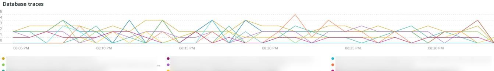

The **[!UICONTROL Database Traces]** frame shows the database traces by type across the selected timeline. 

## [!UICONTROL Database processes]

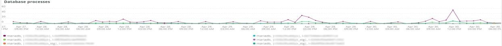

The **[!UICONTROL Database processes]** frame shows the database processes, environments, and node identifiers.

## [!UICONTROL MySQL Non-Sleeping Threads by Node]

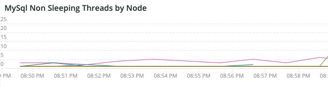

The **[!UICONTROL MySQL Non-Sleeping Threads by Node]** frame shows the connection threads to the database. This frame shows the active threads.

## [!UICONTROL MySQL Running and Sleeping Threads by environment]

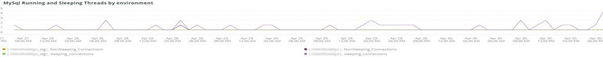

The **[!UICONTROL MySQL Running and Sleeping Threads by environment]** frame shows both active and sleeping connections to the database. If there are connections to the database where slow queries have gone to sleep, there will be sleeping connections. Sleeping connections can be database queries that are blocked by locked rows or tables. These sleeping connections are also holding PHP worker connections.

## [!UICONTROL MySQL mem used by node]

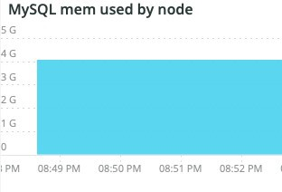

The **[!UICONTROL MySQL mem used by node]** frame shows the node usage of memory by MySQL. On larger sites, this frame may be continuous bars with GBs worth of memory used. 

## [!UICONTROL Database mysql-slow.log]

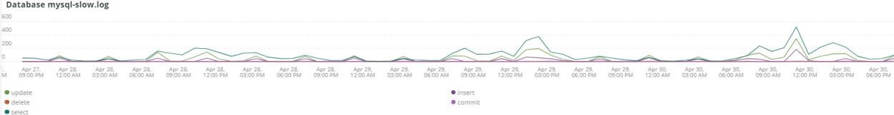

The **[!UICONTROL Database mysql-slow.log]** frame shows the query statement types that were in the `mysql-slow.log` file across the selected timeframe.

